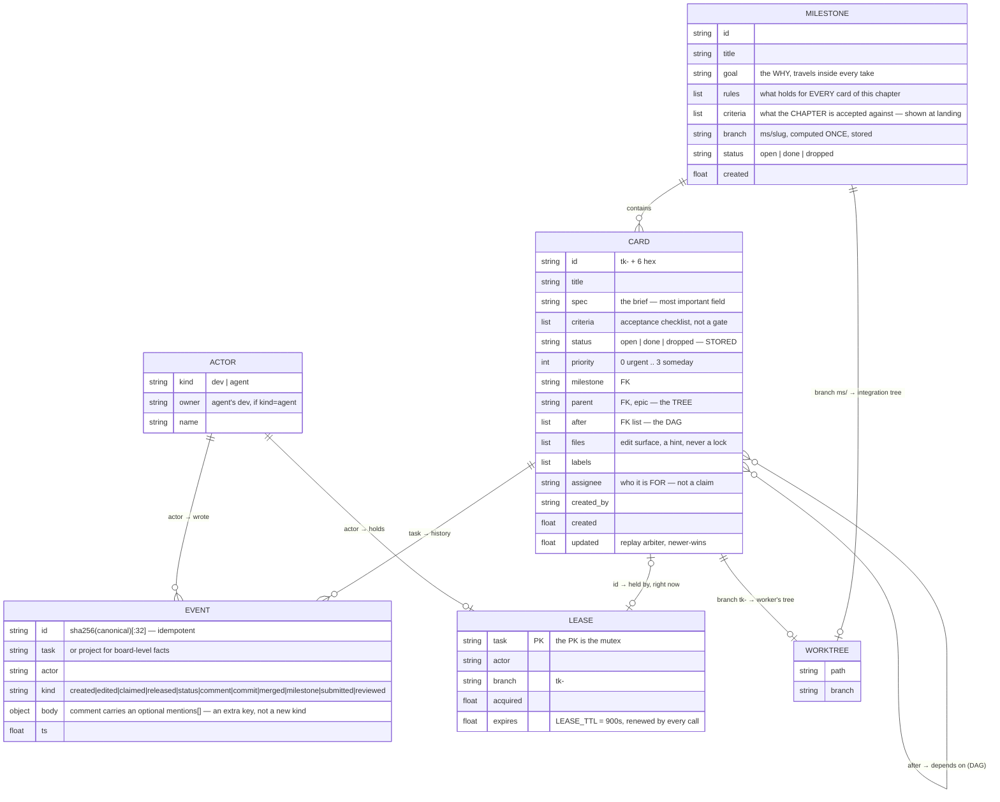
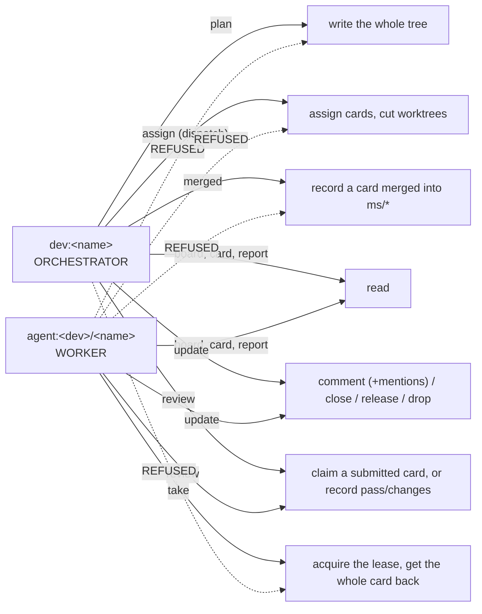
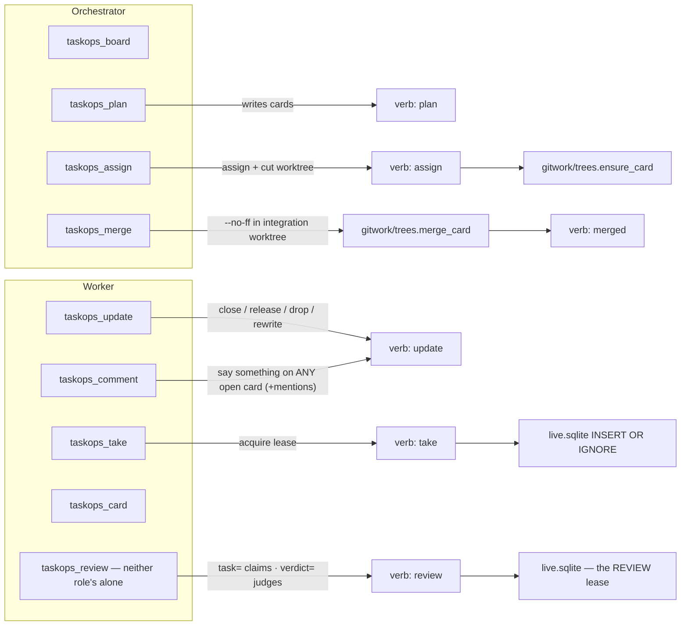
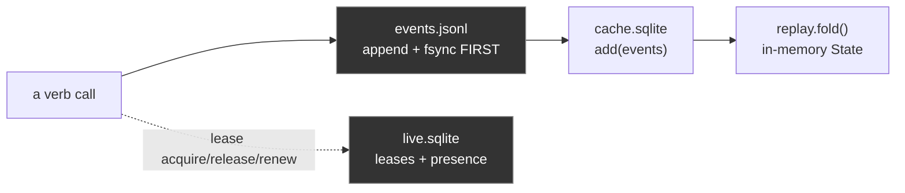
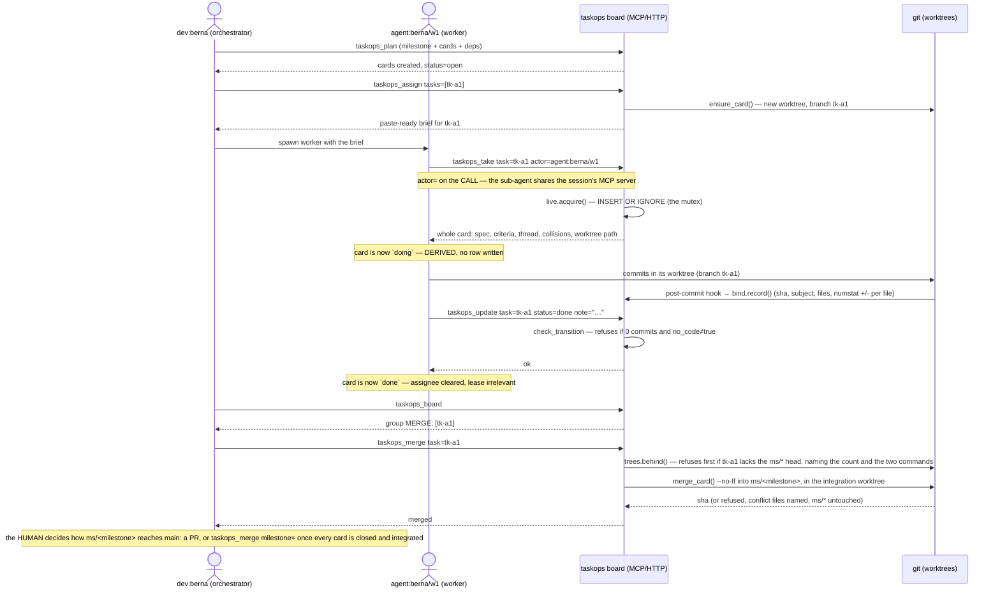

# taskops v2 — architecture

Executive reference for the whole system: what exists, how the pieces relate,
what happens on the wire when an agent does something. Generated by reading
the actual source — `src/taskops`, 79 Python files / ~8,200 lines, plus the
dashboard's own TypeScript source under `ui/src`, which §15 describes and
`CLAUDE.md` gives the command to count — and the tests (`./scripts/test`:
293 passed). Every number here is meant to be re-derived, never
trusted; the dashboard is under active work and its file count moves. This
file describes what is *built* — if it ever disagrees with the code, the code
is right and this is a bug.

Companions: [`README.md`](README.md) (install it, run it, serve the UI) ·
[`CLAUDE.md`](CLAUDE.md) (how to work in this repo) ·
[`MENTIONS.md`](MENTIONS.md) (mentions, and why they are not a hook).

The v1 post-mortem behind each rule is inline, in the docstring of the module
that carries it — that is on purpose: a design document nobody opens is how a
rule outlives its reason. §11 and §14 are the index of those reasons.

---

## 1. Executive summary

taskops v2 is a work board — milestones → cards → subtasks — for teams of
coding agents working in parallel under one human who decides what merges.
It replaces a v1 system (~340 files) that had, in production: cards
permanently stuck "in progress" after a worker died, races between two
machines both convinced they owned the same card, automatic merges that broke
checkouts out from under a working agent, and 35 CLI commands duplicating
what a smaller surface could do once.

Four decisions eliminate those failure classes **by construction**, not by
adding a command that reacts to them after the fact:

1. **Only three facts are ever stored** (`open`, `done`, `dropped`). Everything
   else a board can say about a card — `ready`, `doing`, `blocked`, `stalled`
   — is computed at read time from the dependency graph and from who
   currently holds a live lease. A worker that dies simply stops renewing its
   lease; its card falls out of `doing` with no sweep, no timeout job, and no
   verb that "fixes" it, because there is nothing written to be wrong.
2. **A branch is inhabited, not switched.** Every card gets its own git
   worktree, pinned to its own branch for its whole life. `git switch` does
   not appear anywhere in the codebase. Two agents on two different cards are
   two directory trees sharing nothing; git itself refuses a branch checked
   out in two worktrees at once, which is a lock nobody has to remember to
   take.
3. **Two roles, enforced once, in one table.** `verbs/__init__.py` declares
   for every verb whether it reads or writes and which role may call it. The
   HTTP router, the local board, the MCP tool layer and the tests all defer to
   this one table — v1 re-took the same decision by hand at 25 call sites and
   four of them disagreed.
4. **Context rides in the tool result, not in a hook that decides.** One
   delivery-only Claude hook exists (`MENTIONS.md` §9); it reads and injects,
   never writes. What a worker needs to act — the milestone's goal, the full spec,
   the whole comment thread, file collisions with other live work, the
   previous worker's handover note, its own worktree path — comes back
   *in the response* to `taskops_take`, ordered so that what changes what you
   do before you start is above the spec, not after it.

Storage is an append-only event log (the only truth) plus two SQLite files
that are both derived and both disposable — except that leases are alive, not
derived, and live in a file the cache-rebuild path can never touch.

---

## 2. Entities and relationships



**Reading this diagram:** `CARD.status` is the *only* status a row ever
carries. `doing` is not a value anywhere in this schema — it exists only as
the join between `CARD.id` and a `LEASE` row that has not expired. Delete the
lease (or let it expire) and the card's displayed state changes with zero
writes to `CARD` itself.

---

## 3. Stored vs. derived state

```mermaid
stateDiagram-v2
    [*] --> open : taskops_plan
    open --> done : status=done (needs a commit, or no_code=true+note)
    open --> dropped : status=dropped (reason required)
    done --> open : status=open (reopen)

    state open {
        [*] --> ready
        ready --> doing : taskops_take (lease acquired)
        doing --> ready : lease expires (worker died) — NO event, NO writer
        doing --> stalled : lease expires AND assignee still set
        stalled --> doing : taskops_take (new holder)
        ready --> blocked : an `after` dependency is not closed
        blocked --> ready : that dependency closes — no event on THIS card

        doing --> review : status=review (card.review only) — `submitted`, history-only
        review --> reviewing : taskops_review task= (the REVIEW lease)
        reviewing --> review : that lease expires — NO event, NO writer
        reviewing --> changes : verdict=changes — `reviewed`, history-only
        changes --> doing : the worker picks it back up
        review --> review : status=review again (a new round; the old verdict is stale)
    }
```



Only the outer transitions (`open → done → dropped`, and back) are events in
the log. Everything inside the `open` box — `ready`, `doing`, `blocked`,
`stalled`, and the three optional review states — is
`core/graph.py:derived()`, computed fresh on every read from
`(card.status, card.after[], live leases, live REVIEW leases, standings)`.
`review`, `reviewing` and `changes` appear only on a card with `review: true`;
both new parameters default to "nothing under review", so a board that never
turns it on derives exactly as it did before the feature existed
(`tests/test_core.py::test_a_card_without_review_derives_exactly_as_before`). There is deliberately no path in
this diagram labelled "recover": nothing is ever wrong for a recover to fix.

One more fact is derived the same way and is about a *reader*, not a card: a
**pending mention** (`core/mentions.py`). Being named in a comment's optional
`mentions[]` is pending until that actor writes any event on the card, or the
card closes — computed from the thread on every read, so answering is what
clears it. There is no `read` column and no ack verb, for the same reason
there is no `recover`: both would be a write whose only job is to contradict
an earlier one.

---

## 4. The six layers (imports only point down)

```mermaid
flowchart TB
    subgraph L0["0 · foundation (stdlib only)"]
        errors["_errors, _ids, _clock, _json, _locate, _version"]
    end
    subgraph L1["1 · core (PURE — no I/O)"]
        types["types — Card/Milestone/Event/Lease, KINDS registry"]
        actors["actors — presence, folded from events"]
        event["event — construct + hash"]
        replay["replay — fold(events) → State"]
        machine["machine — transition guards"]
        graph["graph — ready/blocked/doing/stalled"]
        mentionsm["mentions — who was named and has not answered"]
        reviewm["review — submitted/reviewed folded into a Standing"]
        hours["hours — working-time math"]
    end
    subgraph L2["2 · store (the ONLY SQL)"]
        log["log.jsonl — append + fsync"]
        cache["cache.sqlite — derived, disposable"]
        live["live.sqlite — leases + presence, NEVER disposable"]
        reviewsdb["reviews — the REVIEW lease, a second mutex in live.sqlite"]
        creds["creds — invite tokens"]
        stores["stores.py — journal → index → fold, in that order"]
    end
    subgraph L3["3 · verbs (+ the REGISTRY)"]
        plan["plan"]; take["take"]; update["update"]; card["card"]
        assign["assign"]; pulse["pulse (board, mentions, waiting)"]; record["record"]; report["report"]
        reviewv["review — claim a submitted card, or record the verdict"]
        projectv["project — a board-level fact about the repo (op=remote)"]
        registry["__init__ — Verb(fn, kind, roles, refusal)"]
    end
    subgraph L4["4 · board.py + gitwork (the ONLY git, client-side)"]
        board["board.py — LocalBoard | RemoteBoard, routing decided ONCE"]
        run["gitwork/run"]; trees["gitwork/trees — worktrees"]
        trailer["gitwork/trailer"]; bind["gitwork/bind"]; install["gitwork/install"]
        remote["gitwork/remote — origin: {host, slug, url}, and best-effort push"]
    end
    subgraph L5["5 · transports"]
        mcpsrv["mcp/server, hello, tools, gitmoves, dossier, before, render, brief, schema, thread"]
        httpsrv["http/server, mounts, rpc, auth, feed, static"]
    end
    subgraph L6["6 · cli"]
        cli["commands: init · join · hook   ·   serving: serve · invite · ui"]
    end

    L1 --> L0
    L2 --> L1
    L3 --> L2
    L4 --> L3
    L5 --> L4
    L6 --> L5
```

`tests/test_architecture.py` enforces this by reading the AST of every module:
imports only point down, `subprocess` appears only in `gitwork/run.py`, `sqlite3`
only under `store/`, the wall clock only in `_clock.py` and `core/hours.py`
(the one module whose whole subject is time), and every module stays
under 200 lines — a budget that forces a split to land on a cohesive boundary
instead of an arbitrary one.

---

## 5. Actors and permissions



The rule lives once, as data, in `verbs/__init__.py::REGISTRY`:

| verb | kind | role | if the wrong role calls it |
|---|---|---|---|
| `board` | read | both | — |
| `mentions` | read | both | — (a delivery-hook read: one of the two that renew no lease) |
| `waiting` | read | `dev` | *"these are the orchestrator's moves, not yours. Your own picture: `taskops_board`"* — the other non-renewing read: MERGE / REVIEW / STALLED for the delivery hook (`MENTIONS.md` §9f) |
| `card` | read | both | — |
| `report` | read | both | — |
| `events` | read | both | — (the LOG, one keyset page at a time, newest first; board-wide by construction — see `verbs/events.py`) |
| `plan` | write | `dev` | *"workers do not plan the board. Report what you found instead: `taskops_update`…"* |
| `assign` | write | `dev` | *"dispatching is the orchestrator's move. Take what is yours: `taskops_take`"* |
| `merged` | write | `dev` | *"workers do not integrate branches. Close your card and the orchestrator merges it"* |
| `take` | write | `agent` | *"you are the orchestrator — you dispatch, you do not hold cards"* |
| `update` | write | both | — |
| `review` | write | both | — (optional review: claim a submitted card, or record the verdict. A verifier is an ordinary agent — there is no reviewer role) |
| `bind` | write | both | (internal — the git hooks call it) |
| `project` | write | both | (internal — `taskops init` / `taskops join` record where the repo lives on the web; a board-level fact, `op=remote`) |

Every refusal names the call that works. `role_of()` in `core/types.py` is the
*only* actor parser in the codebase (v1 had five, plus an inference step that
let an actor-less sub-agent silently resolve to the human).

**Identity is resolved per CALL, not per process** (2026-08-07). Every MCP
tool accepts `actor=`, and `board.py::_who` lets it win over the board's own
identity (`TASKOPS_ACTOR` at MCP-server start, else the credential's
subject). The reason is the host, not taste: one MCP server runs per session
and every sub-agent shares it, so the `export` in a worker's brief never
reaches the process that speaks MCP — without a per-call actor, every worker
spoke as the orchestrator and `take` was unreachable. On a remote board
`http/auth.py::authorize` judges the override: a credential may act as
itself, and a dev's credential as that dev's own agents — nobody else's.

---

## 6. The nine MCP tools (not the same as the fourteen verbs)

A tool is what an agent should think in one move; a verb is one write on the
board. The mapping is deliberately not 1:1 in either direction:
`taskops_assign` alone is two verb calls (`assign`, then per-card worktree
creation) collapsed into one tool; `taskops_merge` runs git in the *caller's*
filesystem before recording the result as a verb (v1's `recover` ran git on
the *server* and reported paths from a machine that was never the caller's);
`taskops_review` is the verifier's ONE door — `task=` claims the review lease
and returns the whole dossier, `verdict=` judges — because a `review=true` flag
on `taskops_take` was built and then deleted (docs/implement-reviewer.md §10b):
two tool surfaces over one verb is the duplicate-channel shape that broke v1,
and `take` holds the WORK lease and nothing else; and
`taskops_update` + `taskops_comment` are two tools over the ONE `update`
verb — one write path underneath, because v1 split closing across six modules
and forgot to record it in one of them, but two moves on top, because saying
something is not changing something.



---

## 7. Storage and the write path



* `events.jsonl` is the truth. Event ids are `sha256(canonical)[:32]`, so a
  replayed write is a no-op — the log is idempotent by construction.
* `cache.sqlite` is disposable: delete it, `Stores._bootstrap()` replays the
  log and rebuilds it on next open.
* `live.sqlite` is **not** disposable and lives in its own file on purpose —
  a cache rebuild must never be able to drop a live claim (v1 kept both kinds
  of state in one database).
* The write order is fixed: journal → index → fold. A crash between the first
  two costs a rebuild (automatic); the reverse order would cost the events
  themselves.
* Replay sorts strictly by `ts` with Python's *stable* sort, so events sharing
  a timestamp keep arrival order — sorting by `(ts, id)` was tried and broke
  a `claimed`/`released` pair under a frozen test clock.

---

## 8. Sequence — a card's whole life



## 9. Sequence — the case v2 exists to remove

```mermaid
sequenceDiagram
    actor W1 as agent:berna/w1
    participant Live as live.sqlite
    participant Board as taskops board

    W1->>Board: taskops_take task=tk-a1
    Board->>Live: acquire(tk-a1, w1, ttl=900s)
    Note over W1: w1's process crashes. Nothing else happens.
    Note over Live: no DELETE runs, no sweep, no cron — the row just sits there, unexpired

    rect rgb(40,40,40)
    Note over Live: 900 seconds pass
    end

    actor Dev as dev:berna
    Dev->>Board: taskops_board
    Board->>Live: held(now) — the row for tk-a1 has expires <= now
    Board-->>Dev: tk-a1 is NOT in `doing`. It is in `stalled` (assignee=w1, quiet_for≥900s)
    Note over Dev: no verb named "recover" exists to call

    Dev->>Board: taskops_assign tasks=[tk-a1]   (hand it to a new worker)
    actor W2 as agent:berna/w2
    W2->>Board: taskops_take task=tk-a1
    Board->>Live: acquire() — old row past its expiry, new INSERT succeeds
    Board-->>W2: the card, plus w1's handover note if it left one
```



Nothing here is a repair. `stalled` was always going to be the answer the
moment `expires <= now`; `taskops_assign` is the same verb used for a card
nobody has touched yet.

---

## 10. Protocols

| transport | who uses it | shape |
|---|---|---|
| **MCP over stdio** | Claude / any MCP host, per-repo | newline-delimited JSON-RPC 2.0. `initialize` returns `instructions`: the whole role protocol AND the board as of that moment (`mcp/hello.py` — the same verb and renderer an agent would call, so it is a delivered answer, not a second version of one). That is what a v1 system prompt was, minus the second place for truth to live, and it needs no hook and no settings file to be trusted. **One server per SESSION, shared by every sub-agent**, which is why identity rides on the call (`actor=`, §5) and not in the process's environment. `tools/call` on a refusal answers `isError: true` with the refusal *as the text content* — never a protocol-level error, because an agent that cannot read the way out will invent one; an unexpected exception answers the same way rather than ending the loop, since that loop is the session's only door to the board. |
| **HTTP RPC** | a remote board's clients (`RemoteBoard`, the browser) | `POST /<board>/rpc` with `{"verb", "args", "actor"}`, `Authorization: Bearer <token>`. Answer is always an envelope: `{"ok": true, "seq": N, "data": {...}}` or `{"ok": false, "error": {"code", "message"}}` — v1 let three verbs answer with a bare array and the decoder silently turned it into `{}`. |
| **WebSocket feed** | the browser UI only | `GET /<board>/feed`, upgraded via the RFC 6455 handshake (`HTTP/1.1` required for the 101 response to be accepted — the one bug class invisible to a library-based test, caught only with a raw-socket test). A message is a *signal* (`{"type": "changed"}`), never a payload — the client refetches, so a dropped or duplicated frame can never show something the board never said. SSE is the automatic fallback for a proxy that eats the Upgrade. Agents never use this: their live channel is the "pulse" line appended to every tool result. The UI carries exactly ONE write — a comment box with a mention picker on the card panel, through the same `/rpc` door and token (`MENTIONS.md` §9c). |
| **Delivery hook** | Claude Code sessions in a joined repo | `taskops hook claude`, wired by `init`/`join` into `.claude/settings.json` on `PostToolUse` + `UserPromptSubmit`. Read-only and one-way: resolves the reader (env, else worktree-path → card → holder) and injects context — `✉ …` when a mention is pending, for ANYBODY (throttled per reader per 30s); and `◆ …`, one line per group with the count and the call that clears it, when MERGE / REVIEW / STALLED is non-empty and the reader is a `dev:` (throttled per 180s, its own key — `MENTIONS.md` §9f). Silence otherwise, exit 0 always, any failure silent. Both reads (`mentions`, `waiting`) renew no lease. The one sanctioned Claude hook: it may deliver, never decide, store, or write (`MENTIONS.md` §9). |

---

## 11. What is NOT here, on purpose

| removed / never built | why | where it's enforced |
|---|---|---|
| a `recover` verb | doing is derived from the live lease; nothing is ever wrong to recover | no entry in `verbs/__init__.py::REGISTRY`; `tests/test_verbs.py::test_a_dead_workers_card_comes_back_by_itself` |
| a reviewer ROLE, a stored review STATUS, automatic reviewer assignment | v1's review system: `peer` deadlocks, 14 closing rules over 6 modules, reviewers eating the budget of the work | review EXISTS since 2026-08-07 but narrowed (docs/implement-reviewer.md is the paper trail): optional per card, derived from history-only events + a second lease, judged by an ordinary agent that may never judge its own work. `CARD_STATUSES` stays three; there is no reviewer role and nothing auto-assigns |
| AUTOMATIC merges to `main` | v1's `land` merged as a side effect of closing a card and ran checkout under working agents | a CARD cannot be merged to main — `taskops_merge task=` takes no target. A finished MILESTONE lands via `taskops_merge milestone=` (2026-08-07): explicit, refused while any card is open or unintegrated, refused off-trunk, recorded as a `milestone landed` event. What stays impossible is main moving as a side effect of anything |
| git replication between clones | split-brain, two machines "owning" the same card | `RemoteBoard` never falls back to a local store on write failure (`Unreachable` instead) |
| Claude hooks **that decide or store** | latency, another thing to install and drift; v1's held state and gated actions | context travels in `initialize.instructions` + tool responses. The ONE exception, sanctioned 2026-08-06: `taskops hook claude`, delivery-only (`MENTIONS.md` §9) — it reads, injects a ✉ or ◆ line, and can be deleted with no loss but immediacy. `tests/test_claude.py` pins its safety properties, one test each — the module docstring lists them and `grep -c '^def test_' tests/test_claude.py` counts them |
| a mark-as-read / ack verb for mentions | a stored `read` flag is `recover` again: a write whose only job is to contradict an earlier one | `core/mentions.py::pending()` derives it from the thread; `tests/test_verbs.py::test_a_mention_clears_itself_the_moment_the_actor_touches_the_card` |
| a slug in a branch name that isn't the milestone's | a renamed milestone orphaned its branch (ghost branches) | `Milestone.branch` computed once at creation, stored, never re-derived |
| a stored `doing` | a dead worker's card claimed to be worked on forever | `CARD_STATUSES = ("open", "done", "dropped")` — `"doing"` raises `BadRequest` if ever passed to `status=` |
| a worker-SLOT roster (held / free / lapsed as a pool) | taskops allocates no worker: `workers=[…]` is a label chosen at the call, sub-agents are ephemeral, and an actor is a name bound to the RUN of a card — a roster with capacity would be a fiction the board could never make true | the Actors view draws DEVS with their agents as lines inside them instead (`ui/src/pages/Actors.tsx`, `components/monitor/panels.ts` — both carry the post-mortem); an agent with no card is HISTORY, never "free", and `ui/smoke/main.tsx` §10 asserts the words `free`, `slot` and `capacity` appear nowhere in that markup |
| a TILE per ephemeral sub-agent | the first Actors page drew one per ACTOR: sixty-seven tiles, sixty-six of them processes that had already died with their cards, each wearing the human's layout — the page contradicted its own goal | the top level is the DEV (`devRows()`), an agent is a row inside it, and `ui/smoke/main.tsx` §10 pins that a board with one dev and many agents draws exactly one card per dev and none per agent |

---

## 12. Housekeeping (done, 2026-08-07)

The `force_release()` this section used to flag as dead code is **deleted**:
no verb ever called it, and the only thing keeping it alive was a test whose
name (`…_but_recover_always_can`) advertised a recovery path this board does
not have. A dead function that describes a banned design is worse than no
function — the next reader takes it as permission. An abandoned lease expires;
nothing takes a card away from its holder.

The remaining "recover" mentions (`core/types.py`, `verbs/assign.py`,
`mcp/tools.py`, `gitwork/run.py`, `core/mentions.py`, `store/live.py`) are
intentional: each one explains why the
rule exists, which is the whole convention of this codebase.

**A known limit of `collisions()`, argued but not changed.**
`verbs/_context.py::collisions` intersects the DECLARED `files` of open cards:
it lives in path space. The Nova UI milestone (2026-08-07) fanned four cards
onto pairwise-disjoint paths — the warning was correctly silent — and the
merged tree still came back with two `ago()` and three `initials()`, because
that class of failure lives in *symbol* space. **`docs/fan-out.md`** is the
post-mortem, with the file:line evidence and the four proposals weighed. Its
conclusion is deliberately conservative and belongs here: taskops does NOT
learn to parse source (a symbol scanner is the first component that would have
to know what a language is, and §14's layering has nowhere to put it);
`collisions()` is not widened; language-specific duplicate detection stays in
the project's own linter. What it recommends instead is free — land the seams
serialized before fanning out — plus one optional field, `criteria` on a
Milestone, next to `rules`. Both are implemented (tk-097cae, 2026-08-07): the
ordering rule is one sentence in `mcp/server.py::INSTRUCTIONS`, delivered at
the handshake inside `hello.py`'s budget; `Milestone.criteria` travels into
every take like `rules` and is SHOWN at `taskops_merge milestone=`, which
refuses until the human answers `criteria_met=true` — recorded in the `landed`
event, never judged by the machine. `docs/fan-out.md` §10 is the map from each
adoption to its test.

---

## 13. Verified state at time of writing

```
293 passed             ./scripts/test
ruff clean            } ./scripts/lint
pyright --strict clean
```

That number moves with every card; re-run the command rather than reading it
here.

Test categories: architecture (AST-enforced layering), core (pure functions:
replay, graph, machine, hours, mentions, review), store (log/cache/live),
verbs (including the whole review cycle and the two races it can lose),
gitwork (including a raw-socket WebSocket handshake test), http (topology),
mcp (dossier section order, tool refusals), migration (the v1 mapping),
ui (headless: `ui/smoke/run.mjs` renders the modules `src/main.tsx` bundles
through `react-dom/server` — no browser, no jsdom — against a payload a real
`LocalBoard` answered with, plus a read of the COMMITTED bundle. It skips
without node or `ui/node_modules`).

Not yet done: running the migration against the v1 boards on axion
(`scripts/migrate_v1.py` exists and is tested — and the 66 v1 events that
carried `mentions` are worth re-checking by hand once it runs, MENTIONS.md
§5), and deploy via `shipway`. The repo is under git and its history is real:
the board's own milestones land on `master` through `taskops_merge
milestone=`.

---

## 14. The rules the code is held to

Pinned by `tests/test_architecture.py`, which reads the AST of every module.
**A rule with no test is a suggestion**, so each of these has one. Every entry
was a v1 bug that cost real time; the test's docstring names it.

| rule | why | where |
|---|---|---|
| imports only point DOWN, no exceptions | a cycle between layers is how v1 came to re-decide routing at 25 call sites, four of them differently | `test_imports_only_point_down` |
| `mcp/` and `http/` never import each other | peers go through `board`/`verbs`, or the two drift | `test_transports_do_not_import_each_other` |
| `sqlite3` only under `store/` | one place knows SQL exists | `test_sqlite_only_in_store` |
| `subprocess` only in `gitwork/run.py` | v1 had four wrappers; one swallowed stderr and reported a refused push as "somebody landed while this ran", in an infinite retry loop | `test_subprocess_only_in_gitwork_run` |
| the clock only in `_clock.py` + `core/hours.py` | v1 let a stray `strftime` through and a report cut days in two timezones at once | `test_only_clock_reads_the_clock` |
| `core/` imports no I/O at all — not even `os` | level 1 is pure or it is not level 1 | `test_core_is_pure` |
| a verb never runs git, renders, or reaches the network | v1's `recover` ran git porcelain on the SERVER and reported paths from a machine that was not the caller's | `test_verbs_never_run_git_or_render` |
| ≤200 lines per module | v1's ≤70 produced artificial splits — `land` ended in six modules and the step that recorded the result was forgotten in exactly one of two entry points. 200 forces cohesion instead of fabricating files | `test_no_module_exceeds_the_line_budget` |
| no `assert` for an invariant in `src/` | `python -O` deletes them | `test_no_assert_for_invariants_in_src` |
| `from __future__ import annotations` everywhere | ruff `FA102` | `test_future_annotations_everywhere` |

Four more that live in the code rather than the AST:

* **A stored name is never re-derived.** `Milestone.branch` and `Lease.branch`
  are computed once, at creation, and read from where they are. There is no
  `branch_for()` recomputing from a mutable title — that was v1's ghost
  branches and the whole `_whichbranch` saga.
* **No magic input coercion.** `verbs/_args.py` refuses a wrong shape and shows
  the right one. v1 accepted `"true"`, CSV-or-list and JSON-in-a-string in
  fifteen places, and one of them read `claim="false"` as `True`.
* **One error tree.** Everything that escapes descends from `TaskopsError`;
  a foreign exception is converted at the boundary that raises it. A caller
  never sees `sqlite3.OperationalError`.
* **A refusal contains the call that fixes it, verbatim.** The best habit of
  v1, kept word for word: an agent that reads "refused" and cannot see the way
  out will invent one.

Two habits, for whoever works here next:

* **Mutation-check every fix.** Break it on purpose, watch the test fail, put
  it back. Two tests in this repo looked green with the fix removed until this
  was done.
* **Docs are part of the diff.** This file, `README.md`, `CLAUDE.md` and
  `MENTIONS.md` describe what is true NOW — counts, "not yet" and status tables
  all expire, and a statement that can be re-derived by a command beats a number
  that rots in silence. `docs/` splits in two: `implement-reviewer.md` and
  `fan-out.md` are dated paper trails, each pinned to the tree it was written
  against — their history is not rewritten, only their current-tense claims are
  kept honest — while `docs/design.md` is a live reference of the data model
  and is held to the same standard as this file.

---

## 15. The dashboard

A React + TypeScript app, source in `ui/`, built with esbuild by `node
build.mjs` into `src/taskops/ui/{index.html,app.js,style.css}` — **and that
output is committed**, which is what lets `pip install taskops` serve a
dashboard on a machine with no node. React is bundled, never fetched from a
CDN, so it also serves offline. It is a *client of the same HTTP contracts*
described in §10 and imports nothing from the Python tree.

What it shows, at this commit — the section is written to be re-read against
`ui/src/App.tsx` and `ui/src/components/chrome/TabNav.tsx`, which are the two
files that answer it:

* **Monitor** — Nova's first and central section and the default tab. The
  two-column layout (`ui/src/pages/Monitor.tsx`) and the shared pane chrome
  (`components/monitor/Pane.tsx`) landed FIRST, with every panel's props
  declared as an interface in `components/monitor/panels.ts` — the seam
  serialized ahead of the fan-out, which is `docs/fan-out.md`'s own prescription
  applied to the milestone that produced it. Nova drew **eight** `<section>`
  panes in six layout slots (three stacked blocks left, three panes right); the
  **ninth is Swarm** (`components/monitor/Swarm.tsx`), who is attached to what
  right now — the team's `dev:` at the centre, a circle per actor and per card
  on one ring, an edge per LEASE (work and review are two mutexes, so a card
  under review has two edges and the verifier is its own kind), a faint edge for
  a stalled assignment, and a dashed one between two cards that DECLARED a path
  in common. **A lease edge starts at the AGENT, never at its dev**: the pane
  once drew `s14 — dev:berna — tk-13d115`, the lease line crossing the centre,
  which is the one attachment the server makes impossible (`verbs/__init__.py`
  refuses `take` to a `dev:`). A dev reaches a card only through its agents, so
  the diagram carries a second KIND of edge — `owns`, dev → agent, derived from
  the name alone (`format.ts::ownerOf`, the relation `http/auth.py::authorize`
  enforces on the wire), drawn `--hair-2` and thinner and left out of the header
  count, because a standing fact about a name is not work in flight. An agent
  whose dev is not on `team` stands alone; no orchestrator is invented for it.
  The DRAWING is the mockup's SVG transcribed number for number — a 600×400
  viewBox rendered 440 tall, guide rings at r=100 and r=130 with the nodes on
  the outer one, r=26 discs with a halo RING at r=34, two texts per node (the
  glyphs inside, the sub-label at `dy=46`) and a 28px grid as a CSS background
  on the wrapper rather than an SVG `<pattern>`; every one of those numbers
  turns a smoke assertion red on its own. Its placement is `topology()`, a pure function deterministic by
  index — `Math.random()` and a force simulation are both absent on purpose,
  because an animation loop is what no headless harness can assert. It reads
  only slices the board already sends: no verb, no payload key, no second fetch.
  All nine are filled, one card per panel — the Event stream among them, which drew
  an honest empty state for a chapter because nothing returned the log ("layout
  first, data second"), and is now fed by the `events` verb. That pane is the
  ONE place the dashboard fetches outside `useBoard`, and deliberately so: the
  log is a scrollback, not a snapshot, so it is paged by keyset on `seq`
  (`store/cache.py::page`, `verbs/events.py`) by the pane's own container
  (`EventStreamPane` beside the pure `EventStream`, `ui/src/useEvents.ts`). It
  opens no second socket — the board payload's identity is its change signal,
  so a frame on the one feed resets it to page one.
  **Chapter in focus** carries the pane-level version of the same "an honest
  empty state, never an apology" rule (`components/monitor/Chapter.tsx`):
  `verbs/_facts.py::in_scope` returns `None` for SEVERAL open chapters as well
  as for none — it refuses to guess between them, and that refusal stays — but
  the pane used to read the refusal as a fault and drew a paragraph telling the
  reader to land or drop one, saying nothing about either. It now LISTS every
  open chapter, one foldable row each (a real `<button>` with `aria-expanded`),
  the first expanded, the body identical to the single-chapter pane's because it
  IS that component. An accordion and not tabs: choosing a chapter is the header
  picker's job, and a second control that selected would be a second source of
  one fact with the unchosen entry hidden. Each row's `focus` therefore calls the
  picker's OWN setter (`App.tsx::setMilestone`, threaded down) — a door, not a
  copy. Landed chapters are not listed; per-chapter counts are folded from
  `board.groups` and are drawn nowhere if no row names a chapter.
* **Board** — the nine groups of `docs/design.md` §4, as the board reports them.
* **Actors** — the fourth view (`ui/src/pages/Actors.tsx`), and the one that
  answers "who has been on this board, what did they carry, and for how long".
  **It is a page about DEVS, and an agent is a LINE inside one.** It shipped
  once as a grid of ACTOR tiles and that was sixty-seven tiles on the session
  that built it — one human and sixty-six ephemeral sub-agents that had already
  died with their cards — which contradicts the chapter's own goal: an actor is
  a name bound to the RUN of a card, and `w1` today is not `w1` yesterday. The
  top level is now the DEV, the durable identity (`core/types.py::role_of`; an
  `agent:<dev>/<name>` carries its dev in the name, `format.ts::ownerOf`, the
  same relation `http/auth.py::authorize` enforces on the wire), and TWO devs
  are two cards each with its own agents — the case the shape exists for, and
  the reason the top level is not "the current user". A dev card says how many
  of its agents are on a card RIGHT NOW without being opened, its figures over
  the window, the most recent few agent names and the rest as a count — never a
  list of sixty-eight ids. `devRows()` and `actorRows()` are exported pure
  precisely so the folding and the ordering are asserted without rendering. It
  reads no verb and no new payload key: `team`, `doing`, `reviewing`, `stalled`
  and `board.hours` are four slices the board already sends, and
  `closed`/`commits` are counts over the SAME window, said once in the subtitle.
  A figure the payload cannot say draws an em dash and never `0`, and a dev's
  totals are dev + agents — refused WHOLE when one member cannot say its own,
  because a sum over a subset presented as a total is the dishonesty this
  chapter removes.
  **Nova draws this screen with a WORKER SLOTS roster — held / free / lapsed as
  a pool with a capacity — and that panel is deliberately not built** (§11): an
  agent with no card is HISTORY, saying what it carried and when it was last
  seen, never `— free —`. What stands where the roster would have stood is
  *Hours worked today*, which is Nova's own second panel, is measured, and is
  the last DAY's fold (`report.days`), not the fourteen-day `by_actor` the
  heading would have made a lie of. It is grouped by dev with its agents inside
  it, and a row worth zero is not drawn at all: a column of em dashes is a list
  of nothing.
  A dev opens into a **full overlay** (`components/actors/DevPanel.tsx`), which
  REUSES `shared/Overlay` — the same portal, the same scrim, the same ONE
  `overlayStack` that owns Escape; the only thing it asked for is a `width`,
  because the thing inside is a drawing. `DevDetail` is exported beside
  `DevPanel` for the reason `Dossier` is exported beside `Drawer`: a portal
  renders nothing under `react-dom/server`, and the document must still be
  readable headlessly. The earlier "it reveals in place, it is not a modal" is
  reversed — that reasoning was about routing, and what is on screen is a
  drawing that does not fit in a grid cell.
  The **timesheet** (`components/actors/Timesheet.tsx`) is that drawing: a
  horizontal axis in real wall-clock with hour marks, one filled block per
  counted session positioned and sized by its own start and duration, gaps as
  visible empty space, and **ONE LANE PER AGENT on the day's one shared axis** —
  which is where "who worked in parallel" is answered. The first version drew
  the axis and set a list of card ids joined by dots under it, and the reader
  read the list; the list is gone and the ids live in the block titles, where
  they belong to a position in time. The blocks are `ActorHours.sessions`, the
  very list `core/hours.py::spent` folds into the total drawn beside each lane:
  ONE definition of an interval, so timeline and figure cannot drift. The axis
  is the DAY's, taken over every actor that worked it — lanes scaled to their
  own extents would put 09:00 and 14:00 at the same x and answer the one
  question a timeline is for wrongly. A gap over 30 minutes is dropped WHOLE,
  never capped (v1 capped it and every break added a phantom half hour), so it
  is drawn as real space AND said as a figure, with the rule itself on screen in
  `core/hours.py`'s own words.
* **Worktrees** — an INDEX OF PULL REQUESTS (`ui/src/pages/Worktrees.tsx`): one
  tile per inhabited directory, which is idea 2 made visible, in two 50/50
  columns — *In progress* and *Merged* — each split into two sub-blocks, and a
  row carries the four facts you choose one by (branch, title, who carries it,
  which chapter). It was a five-column table whose commit cell had no source;
  that cell and its `worktree-commits` marker are gone. A tree is a pull
  request, so a row opens THIS view's own full-width diff surface
  (`WorktreeDiff`, its props declared in `components/monitor/panels.ts` as
  `WorktreeDiffProps`) and never the card drawer: the index is replaced, not
  floated over. The selection lives in `App.tsx`, next to the tab — it started
  as one `useState` in the page and had to move, because the thing that must
  clear it is the tab bar (`App.tsx::onTab`, pure and tested: selecting a tab,
  including the one already active, returns to the index). `Worktrees` takes it
  as an OPTIONAL controlled pair, so a caller that passes neither still gets the
  page it had. **A column with nothing in it is not drawn at all**: the grid is
  built from the columns that HAVE rows, so a chapter with nothing merged yet is
  ONE full-width panel rather than a tall column beside a stub, and both columns
  empty is one sentence centred in the page with no shell, no heading and no
  count. That reverses the first answer — an equal-height shell with a dotted
  empty field and its own sentence inside — which on a landed chapter was still
  half a screen spent on an absence; half a screen of styled nothing is not more
  honest than no panel, only bigger. `align-items: stretch` stays, because with
  two columns it is what keeps them level. The three note cards are drawn in
  every state, both-empty included: they state the rule the board enforces,
  which is true whether or not a tree exists. **The compare BASE belongs to the
  row's chapter, never to the one in focus**: it is resolved in `rows()` out of
  the same `board.milestones` list the title comes from and rides on
  `WorktreeRow.milestone.branch`. It was `board.milestone?.branch` threaded down
  as one prop, and with the header on "All milestones" that is `""`
  (`verbs/_facts.py::in_scope` returns `None` for zero or several rather than
  guessing), so every tree on the screen asked the door for `compare("", tk-x)`
  and got the cascade's last step — "this host could not read that diff". A card
  belongs to a chapter regardless of who is looking at it. There are only two
  steps and no fallback: the row's own chapter branch, else NO base (the
  forge's own default branch, the local door asked nothing) — substituting
  another chapter's branch would draw one chapter's work as another's diff. The
  diff page itself reads side by side (§16) and carries **the card's own
  thread** — there is no
  worktree comment and there must never be one, because a worktree has no
  identity apart from its card and a second thread would be two places to say
  one thing. `WorktreeDiffProps` and `ThreadProps` both live in
  `components/monitor/panels.ts`: `ThreadProps` spent one wave declared inside
  `WorktreeDiff.tsx` because the seam was held by another card, and came back at
  the chapter close. The seam is where a props contract lives; a page-local copy
  is a wave-length exception with a date on it, never the resting place.
* **the card dossier drawer**, opening over Monitor and Board through `App`'s
  `openCard` — it renders the acceptance criteria no v1 screen ever drew, and
  carries the UI's ONE write, the comment box with its mention picker
  (`MENTIONS.md` §9c). The header's milestone picker scopes every tab at once.

Removed on purpose and not to be rebuilt: an "Attention" screen, which is in no
Nova section, and an "Hours" tab, which in Nova is the Throughput panel *inside*
Monitor.

**The board points at the code** (`ui/src/links.tsx`): given a slug, a sha is an
anchor to `…/commit/<sha>`, a card offers its PR-style `…/compare/<base>...<head>`
and a chapter compares against the forge's own default branch — the trunk's name
is not on the board, and a `main` in one of these URLs would be the UI guessing.
The host is a VALUE (`BY_HOST`), not a second code path: GitLab differs by
`/-/commit/` and nothing else. And it shows the diff ITSELF when the host it is
served from sits in a clone: **Files changed** in the dossier, a fold under every
commit row, both drawn by `ui/src/components/card/Patch.tsx` from the step
`links.tsx::cascade` hands it. See §16 and its amendment for the switch and the
four steps.

Colour lives in exactly one file, `ui/src/theme/tokens.css`; the theme is an
attribute on `<html data-tk>`, remembered in `localStorage`, defaulting to the
OS scheme. `tests/test_ui.py` runs the page headlessly through the smoke
harness (`ui/smoke/run.mjs`); `npm run check` runs all four of its steps and all
four are green. Its `git diff --exit-code` clause reports a bundle that has
drifted from `ui/` — red while a `.tsx`-only wave is in flight, green again once
the chapter-close rebuild lands.

---

## 16. GitHub-visible — the board points at the code

GitHub is the viewer; taskops is the board. Cards read like PRs (base
`ms/<slug>`, head `tk-<id>`) and milestones like PR groups — but **taskops never
hosts, serves or replicates git content**. Patches, trees and blame live in git;
`events.jsonl` stores REFERENCES AND MEASURES (sha, subject, numstat) and is
replayed forever, so it has no delete and no place for a diff.

Three mechanisms, all client-side, all in the layers that already had git:

| # | mechanism | where |
|---|---|---|
| 1 | a commit event carries `numstat` — `+/-` per file, `null` for a file git could not count (a binary, never a `0`) | `gitwork/bind.py` → `verbs/record.py`; drawn by `ui/src/links.tsx` on the dossier's commit list and on the Event stream |
| 2 | branches reach `origin` by **best-effort pushes** at the three lifecycle moments that already exist — done, integrate, land | `gitwork/remote.py::push`, called from `gitwork/trees.py` / `mcp/gitmoves.py`. `trees.py:121` is the precedent and its comment is the contract: *best effort; local still landed*. Never a gate, never in a commit hook, never a board fact |
| 3 | the repo's forge slug is recorded ONCE, by the side that HAS the repo (`init`/`join`), as `{host, slug, url}`, and rides on the board payload | `gitwork/remote.py::remember` → `verbs/project.py`; consumed by `ui/src/links.tsx` |

**The switch for all of it is `git remote get-url origin`, never a
local-vs-remote mode.** With no origin: nothing pushes, no link renders, and
nothing degrades — a board without a remote behaves byte-for-byte like the
taskops that predates this chapter, with no dead anchors and no column reserved
for one. That case is pinned headlessly (`ui/smoke/main.tsx` §7: *not one anchor
is rendered*, and the Worktrees index still draws both its columns and every row
in them) because it is the default, not the exception: this repo's own board
records no origin.

The rules this chapter was held to are the milestone's own: LOCAL == REMOTE BY
CONSTRUCTION (a git fact enters the board only as an EVENT written by the side
that has the repo — no verb touches git), and every new payload key optional in
`ui/src/types.ts` with a fallback in every consumer.

### The amendment: a host that sits in a repo may read it (decided 2026-08-08)

The paragraph above used to end *"no verb touches git, **no server reads a
repo**"*. That second clause was written deliberately, and it is now **narrowed
on purpose** — recorded here rather than quietly dropped:

> **The dashboard renders the board, PLUS git content served by a host that
> sits inside a repo. A host that does not, says so.**

The reasoning is a fact about who runs the server, not a convenience. **Every
dev has the clone by construction**: `board.json` lives inside `.taskops/`,
inside the repo, and you cannot `init` or `join` without a checkout. So "the
side that HAS the repo" — the side the rule above already trusts to write git
facts — is the same machine that serves the page at render time. Asking it for
a diff is not a new trust boundary; it is the boundary that already existed,
read from instead of only written through.

The asymmetry is therefore honest and structural, **decided once at
construction and never sniffed per request** (`Mounts(repo=…)`,
`http/gitdoor.py`):

| host | root | /git |
|---|---|---|
| `taskops ui` | `<repo>/.taskops` — it IS in a checkout | mounted: `git/commit/<ref>`, `git/compare/<a>...<b>` |
| `taskops serve` | a directory of boards, no checkout | **404 with the reason spelled out**, and nothing faked |

The only viewer that ever meets that gap is a browser with no clone — a phone
against a hosted board — and there the UI's declared cascade takes over:
numstat from the event → patch from /git → the forge link if a slug exists →
one honest sentence. No dead anchor, no empty pane pretending.

That cascade is ONE function — `ui/src/links.tsx::cascade`, beside the slug and
the link templates it already owned — and `ui/src/components/card/Patch.tsx`
only DRAWS the step it is handed, so no component holds a fallback order of its
own. It feeds the dossier's **Files changed** (the card as a PR:
`compare/ms/<slug>...tk-<id>`, the file list from `stat`, each file's patch on
expand via `?path=`) and the fold on every commit row. Availability is
DISCOVERED, not configured: the first refusal whose words are
`gitdoor.py::NO_REPO` flips a module-level flag for the session and nothing asks
again — an unknown ref does not flip it, because that means "ask again for
another ref". All four steps are drawn from the door's own payload in
`ui/smoke/main.tsx` §8; what no headless harness reaches is `useGitDiff`'s
effect firing, and that half is covered against a real server in
`tests/test_topology.py`.

**The same cascade now feeds a SECOND surface** (the worktrees-as-pull-requests
chapter): `pages/WorktreeDiff.tsx`, the full-width page a Worktrees row opens,
hands its whole range `<milestone branch>...tk-<id>` to the very same
`FilesChanged` — plus a summary bar, which is a prop on it and not a second ask.
Nothing else moved to do that: **no verb, no stored key, no change to the door**,
and no component fetches a patch outside `cascade()`. The one seam this cost is
`FileList` exported beside `FilesChanged` — the pure half, given a step — for
exactly the reason `Dossier` is exported beside `Drawer`: the asking half is a
`useEffect`, and `react-dom/server` fires none, so the drawn list would otherwise
have no headless test at all.

**And that surface reads like a page, not like a pane in a drawer.** Three
things, none of which stores anything or adds a verb. (1) The pane's
measurements are a PROP with two named values — `PatchSize = "drawer" | "page"`,
defaulted to `drawer`, so the dossier's pane is byte-for-byte what it was
(11.5px, 360px cap) while the page gets a page's typography and a cap on the
*viewport*. (2) Side by side: `components/card/split.ts` folds a unified patch
into `Hunk[]` of aligned rows with a line number per side, reading exactly the
prefixes `Patch.tsx::tone` reads and pairing a run of `-` with the run of `+`
after it POSITIONALLY. Anything it cannot parse returns `[]` and the component
draws the unified view it already had — an empty two-column table reads as "no
changes" and means "I did not understand", so that fallback is the whole safety
of the feature. The toggle is on the page, defaults to split, and remembers
nothing. (3) The card's OWN thread is on the page: the same `Thread` and the
same `CommentBox`, fed the dossier `App` already opened when it opened the tree,
writing through the same `update comment=`. There is **no worktree comment and
there must never be one** — a worktree has no identity apart from its card
(`gitwork/trees.py` pins `tk-<id>` as branch, directory and id at once), and a
second thread would be two places to say one thing. `ui/smoke/main.tsx` §9 pins
all of it, `split()` against the door's own patch.

What did NOT change: `events.jsonl` still stores references and measures and
never content; the door DERIVES on demand and nothing it returns is written
back; git still lives only in `gitwork/` (`gitwork/diff.py`), read-only, behind
the same token door as `/rpc` and the same envelope as `rpc.py`. **A ref from a
browser is refused by shape, then resolved by `git rev-parse --verify --quiet`
as one argv element, and from there only the 40-hex sha is used** — nothing is
ever interpolated. A commit is spelled `git diff <sha>^1 <sha>` (first parent
only, so a merge does not explode into its whole branch; a root commit against
git's empty tree), a compare is `merge-base(a, b) → b`, and an over-cap patch
comes back `truncated: true` — flagged, never silently cut.

### A concept named by two cards is a seam — the fan-out rule, third notch

`gitwork/remote.py` was born TWICE in one wave: two workers, each over the
200-line budget in a different module, each split the origin concern out under
the obvious name, neither able to see the other. Both specs said "check `git
remote get-url origin`". Unlike `docs/fan-out.md`'s silent `ago()` twins, the
same-path collision made the merge refuse loudly and the halves were
complementary, so the union IS the module — the full post-mortem is its
docstring. The planning lesson generalises the one `docs/fan-out.md` already
concluded: taskops still never parses source, and `collisions()` is still not
widened; what changes is what the human looks for before dispatching. A NOUN
that appears in two specs is a seam, and a seam lands serialized first.
