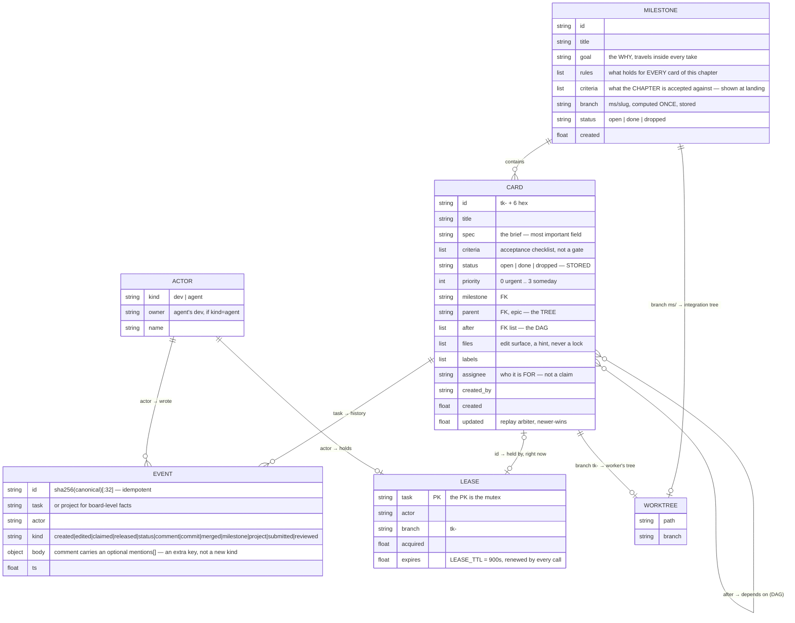
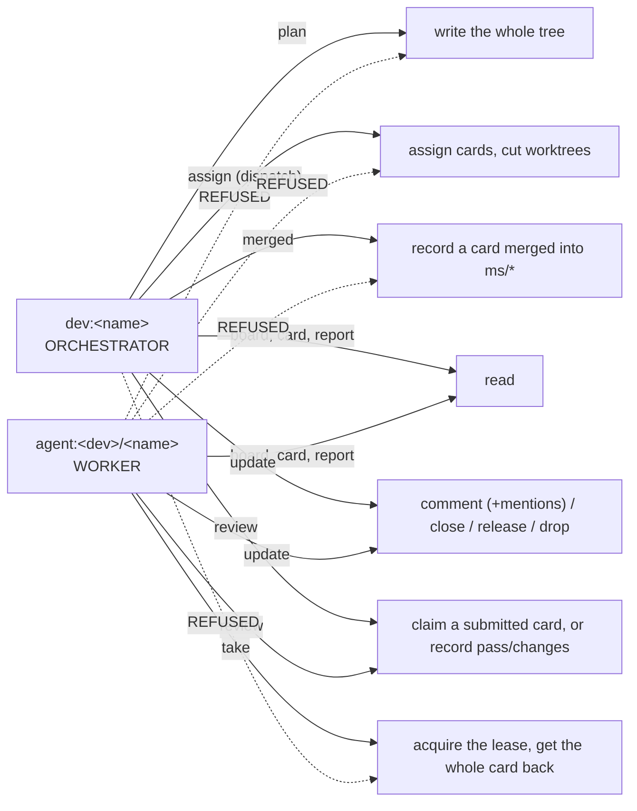
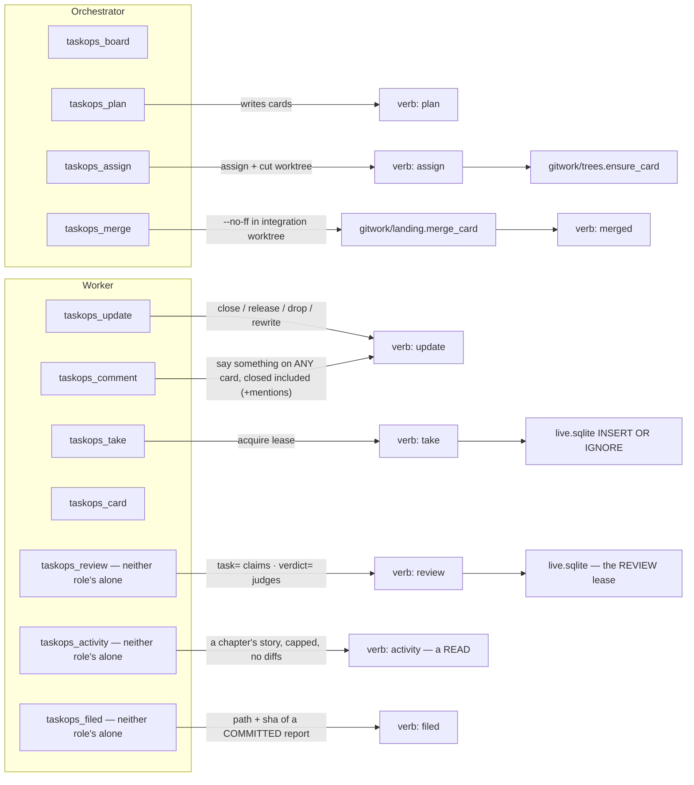
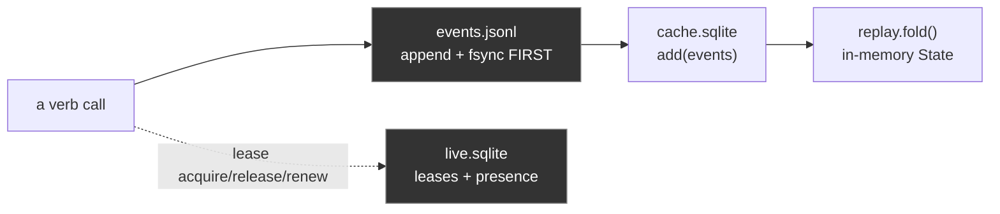

# taskops — architecture

Executive reference for the whole system: what exists, how the pieces relate,
what happens on the wire when an agent does something. Generated by reading
the actual source — `src/taskops`, plus the dashboard's own TypeScript source
under `ui/src` and `ui/smoke`, which §15 describes — and the tests (`uv run
pytest`). The size of both is a command rather than a number here, because the
number rotted twice (it said 97 Python files at 116, and 45 dashboard files at
66) while the command cannot:

```sh
find src/taskops -name '*.py' | wc -l            # …and | xargs cat | wc -l for lines
find ui/src ui/smoke \( -name '*.ts' -o -name '*.tsx' \) ! -name 'index.generated.ts' | wc -l
```

Every number below is meant to be re-derived, never trusted. This
file describes what is *built* — if it ever disagrees with the code, the code
is right and this is a bug.

Companions: [`README.md`](README.md) (install it, run it, serve the UI) ·
[`CLAUDE.md`](CLAUDE.md) (how to work in this repo).

The v1 post-mortem behind each rule is inline, in the docstring of the module
that carries it — that is on purpose: a design document nobody opens is how a
rule outlives its reason. §11 and §14 are the index of those reasons.

---

## 1. Executive summary

taskops v2 is a work board — milestones → cards → subtasks — for teams of
coding agents working in parallel under one human who decides what merges.
It replaces a v1 system (~340 files) that had, in production: cards
permanently stuck "in progress" after a worker died, races between two
machines both convinced they owned the same card, automatic merges that broke
checkouts out from under a working agent, and 35 CLI commands duplicating
what a smaller surface could do once.

Four decisions eliminate those failure classes **by construction**, not by
adding a command that reacts to them after the fact:

1. **Only three facts are ever stored** (`open`, `done`, `dropped`). Everything
   else a board can say about a card — `ready`, `doing`, `blocked`, `stalled`
   — is computed at read time from the dependency graph and from who
   currently holds a live lease. A worker that dies simply stops renewing its
   lease; its card falls out of `doing` with no sweep, no timeout job, and no
   verb that "fixes" it, because there is nothing written to be wrong.
2. **A branch is inhabited, not switched.** Every card gets its own git
   worktree, pinned to its own branch for its whole life. `git switch` does
   not appear anywhere in the codebase. Two agents on two different cards are
   two directory trees sharing nothing; git itself refuses a branch checked
   out in two worktrees at once, which is a lock nobody has to remember to
   take.
3. **Two roles, enforced once, in one table.** `verbs/__init__.py` declares
   for every verb whether it reads or writes and which role may call it. The
   HTTP router, the local board, the MCP tool layer and the tests all defer to
   this one table — v1 re-took the same decision by hand at 25 call sites and
   four of them disagreed.
4. **Context rides in the tool result, not in a hook that decides.** One
   delivery-only Claude hook exists; it reads and injects,
   never writes. What a worker needs to act — the milestone's goal, the full spec,
   the whole comment thread, file collisions with other live work, the
   previous worker's handover note, its own worktree path — comes back
   *in the response* to `taskops_take`, ordered so that what changes what you
   do before you start is above the spec, not after it.

Storage is an append-only event log (the only truth) plus two SQLite files
that are both derived and both disposable — except that leases are alive, not
derived, and live in a file the cache-rebuild path can never touch.

---

## 2. Entities and relationships



**Reading this diagram:** `CARD.status` is the *only* status a row ever
carries. `doing` is not a value anywhere in this schema — it exists only as
the join between `CARD.id` and a `LEASE` row that has not expired. Delete the
lease (or let it expire) and the card's displayed state changes with zero
writes to `CARD` itself.

---

## 3. Stored vs. derived state

```mermaid
stateDiagram-v2
    [*] --> open : taskops_plan
    open --> done : status=done (needs a commit, or no_code=true+note)
    open --> dropped : status=dropped (reason required)
    done --> open : status=open (reopen)

    state open {
        [*] --> ready
        ready --> doing : taskops_take (lease acquired)
        doing --> ready : lease expires (worker died) — NO event, NO writer
        doing --> stalled : lease expires AND assignee still set
        stalled --> doing : taskops_take (new holder)
        ready --> blocked : an `after` dependency is not closed
        blocked --> ready : that dependency closes — no event on THIS card

        doing --> review : status=review (card.review only) — `submitted`, history-only
        review --> reviewing : taskops_review task= (the REVIEW lease)
        reviewing --> review : that lease expires — NO event, NO writer
        reviewing --> changes : verdict=changes — `reviewed`, history-only
        changes --> doing : the worker picks it back up
        review --> review : status=review again (a new round; the old verdict is stale)
    }
```



Only the outer transitions (`open → done → dropped`, and back) are events in
the log. Everything inside the `open` box — `ready`, `doing`, `blocked`,
`stalled`, and the three optional review states — is
`core/graph.py:derived()`, computed fresh on every read from
`(card.status, card.after[], live leases, live REVIEW leases, standings)`.
`review`, `reviewing` and `changes` appear only on a card with `review: true`;
both new parameters default to "nothing under review", so a board that never
turns it on derives exactly as it did before the feature existed
(`tests/test_core.py::test_a_card_without_review_derives_exactly_as_before`). There is deliberately no path in
this diagram labelled "recover": nothing is ever wrong for a recover to fix.

One more fact is derived the same way and is about a *reader*, not a card: a
**pending mention** (`core/mentions.py`). Being named in a comment's optional
`mentions[]` is pending until that actor writes any event on the card, or the
card closes — computed from the thread on every read, so answering is what
clears it. There is no `read` column and no ack verb, for the same reason
there is no `recover`: both would be a write whose only job is to contradict
an earlier one.

A third one is about a *chapter*: its **reports** (`core/reports.py`). A report
is a file COMMITTED under `.taskops/reports/`, registered by the `filed` verb
with one history-only `report` event carrying `{path, title, milestone, sha}` —
a pointer, never the prose, the same rule that keeps diffs out of the log. "Which
reports does this chapter have" is `reports.of()` over those events on every
read, newest first, capped with `reports_total` beside it — never a table and
never a column on `Milestone`, because a stored list is a second fact somebody
has to keep in step with the events that produced it. `core/reports.py::under()`
is the ONE place that decides whether a path is a report path, and both ends ask
it: the verb that registers one, and the `/git` door that later serves its bytes
to the dashboard.

---

## 4. The six layers (imports only point down)

```mermaid
flowchart TB
    subgraph L0["0 · foundation (stdlib only)"]
        errors["_errors, _ids, _clock, _json, _locate, _version"]
        wire["_wire — one POST, one envelope: the decoder both clients share"]
    end
    subgraph L1["1 · core (PURE — no I/O)"]
        types["types — Card/Milestone/Event/Lease (re-exports KINDS and the actor grammar)"]
        kindsm["kinds — the event-kind registry: replayed? required body keys"]
        actors["actors — presence, folded from events"]
        event["event — construct + hash"]
        replay["replay — fold(events) → State"]
        chapters["chapters — the milestone half of the fold: create/status/landed/edit"]
        machine["machine — transition guards"]
        graph["graph — ready/blocked/doing/stalled"]
        scope["scope — the SERVER-scope roles: owner | member | anon"]
        challenge["challenge — the login nonce: in memory, single-use, dead on claim"]
        mentionsm["mentions — who was named and has not answered"]
        reviewm["review — submitted/reviewed folded into a Standing"]
        reportsm["reports — is this a report PATH, and the chapter's list as a fold"]
        holdingm["holding — 'is this history held here?', by event id: board pull + board rm"]
        forgem["forge — the forge vocabulary: which host can be asked, what access counts, owner/name"]
        seamsm["seams — which ready cards name the same CONCEPT, from the specs alone"]
        hours["hours — working-time math, and the calendar windows to report it over"]
    end
    subgraph L2["2 · store (the ONLY SQL)"]
        log["log.jsonl — append + fsync"]
        cache["cache.sqlite — derived, disposable"]
        live["live.sqlite — leases + presence, NEVER disposable"]
        reviewsdb["reviews — the REVIEW lease, a second mutex in live.sqlite"]
        creds["creds — invite tokens, per board"]
        serverdb["server.sqlite — the HOST's principals + pubkeys, and allowed_signers derived from them"]
        pubkeysm["pubkeys — the ssh key grammar: parse, fingerprint, name"]
        stores["stores.py — journal → index → fold, in that order"]
    end
    subgraph L3["3 · verbs (+ the REGISTRY)"]
        plan["plan"]; take["take"]; update["update"]; card["card"]
        assign["assign"]; pulse["pulse — the board"]; record["record"]; report["report"]
        mentionsv["_mentions — the ✉ read"]; waitingv["_waiting — the ◆ read"]; eventsv["events — the log, paged"]
        reviewv["review — claim a submitted card, or record the verdict"]
        projectv["project — board-level facts: op=remote, op=visibility, op=forge"]
        helpersv["_args _cards _chapter _context _facts _rows _stories _windows — the helpers; the _ says 'not a verb'; _windows owns what a window= spelling MEANS"]
        registry["__init__ — Verb(fn, kind, roles, refusal)"]
    end
    subgraph L4["4 · board.py + gitwork (the ONLY git, client-side)"]
        board["board.py — LocalBoard | RemoteBoard, routing decided ONCE"]
        run["gitwork/run"]; trees["gitwork/trees — worktrees: the GEOMETRY"]
        landing["gitwork/landing — the MERGES: card→chapter, chapter→trunk"]
        catchup["gitwork/catchup — one worktree, up to date with a branch; the chapter's declared union_files fold, everything else still aborts"]
        trailer["gitwork/trailer"]; bind["gitwork/bind"]
        install["gitwork/install — what GIT needs: hooks, gitignore, the address"]
        claudef["gitwork/claudefiles — what CLAUDE reads: .mcp.json, settings.json"]
        remote["gitwork/remote — origin: {host, slug, url}, and best-effort push"]
        diff["gitwork/diff — the walls and the range arithmetic"]
        patchm["gitwork/patch — a resolved range → text and numbers"]
        sigm["gitwork/sig — SSHSIG: ssh-keygen -Y sign / -Y verify"]
        sessionm["session.py — the token's life: mint, refresh, remember"]
        identitym["identity.py — WHO signs in, with WHICH key: discover, establish"]
    end
    subgraph L5["5 · transports"]
        mcpsrv["mcp/server, hello, tools, gitmoves (assign + merge dispatch), integrate (a CARD lands), chapter (a MILESTONE lands: gate, catch-up, record), dossier, before, render, brief, activity, boardview, schema, orders, thread, boards, fields"]
        httpsrv["http/server (lifecycle), handler (one method per door), mounts, watcher, rpc, admin, scoped, grants, ingest, removal, auth, login, members (the owner's enrol BATCH), feed, static, gitdoor, upstream"]
    end
    subgraph L6["6 · cli"]
        cli["commands: init · join --key/--invite   ·   enrol: the invite introduction   ·   github + team: the OWNER's forge sync, and WHERE a GitHub token may come from   ·   hooks: what the two git hooks call   ·   watch: join with nothing   ·   serving: serve · ui   ·   remote: remote add — which host, which board   ·   operate: board · board visibility · board forge   ·   grants: invite · revoke   ·   push: board push   ·   pull: board pull — the same five steps backwards, over paging: the whole log through the `events` verb   ·   rm: board rm — the guardrail   ·   admin: server init + break-glass"]
    end

    L1 --> L0
    L2 --> L1
    L3 --> L2
    L4 --> L3
    L5 --> L4
    L6 --> L5
```

`tests/test_architecture.py` enforces this by reading the AST of every module:
imports only point down, `subprocess` appears only in `gitwork/run.py`, `sqlite3`
only under `store/`, the wall clock only in `_clock.py` and `core/hours.py`
(the one module whose whole subject is time), and every module stays
under 200 lines — a budget that forces a split to land on a cohesive boundary
instead of an arbitrary one.

**A leading `_` marks plumbing for the layer above, and it is a three-zone
convention**: the package root (`_errors _ids _clock _json _locate _version
_wire` are level 0; `board.py`, `session.py` and `identity.py` are that layer's
doors), and `verbs/` (`_args _cards _chapter _context _facts _mentions _rows
_stories _waiting _windows` are helpers — the un-prefixed files are the registry's entries, one per verb).
Nowhere else carries it, because every module under `core/ store/ gitwork/
http/ mcp/ cli/` is internal to its layer and there is nothing to distinguish;
`import taskops` exposes five errors and a version, so module names are a
contract with nobody. This is NOT anthropic-sdk-python's convention, where `_`
marks the half of a *library* users must not import — taskops has no such half,
and renaming a package to `_core/` to resemble one would be cargo cult.

**Zero headroom is a finding, not a pass** (audited 2026-08-09). The budget test
is `<= 200`, and it was green with SIX modules at exactly 200 and fifteen within
ten lines — a seventh of the package that could not accept one line, so the next
card to touch any of them would have had to split it *under pressure*, which is
the one condition under which a split lands somewhere arbitrary. Eight modules
were split in cold blood instead, each at a seam that already existed:
`verbs/pulse → _rows`, `session → identity`, `http/server → handler`,
`gitwork/trees → landing`, `gitwork/install → claudefiles`, `gitwork/diff →
patch`, `core/replay → chapters`, `verbs/plan → _cards`. The cap is now 196 and
nothing sits on the line. Re-derive it rather than trusting this paragraph:

```sh
find src/taskops -name '*.py' -exec wc -l {} + | awk '$2!="total" && $1>=190' | sort -rn
```

---

## 5. Actors and permissions



The rule lives once, as data, in `verbs/__init__.py::REGISTRY`:

| verb | kind | role | if the wrong role calls it |
|---|---|---|---|
| `board` | read | both + **anon** | — |
| `mentions` | read | both + **anon** | — (a delivery-hook read: one of the two that renew no lease; for `anon` it is empty by construction) |
| `waiting` | read | `dev` | *"these are the orchestrator's moves, not yours. Your own picture: `taskops_board`"* — the other non-renewing read: MERGE / REVIEW / STALLED for the delivery hook |
| `card` | read | both + **anon** | — |
| `report` | read | both + **anon** | — |
| `events` | read | both + **anon** | — (the LOG, one keyset page at a time, newest first; board-wide by construction — see `verbs/events.py`) |
| `plan` | write | `dev` | *"workers do not plan the board. Report what you found instead: `taskops_comment task=<yours> text="…"`"* |
| `assign` | write | `dev` | *"dispatching is the orchestrator's move. Take what is yours: `taskops_take`"* |
| `merged` | write | `dev` | *"workers do not integrate branches. Close your card and the orchestrator merges it"* |
| `take` | write | `agent` | *"you are the orchestrator — you dispatch, you do not hold cards"* |
| `update` | write | both | — |
| `review` | write | both | — (optional review: claim a submitted card, or record the verdict. A verifier is an ordinary agent — there is no reviewer role) |
| `bind` | write | both | (internal — the git hooks call it) |
| `project` | write | both | (internal — board-level facts: `op=remote`, where the repo lives on the web; `op=visibility`, public or private; and `op=forge`, the repo whose membership opens the board — absent by default, and `core/forge.py` owns its shape) |

**A PUBLIC board: anyone may watch, nobody writes without a key** (2026-08-09).
GitHub's model, deliberately and exactly — private by default, the owner may
publish (`taskops board visibility <host>/<name> public|private`, an owner-only
server-scope operation), public means ANONYMOUS READ, and a write always needs a
registered key. **No third state and no anonymous-write grace.**

`board.forge` is that same shape one notch sharper — owner-only, one board, a
value from a closed set — because it decides whose GitHub membership becomes a
key here. Both are `verbs/project.py` facts reached through `http/admin.py`'s
REGISTRY, and neither has a `get` half: the board payload already answers.

The flag is a project-level EVENT beside `remote`, folded newest-wins, so "when
did this become public and who did it" is in the log; absent, a board is private,
which is why no board that predates the feature changed. It is derived onto the
`board` payload, and `_context.py::pulse` echoes the actor the server resolved —
so a reader can be told it is anonymous BEFORE it types, which is what the
dashboard's comment box does instead of offering a form that always 409s.

**The whole difficulty was that a read writes.** Every read verb opens with
`stores.live.renew(actor, now)`, which UPDATEs the leases that actor holds and
INSERTs a presence row: a public board without a guard would have every visitor
writing to `live.sqlite` on every page load — no event, no card, nothing any
screen would show. The guard is in `store/live.py::renew`, the ONE place that
writes, and not at the six callers, for the reason this file's §4 exists: a
seventh read verb gets written next month by somebody who never read the rule.
`tests/test_topology.py` hashes `events.jsonl`, `live.sqlite` and its `-wal`
before and after a full anonymous crawl — every read verb, twice, plus `/feed` —
and asserts they are byte-identical. `cache.sqlite` is excluded on purpose: it is
derived and disposable, and deleting it rebuilds it.

`/feed` opens for anon on a public board and that is not a relaxation: a message
there is `{"type": "change", "verb", "seq"}` and NOTHING else, so a watcher
learns only that the board moved and answers by re-reading through `/rpc`, where
the gate applies again in full. The day a message carries a card, that door
closes with it (`http/feed.py` carries the argument).

Anonymous is refused a write TWICE — `http/auth.py::anonymous` never hands out a
credential for one, and the registry refuses the role — and over a socket each
guard silently answered for the other: deleting either left the suite green.
Both are now asserted against their own function
(`test_each_of_the_two_write_walls_stands_on_its_own`). Anonymous may also not
CLAIM to be somebody: `actor` travels in the call, so `authorize` refuses an
`anon` credential naming any other actor.

`taskops join <url>` with no invite against a public board is a READ-ONLY join
(`cli/watch.py`): the board is ASKED rather than assumed, config is written with
`readonly: true` — recorded and not inferred from an empty token, because that is
also what a BROKEN join leaves — nothing is minted, no key is registered, and
`gitwork/remote.py::remember` is deliberately NOT called, since recording this
repo's origin would be the anonymous write the rule forbids. `taskops ui` then
serves the viewer's window: an `Upstream` with no bearer, which is exactly what
`Mounts.public` reads to let the local browser in while the REMOTE decides.

**Server scope is a SECOND registry, in the same shape** (`core/scope.py`,
added 2026-08-09). `verbs/__init__.py` answers *what may you do on a board*;
`scope.py` answers *what may you do to the HOST* — create a board, list them,
register a key, mint an invite. Three roles and no fourth: `owner` (the
principal that bootstrapped this host), `member` (a registered key that is not
the owner), `anon` (no credential — reads a public board, writes nothing).
GitHub's model, deliberately. `scope.permit(operation, role)` is the one gate
and its refusal names the role that may **and how a key gets registered**.

**No board comes into existence by accident** (the hole closed on 2026-08-09,
found the day before). `http/mounts.py::stores()` used to do
`Stores(self.root / name)` for any name matching the pattern, and `Stores`
makes its own directory — while `http/server.py` calls `mounts.check(board)`
BEFORE `self._credential(...)`. So an anonymous request for a name nobody had
ever used left a board directory with a cache and a lease file on the server's
disk: a write caused by a stranger's question. `stores()` now only OPENS; an
unknown board is 404 with no side effect
(`tests/test_topology.py::test_an_unknown_board_is_404_and_leaves_nothing_on_disk`),
and creation is `Mounts.create()`, reached only through the owner-only
`board.create` operation.

**The one ssh in the design.** `taskops server init --root <dir> --key
<path.pub>` (`cli/admin.py`) writes the first principal as owner and is meant
to be run on the host itself. Trust has to enter through a channel that
predates the system, and the machine's own shell is that channel: a remote
bootstrap would need a credential this host does not have yet. Every admin act
after it is a signed call over the API. The `allowed_signers` file beside
`server.sqlite` is DERIVED — regenerated whole from the store on every change,
never hand-edited, never read back into the store — the same relationship
`cache.sqlite` has to `events.jsonl`. Bearer tokens (`store/creds.py`, per
board) are untouched: keys are how tokens come to be MINTED.

**A key authenticates a LOGIN; the login mints a SESSION** (`http/login.py`,
`core/challenge.py`, `gitwork/sig.py`, `session.py` — 2026-08-09). `POST /login`
answers a random, single-use, in-memory nonce; the client signs it with
`ssh-keygen -Y sign -n taskops`; the server runs `ssh-keygen -Y verify -f
<root>/allowed_signers -I <principal>` and, if OpenSSH says yes, mints an
ordinary bearer credential with a 12-hour TTL. **Every downstream path is
UNTOUCHED** — /rpc's bearer check, /feed, the MCP board all see the token they
always saw. That is why the session model beat per-request signing: a signature
envelope would have to be taught to the stdlib HTTP server, to the WebSocket
handshake and to the MCP layer, three times. Exactly one thing changed: where
tokens come from.

The signed payload is a SERVER-ISSUED CHALLENGE and not a client timestamp, so
there is no clock-skew window to pick and no replay cache to size — the nonce
dies on the claim (`core/challenge.py` carries the argument, and why it is
memory and never a table: a challenge that outlived its process would be a
stored fact whose only job is to be contradicted, which is `recover`'s shape).
The subprocess runs through `gitwork/run.py::tool`, the ONE module allowed to
start a process, and `tests/test_architecture.py` still enforces exactly that.
ZERO pip dependencies, no hand-rolled crypto.

**The host is OPERATED from `taskops`, over its own API** (`http/admin.py`,
`cli/operate.py` — 2026-08-09, the anomaly this chapter exists to kill). Five
acts that used to be an ssh session on the box are now signed calls from the
laptop:

```sh
taskops remote add <url>                the host, once per checkout — git's origin
taskops board create [<name>]           owner only — THE way a board comes to exist
taskops board ls [<host>]               owner: all of them; member: their own
taskops board push [<name>]             a LOCAL board becomes the hosted one
taskops board pull [<name>]             and back down: a SNAPSHOT here, the host untouched
taskops board visibility [<name>] public|private     owner only
taskops board rm [<name>] [--discard-history]        owner only — the only one that DESTROYS
taskops board forge [<name>] <owner>/<repo> [--need push|admin]   owner only
taskops board forge --clear             back to invite-only — opting in is reversible
taskops invite <who> --board <name>     owner only — prints the join line
taskops revoke --key SHA256:… | --invite <id>
```

**And they read like git: host once, key discovered, verbs bare**
(`cli/remote.py`, 2026-08-09 — the human's words: «esto debería ser como git …
pero sin --key»). Git asks for neither a URL nor an identity file on every push,
and both reasons are copied rather than invented. The ADDRESS is recorded per
checkout — `taskops remote add <url>` writes `login.host` into
`.taskops/remote.json`, the uncommitted per-machine file a `join --key` already
cached the same field into, which is git's `.git/config` and NOT the host alias
registry §11 refuses: what was refused is a TABLE, many names and global; this
is ONE host, in the file that already holds it, acquired by an explicit command
instead of only as a side effect of a join the owner on day one cannot run.
`board create` records the NAME it chose in the same block, so the bare `board
push` after `board create minombre` does not re-derive the directory and make
the human repeat a name — precedence is explicit argument > recorded name >
directory (`gh repo create`'s convention). The block is merged FIELD BY FIELD
(`_locate.py::write_remote`) because three writers own three of its fields and a
whole-block update would let a sign-in silently drop the recorded name. The KEY
is DISCOVERED the way ssh discovers one — `~/.ssh/id_ed25519`, `id_ecdsa`,
`id_rsa`, ssh's own files in ssh's own order, in ONE function
(`identity.py::discover_key`) that `establish` consumes so no verb guesses for
itself; `--key` stays as the override, exactly as `ssh -i` is, and the refusal
when none exists lists what it tried. Recording an address is not signing in:
`remote add` mints nothing and touches no key. Creating a board on a DIFFERENT
host from inside a joined checkout records nothing here — the same rule
`session.is_own_host` holds the token to, and the suite caught the first version
without it.

**A key is accepted by every one of them, and that is what
makes the FIRST one runnable** (`identity.py::establish`, 2026-08-09 — found by
running the chapter end to end on a clean host, not by a test). Without it the
owner of a new box was deadlocked: `operate.call` only knew the session a
previous `join --key` had cached, the invite that `join` wants is minted by
`taskops invite`, which wanted a session of its own, for a board nobody had
created yet — so day one on every host fell back to ssh, the exact anomaly this
chapter exists to kill. `establish` is `push.py`'s already-working key-to-session
logic, lifted so both consume ONE implementation; `--as <principal>` overrides
the `$USER` guess (a machine whose unix user is not the principal's name could
not sign in at all before it); the login block is cached once the host accepts
the signature, so the second command needs no flags; and the refusal names
`--key` beside `join`. On `revoke` the signing key is `--sign-key`, because
there `--key` is already the fingerprint being retired. The four scenarios go
through the real `main()` and argv in `tests/test_topology.py` — the wiring was
what was broken, and calling the functions is what hid it.

They are SERVER-SCOPE verbs in a registry of their own, gated by
`scope.permit`, authenticated by the session an ssh key mints, and they answer
on the **root `/rpc`** — one segment, because `admin` is a legal board name and
`/admin/rpc` would be that board's own door character for character. The
envelope is the board rpc's, so `_wire.py` is the client for both.
`board.create` refuses an existing name (`Mounts.create` is
`mkdir(exist_ok=True)`, so without the refusal it would hand somebody else's
history back as new) and writes WHO made it as the board's first project-level
event — the one fact no later event could reconstruct. A member's "their own
boards" is DERIVED from the credentials they hold, never a membership table.

**The scp dies: `taskops board push` promotes a local board** (`cli/push.py`,
`http/ingest.py` — 2026-08-09). Moving a board used to be a README paragraph
naming `events.jsonl` and a shell on the box — storage leaking into UX, with no
count and no verification. It is now one command, and **the ORDER is the
safety, with the config flipping LAST**: (1) the target must exist and hold no
history but its own beginning, (2) no live lease here, (3) the whole log is
streamed through the server-scope `board.ingest`, (4) the counts are compared,
per event KIND and not just a total, and a mismatch is a STOP, (5) only then
`board.json`/`remote.json`, with `.taskops/board/` renamed to
`board.local-<date>/` rather than deleted. A failure at any point above leaves
the repo exactly as it was.

Three decisions inside it, each pinned in `tests/test_topology.py`:

* **No force flag, and there must never be one.** A non-empty target means two
  histories, and giving them an order they never had is fabricating a timeline;
  the refusal says exactly that instead of offering a way.
* **The ingest verb is not a sync channel and cannot become one.** Its
  precondition is true exactly once in a board's life. "Empty" is not `seq == 0`
  but **"no history but its own configuration"** — `board.create` writes WHO
  made the board as its first event, and setting the visibility or recording a
  remote — or naming the forge that opens it — before the board is filled is a
  fact about the CONTAINER, not about the work. So the door exempts project
  events whose `op` is in the CLOSED list
  `{created, visibility, remote, forge}` — and only while the board holds ZERO card
  events; one event about work and the exemption narrows back to the birth
  certificate (`ingest.py::_configuration`, whose docstring is the 2026-08-09
  reproduction: this repo's own board was created and made public before it was
  pushed, and the wall refused a push with nothing to merge). It
  appends through the store path replay already trusts and does NOT re-judge:
  events were validated by the verbs that made them, so the door checks the
  HASH and moves them. Retry is free by construction — ids are `sha256` of the
  content, so an interrupted push re-runs to a no-op and continues, which is
  why the whole history travels in ONE call (the set comparison that separates
  a retry from a stranger's board is only decidable with all of it in hand).
  The payload is deduplicated against ITSELF as well: `Stores.write` appends
  everything it is handed to the log while the cache ignores a repeated id, so
  a payload naming one line twice would put two lines in the truth and one row
  in the index.
* **Leases and presence do not travel.** `live.sqlite` is a fact about running
  processes, none of which will run against the new host; the board starts with
  nobody working, which is true. A held lease refuses the push rather than being
  copied.

And **`taskops join` refuses to orphan a local board** (`cli/commands.py`, the
same day). Joining a repo whose `.taskops/board/` held events simply started
reading the remote one: the history stayed on disk, byte for byte, and nothing
ever looked at it again or said so. It is now a STOP naming both ways out —
`taskops board push` to take it along, or `--discard-local` to archive (never
delete) and join anyway. It counts EVENTS, not the directory, so the ordinary
`init` → `join` sequence is untouched.

**A dev's join carries nothing about GitHub, and did for one day** (deleted
2026-08-11, §19.1). `taskops join --github` posted the joiner's own GitHub token
for the host to verify against the declared repo; it was the `--invite` path with
a different proof, and it was the right shape for the wrong side. The owner's
`board forge` already knows the team, so the fact is established once, on their
laptop, and a dev whose key that sync published joins BARE: `taskops join`, the
address carried by the clone, the key discovered the way ssh discovers one, the
challenge signed on the spot. Nothing of theirs travels — which is stronger than
never storing what did. **A GitHub token is never a flag value** survives the
flag it was written for and now lives beside the only caller left
(`cli/github.py::token`, §19.1): `gh auth token`, else `$GITHUB_TOKEN`, else a
HIDDEN `getpass` prompt, because a secret passed as an argument is in the shell's
history file before the process starts and in `ps` while it runs.

**The on-box commands survive as break-glass**: `taskops invite/revoke --root
<dir>` still work against the files, on the machine that holds them, for the day
the server is down or the owner's key is lost. Not deprecated — a system whose
only door is its own API cannot be repaired when that API is what broke. And
there is deliberately **no `taskops host add`**: the host is already recorded per
project by the join that registered the key (`remote.json`'s `login.host`), so an
alias table would be a third place a server's address lives and the first to
drift.

The client half is `session.py`: `board.py::open_board` refreshes an absent or
expiring session before it hands a board back, and `RemoteBoard.call` retries
ONCE when the server says a credential expired — because the MCP server opens a
board once and keeps it for a session longer than the token. A config with no
`login` block, and a token with no expiry, are never touched: that is the shape
production's four boards are in. One limit, stated and not solved: `-Y sign`
needs the private key FILE, so an agent-only setup is refused in one sentence
naming the limit rather than taught the ssh-agent protocol.

    POST /login {"principal": "berna"}                        -> nonce, expires
    POST /login {"principal", "nonce", "signature"}           -> token, expires, role

Every refusal names the call that works. `core/actors.py::role_of` (re-exported
by `core/types.py`, so `types` stays the one name a caller imports) is the
*only* actor parser in the codebase (v1 had five, plus an inference step that
let an actor-less sub-agent silently resolve to the human).

**Identity is resolved per CALL, not per process** (2026-08-07). Every MCP
tool accepts `actor=`, and `board.py::_who` lets it win over the board's own
identity (`TASKOPS_ACTOR` at MCP-server start, else the credential's
subject). The reason is the host, not taste: one MCP server runs per session
and every sub-agent shares it, so the `export` in a worker's brief never
reaches the process that speaks MCP — without a per-call actor, every worker
spoke as the orchestrator and `take` was unreachable. On a remote board
`http/auth.py::authorize` judges the override: a credential may act as
itself, and a dev's credential as that dev's own agents — nobody else's.

---

## 6. The eleven MCP tools (not the same as the sixteen verbs)

A tool is what an agent should think in one move; a verb is one write on the
board. The mapping is deliberately not 1:1 in either direction:
`taskops_assign` alone is two verb calls (`assign`, then per-card worktree
creation) collapsed into one tool; `taskops_merge` runs git in the *caller's*
filesystem before recording the result as a verb (v1's `recover` ran git on
the *server* and reported paths from a machine that was never the caller's);
`taskops_review` is the verifier's ONE door — `task=` claims the review lease
and returns the whole dossier, `verdict=` judges — because a `review=true` flag
on `taskops_take` was built and then deleted:
two tool surfaces over one verb is the duplicate-channel shape that broke v1,
and `take` holds the WORK lease and nothing else; and
`taskops_update` + `taskops_comment` are two tools over the ONE `update`
verb — one write path underneath, because v1 split closing across six modules
and forgot to record it in one of them, but two moves on top, because saying
something is not changing something.

`taskops_activity` and `taskops_filed` are the reports chapter's pair, and the
count of tools is asserted in `tests/test_mcp.py` so this sentence cannot rot.
**`taskops_activity` is `taskops_card` for a whole chapter**: the header once,
then a story per card — state, standing, commits with their numstat,
`merged_into`, the released note, the seconds. It is the one read with a
declared PAYLOAD BUDGET (`verbs/activity.py` carries the measurement): 76 cards
at the default `depth=headline` come back under ~100KB, which is paid for by
dropping the two unbounded prose fields — the spec and the thread — and sending
`thread_total` instead. `depth=full` asks for them. No diffs and no patch text,
ever: `branch` and the shas are the pointers a reader follows into its own
clone, exactly as the log stores a report's path and not its bytes.
**`taskops_filed`** is the write half of that same rule (§2's reports), and the
reason it exists as a tool at all: without it an agent can commit a narration
and has no way to put it on the board.



---

## 7. Storage and the write path



* `events.jsonl` is the truth. Event ids are `sha256(canonical)[:32]`, so a
  replayed write is a no-op — the log is idempotent by construction.
* `cache.sqlite` is disposable: delete it, `Stores._bootstrap()` replays the
  log and rebuilds it on next open.
* `live.sqlite` is **not** disposable and lives in its own file on purpose —
  a cache rebuild must never be able to drop a live claim (v1 kept both kinds
  of state in one database).
* The write order is fixed: journal → index → fold. A crash between the first
  two costs a rebuild (automatic); the reverse order would cost the events
  themselves.
* Replay sorts strictly by `ts` with Python's *stable* sort, so events sharing
  a timestamp keep arrival order — sorting by `(ts, id)` was tried and broke
  a `claimed`/`released` pair under a frozen test clock.

---

## 8. Sequence — a card's whole life

```mermaid
sequenceDiagram
    actor Dev as dev:berna (orchestrator)
    actor W1 as agent:berna/w1 (worker)
    participant Board as taskops board (MCP/HTTP)
    participant Git as git (worktrees)

    Dev->>Board: taskops_plan (milestone + cards + deps)
    Board-->>Dev: cards created, status=open

    Dev->>Board: taskops_assign tasks=[tk-a1]
    Board->>Git: ensure_card() — new worktree, branch tk-a1
    Board-->>Dev: paste-ready brief for tk-a1
    Dev->>W1: spawn worker with the brief

    W1->>Board: taskops_take task=tk-a1 actor=agent:berna/w1
    Note over W1,Board: actor= on the CALL — the sub-agent shares the session's MCP server
    Board->>Board: live.acquire() — INSERT OR IGNORE (the mutex)
    Board-->>W1: whole card: spec, criteria, thread, collisions, worktree path
    Note over W1: card is now `doing` — DERIVED, no row written

    W1->>Git: commits in its worktree (branch tk-a1)
    Git->>Board: post-commit hook → bind.record() (sha, subject, files, numstat +/- per file)

    W1->>Board: taskops_update task=tk-a1 status=done note="…"
    Board->>Board: check_transition — refuses if 0 commits and no_code≠true
    Board-->>W1: ok
    Note over W1: card is now `done` — assignee cleared, lease irrelevant

    Dev->>Board: taskops_board
    Board-->>Dev: group MERGE: [tk-a1]
    Dev->>Board: taskops_merge task=tk-a1  (or tasks=[tk-a1, tk-b2] / done=true — the same path per card, in order, stopping at the first failure)
    Board->>Git: trees.behind() — if tk-a1 lacks the ms/* head, catchup.catch_up() merges ms/* IN tk-a1's own worktree, with the chapter's union_files (from the dossier already loaded) applied as merge=union through an EPHEMERAL core.attributesFile outside the repo (dirty or missing: refused, untouched; conflict in anything undeclared: aborted clean, git's files + the count)
    Board->>Git: merge_card() --no-ff into ms/<milestone>, in the integration worktree
    Git-->>Board: sha (or refused, conflict files named, ms/* untouched)
    Board-->>Dev: merged

    Note over Dev: the HUMAN decides how ms/<milestone> reaches main: a PR, or taskops_merge milestone= once every card is closed and integrated
    Dev->>Board: taskops_merge milestone=ms-x criteria_met=true
    Board->>Board: the GATE first — open work, then the chapter's criteria (no answer, no git)
    Board->>Git: trees.behind_trunk() — if ms/* lacks base_ref's head, the SAME catchup.catch_up() merges the trunk IN the integration worktree (dirty or missing: untouched, today's path; conflict: aborted clean, git's files + the count)
    Board->>Git: land_milestone() --no-ff into the trunk, in the shared checkout
```

## 9. Sequence — the case v2 exists to remove

```mermaid
sequenceDiagram
    actor W1 as agent:berna/w1
    participant Live as live.sqlite
    participant Board as taskops board

    W1->>Board: taskops_take task=tk-a1
    Board->>Live: acquire(tk-a1, w1, ttl=900s)
    Note over W1: w1's process crashes. Nothing else happens.
    Note over Live: no DELETE runs, no sweep, no cron — the row just sits there, unexpired

    rect rgb(40,40,40)
    Note over Live: 900 seconds pass
    end

    actor Dev as dev:berna
    Dev->>Board: taskops_board
    Board->>Live: held(now) — the row for tk-a1 has expires <= now
    Board-->>Dev: tk-a1 is NOT in `doing`. It is in `stalled` (assignee=w1, quiet_for≥900s)
    Note over Dev: no verb named "recover" exists to call

    Dev->>Board: taskops_assign tasks=[tk-a1]   (hand it to a new worker)
    actor W2 as agent:berna/w2
    W2->>Board: taskops_take task=tk-a1
    Board->>Live: acquire() — old row past its expiry, new INSERT succeeds
    Board-->>W2: the card, plus w1's handover note if it left one
```



Nothing here is a repair. `stalled` was always going to be the answer the
moment `expires <= now`; `taskops_assign` is the same verb used for a card
nobody has touched yet.

---

## 10. Protocols

| transport | who uses it | shape |
|---|---|---|
| **MCP over stdio** | Claude / any MCP host, per-repo | newline-delimited JSON-RPC 2.0. `initialize` returns `instructions`: the whole role protocol AND the board as of that moment (`mcp/hello.py` — the same verb and renderer an agent would call, so it is a delivered answer, not a second version of one). That is what a v1 system prompt was, minus the second place for truth to live, and it needs no hook and no settings file to be trusted. **One server per SESSION, shared by every sub-agent**, which is why identity rides on the call (`actor=`, §5) and not in the process's environment. `tools/call` on a refusal answers `isError: true` with the refusal *as the text content* — never a protocol-level error, because an agent that cannot read the way out will invent one; an unexpected exception answers the same way rather than ending the loop, since that loop is the session's only door to the board. |
| **HTTP RPC** | a remote board's clients (`RemoteBoard`, the browser) | `POST /<board>/rpc` with `{"verb", "args", "actor"}`, `Authorization: Bearer <token>`. Answer is always an envelope: `{"ok": true, "seq": N, "data": {...}}` or `{"ok": false, "error": {"code", "message"}}` — v1 let three verbs answer with a bare array and the decoder silently turned it into `{}`. |
| **GitHub, from the OWNER's laptop** | `taskops board forge <owner>/<repo>`, and nothing else in the system | two GETs, neither of them at a taskops door: `GET /repos/{owner}/{name}/collaborators?permission=<need>` (paginated, the owner's own token in the `Authorization` header — the only authenticated call in the chapter) and `GET https://github.com/<login>.keys` (PUBLIC, `text/plain`, no credential spent). What reaches the host afterwards is `members.enroll` over the ordinary `/rpc`, carrying principals and ssh key lines: **no GitHub token ever crosses to a taskops host, and none is stored on either side** — it is a header on the owner's outgoing requests and dies with the command. A board that declared no forge is not asked about at all, so it stays invite-only exactly as before. There was a door here for one day — a dev POSTing their own token to `/<board>/join/github` — and §19.1 is why it is gone (`cli/github.py`, `cli/team.py`, `http/members.py`, and the tail block in `tests/test_topology.py`). |
| **WebSocket feed** | the browser UI only | `GET /<board>/feed`, upgraded via the RFC 6455 handshake (`HTTP/1.1` required for the 101 response to be accepted — the one bug class invisible to a library-based test, caught only with a raw-socket test). A message is a *signal* (`{"type": "changed"}`), never a payload — the client refetches, so a dropped or duplicated frame can never show something the board never said. SSE is the automatic fallback for a proxy that eats the Upgrade. Agents never use this: their live channel is the "pulse" line appended to every tool result. The UI carries exactly ONE write — a comment box with a mention picker on the card panel, through the same `/rpc` door and token. |
| **Delivery hook** | Claude Code sessions in a joined repo | `taskops hook claude`, wired by `init`/`join` into `.claude/settings.json` on `PostToolUse` + `UserPromptSubmit`. Read-only and one-way: resolves the reader (env, else worktree-path → card → holder) and injects context — `✉ …` when a mention is pending, for ANYBODY (throttled per reader per 30s); and `◆ …`, one line per group with the count and the call that clears it, when MERGE / REVIEW / STALLED is non-empty and the reader is a `dev:` (throttled per 180s, its own key). Silence otherwise, exit 0 always, any failure silent. Both reads (`mentions`, `waiting`) renew no lease. The one sanctioned Claude hook: it may deliver, never decide, store, or write. |

---

## 11. What is NOT here, on purpose

| removed / never built | why | where it's enforced |
|---|---|---|
| a `recover` verb | doing is derived from the live lease; nothing is ever wrong to recover. Handing a card on is not that verb and never grew into one — it stayed inside `assign`, needs a named replacement, and is argued in §12 | no entry in `verbs/__init__.py::REGISTRY`; `tests/test_verbs.py::test_a_dead_workers_card_comes_back_by_itself` |
| a reviewer ROLE, a stored review STATUS, automatic reviewer assignment | v1's review system: `peer` deadlocks, 14 closing rules over 6 modules, reviewers eating the budget of the work | review EXISTS since 2026-08-07 but narrowed: optional per card, derived from history-only events + a second lease, judged by an ordinary agent that may never judge its own work. `CARD_STATUSES` stays three; there is no reviewer role and nothing auto-assigns |
| AUTOMATIC merges to the trunk | v1's `land` merged as a side effect of closing a card and ran checkout under working agents | a CARD cannot be merged to the trunk — `taskops_merge task=` takes no target. A finished MILESTONE lands via `taskops_merge milestone=` (2026-08-07): explicit, refused while any card is open or unintegrated, refused off-trunk, recorded as a `milestone landed` event. What stays impossible is the trunk moving as a side effect of anything |
| git replication between clones | split-brain, two machines "owning" the same card | `RemoteBoard` never falls back to a local store on write failure (`Unreachable` instead). Narrowed on 2026-08-31, not lifted: the host became the board's git REMOTE (§16, "The host becomes the remote") — a hub, one direction on each leg (worktree → host, host → forge). What stays banned is BETWEEN clones: no clone pushes to another clone, and the host never pulls git from the forge |
| Claude hooks **that decide or store** | latency, another thing to install and drift; v1's held state and gated actions | context travels in `initialize.instructions` + tool responses. The ONE exception, sanctioned 2026-08-06: `taskops hook claude`, delivery-only — it reads, injects a ✉ or ◆ line, and can be deleted with no loss but immediacy. `tests/test_claude.py` pins its safety properties, one test each — the module docstring lists them and `grep -c '^def test_' tests/test_claude.py` counts them |
| a mark-as-read / ack verb for mentions | a stored `read` flag is `recover` again: a write whose only job is to contradict an earlier one | `core/mentions.py::pending()` derives it from the thread; `tests/test_verbs.py::test_a_mention_clears_itself_the_moment_the_actor_touches_the_card` |
| PER-REQUEST SIGNING (every call carrying an SSHSIG envelope, no sessions) | it was the first design and sessions won on cost, not on taste: a signature per request means teaching a signature envelope to THREE transports — the stdlib `http.server`, the WebSocket handshake on `/feed`, and the MCP layer that opens a board once and holds it — and every one of them would have had to learn nonce replay, clock skew and canonicalisation separately, for exactly the result a bearer already has. It also needs the private key FILE on every call, in every worker, forever; a session needs it twice a day. And the fleet argument decides it: a signed envelope is a NEW wire format, so production's four boards would have had to be re-joined, which rule 3 forbids | `/login` is the only door that verifies a signature (`http/login.py`), and what it hands back is an ordinary `Credential` — the same row, the same table, the same `Authorization: Bearer` every legacy token uses (`store/creds.py`). The client half is `session.py` (the token's life: mint, refresh, remember) with `identity.py` beside it (WHO signs in and with WHICH key — `discover_key`, `establish`, the one door `--key` comes in through); each is well under the budget *because* each has one job. `tests/test_topology.py::test_a_legacy_only_board_still_works_on_rpc` and its three siblings are the fleet half: production's exact state — no principal, no key, an empty `allowed_signers` — driven through /rpc, /feed, the MCP handshake and the `taskops ui` window |
| HAND-ROLLED CRYPTO, and a pip crypto DEPENDENCY | two ways to lose the same argument. Writing ed25519 verification by hand is the classic own-goal; adding `cryptography` or `PyNaCl` to buy it back breaks "a wheel and a directory" — the property that makes `pip install taskops` on a bare box a deploy (§17) — and puts a compiled wheel in the path of every agent's install | the verifier is OpenSSH's own: `ssh-keygen -Y sign` / `-Y verify -f allowed_signers`, the same SSHSIG mechanism git uses to sign commits, invoked through the ONE subprocess module (`gitwork/sig.py`, under `gitwork/run.py`). `pyproject.toml` has no runtime dependency at all, and `tests/test_architecture.py` keeps `subprocess` out of every layer but that one |
| ANONYMOUS WRITES, in any form — including the invisible one | a public board is anonymous READ and nothing else. The subtle failure is not a card somebody could see: every read verb opens with `stores.live.renew(actor, now)`, an INSERT into `presence`, so a public board without a guard has every visitor writing to `live.sqlite` on every page load — no event, no card, nothing any ordinary test would notice. There is also no "anonymous-write grace" and no third visibility. A `git push` to the host's `repo.git` is a write under this ban, exactly as an event is (§16, "The host becomes the remote") | `http/auth.py::anonymous` never hands out a credential with more than `{"read"}`, and refuses a write with the sentence that names how a key gets registered; `store/live.py::renew` is the ONE place that decides the presence row. `tests/test_topology.py::test_an_anonymous_crawl_of_a_public_board_moves_not_one_byte` asserts `events.jsonl` and `live.sqlite` (with `-wal` and `-shm`) hash-identical across a crawl of every read door there is, and `…::test_anonymous_may_not_claim_to_be_somebody` closes the `actor=` hole |
| a `--force` on `taskops board push`, and a SYNC channel behind `board.ingest` | a non-empty target means two histories, and giving them an order they never had fabricates a timeline the board never observed. The precondition ("no history but its own beginning") is true exactly once in a board's life, which is what keeps the door a promotion and not replication between clones — the thing banned two rows up | `http/ingest.py` refuses and says so; `tests/test_topology.py::test_a_target_that_is_not_empty_is_refused_and_no_force_is_offered`, and the argument is the module's own docstring |
| a `--force` on `taskops board rm` (and it is not an alias for `--discard-history`) | removing a board deletes the only copy of a history nobody can regenerate, and `--force` is a word every tool spends on something recoverable — it names no consequence, so it cannot warn. The flag that gets past the guardrail names the thing it destroys, and the guardrail itself is on the HOST, comparing the ids the caller says it holds against the ids the board really has: a wall the client enforces is a convention | `http/removal.py` refuses unless `core/holding.py` says the history is held elsewhere, and only a literal `true` opens `discard_history`; `tests/test_topology.py::test_the_flag_is_named_for_what_it_destroys_and_a_force_is_not_a_synonym` and `…::test_board_rm_refuses_a_history_this_checkout_does_not_hold_and_names_both_ways_out` |
| a `--force` push, a ref deletion, or a prune against the host's `repo.git` — and a HAND-ROLLED git protocol behind it | the host became the board's git remote (§16, "The host becomes the remote", 2026-08-31) precisely because a forge-side prune erased a landed card's diff from the board; a force or delete on the host would reintroduce the same erasure at the hub, and there is no flag that opens either, for `board rm`'s reason — `--force` names no consequence. And the pack protocol is git's own, spoken by git's plumbing through the one subprocess module, for the reason hand-rolled crypto is banned two rows up: a Python pkt-line is the same own-goal with a different file extension | `gitwork/bare.py` writes `receive.denyDeletes` and `receive.denyNonFastForwards` into the created repo's own config, so the refusing process IS the `git receive-pack` that would move the ref (`tests/test_topology.py::test_the_host_refuses_a_ref_deletion` and `…_a_non_fast_forward_even_forced` pin both, `--force` included); `subprocess` stays confined to `gitwork/run.py` by `tests/test_architecture.py` |
| a SILENT `taskops join` over a local board | the local history stayed on disk byte for byte and nothing ever looked at it again or said so — a command about connecting is what made it invisible | `cli/commands.py::_keep_or_archive` refuses naming `taskops board push` and `--discard-local` (which archives, never deletes); `tests/test_topology.py::test_join_refuses_to_orphan_a_local_board_and_names_both_ways_out` |
| GitHub as a CREDENTIAL — v1's GitHub login: a stored token, a call to GitHub on every sign-in | three costs, and §19 is the whole argument: a token that travels (worth stealing for reasons unrelated to the board), a network dependency at every login (GitHub down = nobody signs in), and a SECOND identity system beside the keys, with its own enrolment, expiry and revocation to keep in step. The convenience is kept and the costs are not: GitHub is asked ONCE, by the owner, and what persists is an ssh key | the only module that speaks to GitHub is `cli/github.py`, on the owner's machine; the host takes principals and key lines (`http/members.py`) and no token reaches it. `tests/test_topology.py::test_the_owners_token_is_spent_on_ONE_endpoint_and_written_nowhere` greps the host tree AND the checkout with a positive control, and `…::test_no_flag_on_join_takes_a_token_and_none_ever_will` holds the parser to "never a flag value". There is one `members.enroll` row in `core/scope.py` — a ROLE rule — and no second credential type anywhere |
| a GitHub door on the DEV's side — `POST /<board>/join/github`, a `--github` flag, a token discovered at join time (2026-08-11) | it made every dev's own credential travel to a host that has no business seeing one, to prove a fact the OWNER already holds; and it asked for an ssh key from people who, having push over ssh, had published one already. Deleted the day after it shipped — §19.1 | there is no route, no flag and no client function: `grep -r 'join/github\|by_github' src tests` is empty, and `test_no_flag_on_join_takes_a_token_and_none_ever_will` asserts the ABSENCE from `join --help`. The replacement is one command on the owner's side and `taskops join`, bare, on the dev's (`…::test_the_dev_whose_key_the_sync_published_joins_with_two_words`) |
| a COMMITTED `.gitattributes` (or a written `$GIT_DIR/info/attributes`) as the union-merge mechanism | a milestone's `union_files` is one chapter's convenience, and both of those are repo-wide and outlive the merge. Measured in this repo: `git rev-parse --git-path info/attributes` inside a LINKED worktree answers the COMMON dir, so writing there hands one card's declaration to every sibling merging at the same moment, and a crash between write and delete leaves it enabled for the whole repository, invisibly. A committed file is worse still: it makes the chapter's convenience permanent and reviewable as if it were a repo decision | `gitwork/catchup.py::_attributes` writes a temp file OUTSIDE the repository and passes it as `git -c core.attributesFile=…` for that one process, deleted in a `finally` on both paths. The precedence is deliberate: an in-tree `.gitattributes` BEATS `core.attributesFile`, so the dashboard bundle's `-merge` cannot be overridden by a declaration. `tests/test_git.py::test_no_attributes_file_survives_a_merge_that_worked` and `…_that_aborted` assert nothing is left in the temp dir, in the tree, or at `info/attributes` |
| a slug in a branch name that isn't the milestone's | a renamed milestone orphaned its branch (ghost branches) | `Milestone.branch` computed once at creation, stored, never re-derived |
| a stored `doing` | a dead worker's card claimed to be worked on forever | `CARD_STATUSES = ("open", "done", "dropped")` — `"doing"` raises `BadRequest` if ever passed to `status=` |
| a worker-SLOT roster (held / free / lapsed as a pool) | taskops allocates no worker: `workers=[…]` is a label chosen at the call, sub-agents are ephemeral, and an actor is a name bound to the RUN of a card — a roster with capacity would be a fiction the board could never make true | the Actors view draws DEVS with their agents as lines inside them instead (`ui/src/pages/Actors.tsx`, `components/monitor/panels.ts` — both carry the post-mortem); an agent with no card is HISTORY, never "free", and `ui/smoke/sections/actors.tsx` asserts the words `free`, `slot` and `capacity` appear nowhere in that markup ("actors: NO WORKER SLOTS, under that name or any other") |
| a report's CONTENT in `events.jsonl`, and a reports TABLE beside it | the log is replayed forever, so a 200KB narration in it is 200KB paid on every rebuild of every cache, for a string nothing folds. And a stored list is a second fact somebody has to keep in step with the events that produced it — this project's oldest bug, the one `core/mentions.py` carries the long version of | the `report` event body is `{path, title, milestone, sha}` and `Kind(replayed=False)`, so replay never folds it into state; the list is `core/reports.py::of()` on every read. `tests/test_verbs.py::test_the_log_grows_by_a_pointer_and_never_by_the_report` measures `events.jsonl` across a `filed` call and asserts under 1024 bytes, whatever the report's size |
| `allow-scripts` **beside** `allow-same-origin` on the report frame, and a `sandbox` the caller can pass | not two permissions but the absence of the sandbox: with both, the frame reads `parent.localStorage` — where this dashboard's token is — writes `parent.document` and strips its own `sandbox` attribute from the inside. A `sandbox` prop is the same hole with a longer fuse: one caller widens it and the boundary is gone with nothing red | `SANDBOX` is a module CONSTANT in `ui/src/components/reports/ReportFrame.tsx` (§15), there is no `dangerouslySetInnerHTML` in the dashboard, and a `text/plain` report is never framed at all. Pinned at both levels: `ui/smoke/sections/report-sandbox.tsx` renders a report that really tries all three attacks (`tests/test_ui.py::A_HOSTILE_REPORT`) and asserts the parent document carries no `<script` of it, and `tests/test_ui.py::test_the_committed_bundle_carries_the_dashboard` asserts the pair is absent from the SHIPPED bytes — which is what would notice a rebuild from a widened tree |
| a TILE per ephemeral sub-agent | the first Actors page drew one per ACTOR: sixty-seven tiles, sixty-six of them processes that had already died with their cards, each wearing the human's layout — the page contradicted its own goal | the top level is the DEV (`devRows()`), an agent is a row inside it, and `ui/smoke/sections/actors.tsx` pins that a board with one dev and many agents draws exactly one card per dev and none per agent ("actors: one card per dev is DRAWN, and no card for an agent") |

---

## 12. Housekeeping (done, 2026-08-07)

The `force_release()` this section used to flag as dead code is **deleted**:
no verb ever called it, and the only thing keeping it alive was a test whose
name (`…_but_recover_always_can`) advertised a recovery path this board does
not have. A dead function that describes a banned design is worse than no
function — the next reader takes it as permission. An abandoned lease expires;
nothing takes a card away from its holder.

**Amended 2026-08-11, and the amendment is narrow.** One thing does take a card
from its holder, and it is not a recover: `taskops_assign` handing that card to
a NAMED replacement (`store/handover.py::displace`, its only caller
`verbs/assign.py`). What made `force_release()` a banned shape was that it freed
a lease into nobody's hands, on nobody's authority, to fix something the design
says is never wrong. This frees it into a named worker's, on the orchestrator's,
in the same call and the same event that names them — and the reason is that the
clock was answering a question it cannot answer. The lease's only heartbeat is
`Live.renew`, called by every verb, so *MCP traffic* stands in for *alive*, and
that proxy is wrong in both directions at once: a worker that DIED holds its card
for up to `LEASE_TTL` while the orchestrator that watched it die is refused the
hand-over, and a worker that is WORKING — twenty quiet minutes of reading,
editing and running tests, not one MCP call — stops renewing and is reported
`stalled` while alive. No value of `LEASE_TTL` fixes both; raising it worsens the
first and lowering it worsens the second. They are one bug pulling in opposite
directions. So the clock stopped being the authority: `stalled` is now a
*report* ("quiet for N minutes", `quiet_for`), never a mechanism, and what
changes hands is decided by somebody, on the record. Nothing is taken by the
passage of time, and a displaced worker still does not lose what it built —
`core/machine.py::_not_somebody_elses` asks about the ASSIGNEE, never the clock.
Pinned by `tests/test_verbs.py::test_the_orchestrator_hands_over_a_card_whose_lease_is_still_live`
and `…::test_handing_a_card_to_the_worker_that_holds_it_leaves_its_lease_alone`.

**So a lapsed lease never blocks the owner's own close** (2026-08-14, asked by an
operator who watched a resumed worker's `done` land after its lease had expired).
It is accepted, deliberately: `core/machine.py::_not_somebody_elses` refuses only
a LIVE holder who is somebody else, so with no new holder the worker that did the
work still closes it — the same argument as above, read from the other end. A
close that demanded a live lease would punish exactly the twenty quiet minutes of
editing that the clock cannot see, and it would do it at the one moment the work
is finished. Pinned by
`tests/test_core.py::test_a_lapsed_lease_does_not_cost_you_your_own_card`.

**And a done card can never read `stalled`.** The same operator reported seeing
both at once. That is not a state the derivation can produce:
`core/graph.py::derived` answers the STORED status first, above every live fact,
so the instant the done event is in the log the card reads `done` — owner or no
owner, holder or no holder, however long the lease has been gone. `stalled`
belongs to the open branch alone. A stalled row beside a landed done is a read
that happened before the write (or a different copy of the board), never a
disagreement between the two. Pinned by
`tests/test_core.py::test_a_closed_card_derives_done_and_can_never_read_stalled`.

**And a report has to be readable.** `quiet_for` alone was not: a session limit
took five workers at once and every STALLED row said the same "quiet for 1h", so
resume-vs-reassign became an investigation per card. A stalled row now also
carries `last_event = {kind, ago}` — the last thing on the card's thread — and
`commits`, how many commit events are bound to it (`verbs/_rows.py::forensics`,
attached by `pulse.py::run` to the stalled group ALONE, exactly as `waiting_on`
is attached to blocked; every other row is byte-identical to what it was, and no
other row pays for the thread read). Dispatched-and-never-heard-from
(`edited`), claimed-then-silent (`claimed`), thinking-out-loud-then-gone
(`comment`) and work-on-the-branch (`commit`, with a count) are four different
moves, and they are now four different lines. Still derived per read, still
nothing stored, and still no cause of death: the lease's only heartbeat is MCP
traffic, so the board can say WHAT was last said and never WHY it stopped.
Rendered on the MCP board by `mcp/boardview.py::_group`; pinned by
`tests/test_verbs.py::test_a_stalled_row_says_what_its_holder_last_did_and_how_long_ago`,
`…::test_a_stalled_row_counts_the_commits_bound_to_the_card`,
`…::test_only_a_stalled_row_carries_the_forensics_keys` and
`tests/test_mcp.py::test_a_stalled_line_says_what_the_holder_last_did_and_what_is_on_the_branch`.

The remaining "recover" mentions (`core/types.py`, `verbs/assign.py`,
`mcp/tools.py`, `gitwork/run.py`, `core/mentions.py`, `store/live.py`) are
intentional: each one explains why the
rule exists, which is the whole convention of this codebase.

**A known limit of `collisions()`, argued but not changed.**
`verbs/_context.py::collisions` intersects the DECLARED `files` of open cards:
it lives in path space. The Nova UI milestone (2026-08-07) fanned four cards
onto pairwise-disjoint paths — the warning was correctly silent — and the
merged tree still came back with two `ago()` and three `initials()`, because
that class of failure lives in *symbol* space. The conclusion of that
post-mortem is deliberately conservative and belongs here: taskops does NOT
learn to parse source (a symbol scanner is the first component that would have
to know what a language is, and §14's layering has nowhere to put it);
`collisions()` is not widened; language-specific duplicate detection stays in
the project's own linter. What it recommends instead is free — land the seams
serialized before fanning out — plus one optional field, `criteria` on a
Milestone, next to `rules`. Both are implemented (tk-097cae, 2026-08-07): the
ordering rule is one sentence in `mcp/server.py::INSTRUCTIONS`, delivered at
the handshake inside `hello.py`'s budget; `Milestone.criteria` travels into
every take like `rules` and is SHOWN at `taskops_merge milestone=`, which
refuses until the human answers — `criteria_met=true`, or `criteria_met=false`
with a MANDATORY `note=` (2026-08-14, tk-d65ad3: some criteria are structurally
post-landing — "seven days of live rows" for code that only deploys FROM the
trunk — and a gate that took only `true` deadlocked the chapter or invited a
lie). Both answers, and the note, are recorded in the `landed` event and never
judged by the machine; `false` in silence is the one refused outcome, in the
gate (`mcp/chapter.py::land`, before any git runs) and again in the write
(`verbs/record.py::merged`). §10 of that post-mortem was the map from each
adoption to its test.

**And the seam files a chapter declares are a chapter's field, not a repo's**
(2026-08-14, tk-6882a1). Three conflicts in one real wave were the same shape —
sibling cards each APPENDING to a registry, a changelog, a barrel file — and git
already folds that shape with its built-in `union` driver. So a milestone
DECLARES the paths: `taskops_plan union_files=[…]` at creation, or
`taskops_update milestone=… union_files=[…]` afterwards, replaced WHOLE like
`rules` and `criteria` (`verbs/_chapter.py::LISTS`, `core/chapters.py`) — the
un-declare is `union_files=[]`, because an append-only log has no un-declare
event. It is SCOPED twice over. In space: only the declared paths get
`merge=union`; everything undeclared conflicts, aborts and refuses byte for
byte as before, and an in-tree `.gitattributes` still WINS over the ephemeral
file, so the dashboard bundle's `-merge` cannot be overridden by a declaration.
In time and in place: it is applied on the CARD's catch-up alone
(`mcp/integrate.py` reads it off the dossier it already loaded and passes it to
`gitwork/catchup.py::catch_up`); the chapter→trunk catch-up
(`mcp/chapter.py::_catch_up_to_trunk`) passes nothing, because a chapter meeting
a moved trunk is the human's merge, not a sibling's append. Why the mechanism is
an EPHEMERAL `core.attributesFile` outside the repo rather than a committed
`.gitattributes` or `info/attributes` is argued in §11's table — in one line,
both of those are repo-wide and outlive the merge, and inside a linked worktree
`info/attributes` resolves to the COMMON dir, which would hand one card's
declaration to every sibling merging at that moment.

---

## 13. Verified state at time of writing

```
the suite green         uv run pytest
ruff + pyright clean  } uv run ruff check src tests · uv run pyright
pyright --strict clean
```

That number moves with every card; re-run the command rather than reading it
here.

Test categories: architecture (AST-enforced layering), core (pure functions:
replay, graph, machine, hours, mentions, review), store (log/cache/live),
verbs (including the whole review cycle and the two races it can lose),
gitwork (including a raw-socket WebSocket handshake test), http (topology),
mcp (dossier section order, tool refusals), migration (the v1 mapping),
ui (headless: `ui/smoke/run.mjs` renders the modules `src/main.tsx` bundles
through `react-dom/server` — no browser, no jsdom — against a payload a real
`LocalBoard` answered with, plus a read of the COMMITTED bundle. It skips
without node or `ui/node_modules`).

Both remaining items are done. The migration ran against all four v1 boards
(§17), and `taskops.bernardocastro.dev` serves v2 since 2026-08-08 — not via
`shipway`, which moves a code tree to a pm2 app: a board host is a wheel plus a
directory of board logs, so it is `pip install` into a venv and one pm2 entry
(README, "Deployed"). **The box runs this tree** since 2026-08-09 (tk-df8e64,
§17), so `https://taskops.bernardocastro.dev/<board>/ui/` answers `410` and one
sentence, exactly as the trunk does (§16, §17) — until a board with a declared
forge gets its hosted window (§16, "The hosted window"). Re-derivable:
`curl -s https://taskops.bernardocastro.dev/healthz` and
`curl -w '%{http_code}' https://taskops.bernardocastro.dev/axion/ui/`
— measured `{"boards": 4}` (after all four boards had been addressed through
`/rpc`) and `410` with `http/static.py::NO_UI` as the body, on 2026-08-09. The repo is under git and its history is real:
the board's own milestones land on `master` through `taskops_merge
milestone=`.

---

## 14. The rules the code is held to

Pinned by `tests/test_architecture.py`, which reads the AST of every module.
**A rule with no test is a suggestion**, so each of these has one. Every entry
was a v1 bug that cost real time; the test's docstring names it.

| rule | why | where |
|---|---|---|
| imports only point DOWN, no exceptions | a cycle between layers is how v1 came to re-decide routing at 25 call sites, four of them differently | `test_imports_only_point_down` |
| `mcp/` and `http/` never import each other | peers go through `board`/`verbs`, or the two drift | `test_transports_do_not_import_each_other` |
| `sqlite3` only under `store/` | one place knows SQL exists | `test_sqlite_only_in_store` |
| `subprocess` only in `gitwork/run.py` | v1 had four wrappers; one swallowed stderr and reported a refused push as "somebody landed while this ran", in an infinite retry loop | `test_subprocess_only_in_gitwork_run` |
| the clock only in `_clock.py` + `core/hours.py` | v1 let a stray `strftime` through and a report cut days in two timezones at once | `test_only_clock_reads_the_clock` |
| `core/` imports no I/O at all — not even `os` | level 1 is pure or it is not level 1 | `test_core_is_pure` |
| a verb never runs git, renders, or reaches the network | v1's `recover` ran git porcelain on the SERVER and reported paths from a machine that was not the caller's | `test_verbs_never_run_git_or_render` |
| ≤200 lines per module | v1's ≤70 produced artificial splits — `land` ended in six modules and the step that recorded the result was forgotten in exactly one of two entry points. 200 forces cohesion instead of fabricating files | `test_no_module_exceeds_the_line_budget` |
| no `assert` for an invariant in `src/` | `python -O` deletes them | `test_no_assert_for_invariants_in_src` |
| `from __future__ import annotations` everywhere | ruff `FA102` | `test_future_annotations_everywhere` |

Four more that live in the code rather than the AST:

* **A stored name is never re-derived.** `Milestone.branch` and `Lease.branch`
  are computed once, at creation, and read from where they are. There is no
  `branch_for()` recomputing from a mutable title — that was v1's ghost
  branches and the whole `_whichbranch` saga.
* **No magic input coercion.** `verbs/_args.py` refuses a wrong shape and shows
  the right one. v1 accepted `"true"`, CSV-or-list and JSON-in-a-string in
  fifteen places, and one of them read `claim="false"` as `True`.
* **One error tree.** Everything that escapes descends from `TaskopsError`;
  a foreign exception is converted at the boundary that raises it. A caller
  never sees `sqlite3.OperationalError`.
* **A refusal contains the call that fixes it, verbatim.** The best habit of
  v1, kept word for word: an agent that reads "refused" and cannot see the way
  out will invent one.

Two habits, for whoever works here next:

* **Mutation-check every fix.** Break it on purpose, watch the test fail, put
  it back. Two tests in this repo looked green with the fix removed until this
  was done.
* **Docs are part of the diff.** This file, `README.md` and `CLAUDE.md`
  describe what is true NOW — counts, "not yet" and status tables all expire,
  and a statement that can be re-derived by a command beats a number that rots
  in silence.

---

## 15. The dashboard

A React + TypeScript app, source in `ui/`, built with esbuild by `node
build.mjs` into `src/taskops/ui/{index.html,app.js,style.css}` — **and that
output is committed**, which is what lets `pip install taskops` serve a
dashboard on a machine with no node. React is bundled, never fetched from a
CDN, so it also serves offline. It is a *client of the same HTTP contracts*
described in §10 and imports nothing from the Python tree.

Its live channel (`ui/src/client.ts::subscribe`) is **one reconnect loop with no
terminal state but `stop()`**. It had two dead ends and neither survives: a
WebSocket that had opened and dropped retried exactly ONCE after 500ms and then
fell back to SSE permanently, and the SSE error handler only reported
`onLive(false)` — so an `EventSource` that died fatally (`readyState` CLOSED, a
non-200 while the server restarts) was retried by nothing at all, and the header
sat on "offline" with a stale board until somebody pressed reload. Now WS retries
with capped exponential backoff (500ms doubling to 8s: a laptop that slept
through the night must not wait minutes after the lid opens), a fatally-closed
SSE hands itself back to the same loop, and every failure path ends in `retry()`
or in a transport that will. Regaining the feed pokes exactly ONE refetch — the
transports' own `hello` frame, counted by `frame()`, never a second signal on
`open` — so staleness heals with the connection and one recovery is one fetch.
`subscribe` takes an injectable `Env` (`WebSocket`, `EventSource`, `setTimeout`,
`clearTimeout`), which is what lets `ui/smoke/sections/feed-reconnect.tsx` drive
the whole state machine headlessly, both removed dead ends included.

What it shows, at this commit — the section is written to be re-read against
`ui/src/App.tsx` and `ui/src/components/chrome/TabNav.tsx`, which are the two
files that answer it:

* **Monitor** — Nova's first and central section and the default tab. The
  two-column layout (`ui/src/pages/Monitor.tsx`) and the shared pane chrome
  (`components/monitor/Pane.tsx`) landed FIRST, with every panel's props
  declared as an interface in `components/monitor/panels.ts` — the seam
  serialized ahead of the fan-out — the prescription of the post-mortem that
  the same milestone produced. Nova drew **eight** `<section>`
  panes in six layout slots (three stacked blocks left, three panes right); the
  **ninth is Swarm** (`components/monitor/Swarm.tsx`), who is attached to what
  right now — the team's `dev:` at the centre, a circle per actor and per card
  on one ring, an edge per LEASE (work and review are two mutexes, so a card
  under review has two edges and the verifier is its own kind), a faint edge for
  a stalled assignment, and a dashed one between two cards that DECLARED a path
  in common. **A lease edge starts at the AGENT, never at its dev**: the pane
  once drew `s14 — dev:berna — tk-13d115`, the lease line crossing the centre,
  which is the one attachment the server makes impossible (`verbs/__init__.py`
  refuses `take` to a `dev:`). A dev reaches a card only through its agents, so
  the diagram carries a second KIND of edge — `owns`, dev → agent, derived from
  the name alone (`format.ts::ownerOf`, the relation `http/auth.py::authorize`
  enforces on the wire), drawn `--hair-2` and thinner and left out of the header
  count, because a standing fact about a name is not work in flight. An agent
  whose dev is not on `team` stands alone; no orchestrator is invented for it.
  The DRAWING is the mockup's SVG transcribed number for number — a 600×400
  viewBox rendered 440 tall, guide rings at r=100 and r=130 with the nodes on
  the outer one, r=26 discs with a halo RING at r=34, two texts per node (the
  glyphs inside, the sub-label at `dy=46`) and a 28px grid as a CSS background
  on the wrapper rather than an SVG `<pattern>`; every one of those numbers
  turns a smoke assertion red on its own. Its placement is `topology()`, a pure function deterministic by
  index — `Math.random()` and a force simulation are both absent on purpose,
  because an animation loop is what no headless harness can assert. It reads
  only slices the board already sends: no verb, no payload key, no second fetch.
  All nine are filled, one card per panel — the Event stream among them, which drew
  an honest empty state for a chapter because nothing returned the log ("layout
  first, data second"), and is now fed by the `events` verb. That pane is the
  ONE place the dashboard fetches outside `useBoard`, and deliberately so: the
  log is a scrollback, not a snapshot, so it is paged by keyset on `seq`
  (`store/cache.py::page`, `verbs/events.py`) by the pane's own container
  (`EventStreamPane` beside the pure `EventStream`, `ui/src/useEvents.ts`). It
  opens no second socket — the board payload's identity is its change signal,
  so a frame on the one feed resets it to page one.
  **Chapter in focus** carries the pane-level version of the same "an honest
  empty state, never an apology" rule (`components/monitor/Chapter.tsx`):
  `verbs/_facts.py::in_scope` returns `None` for SEVERAL open chapters as well
  as for none — it refuses to guess between them, and that refusal stays — but
  the pane used to read the refusal as a fault and drew a paragraph telling the
  reader to land or drop one, saying nothing about either. It now LISTS every
  open chapter, one foldable row each (a real `<button>` with `aria-expanded`),
  the first expanded, the body identical to the single-chapter pane's because it
  IS that component. An accordion and not tabs: choosing a chapter is the header
  picker's job, and a second control that selected would be a second source of
  one fact with the unchosen entry hidden. Each row's `focus` therefore calls the
  picker's OWN setter (`App.tsx::setMilestone`, threaded down) — a door, not a
  copy. Landed chapters are not listed; per-chapter counts are folded from
  `board.groups` and are drawn nowhere if no row names a chapter.
* **Board** — the board's own groups, folded into SIX
  columns (`ui/src/pages/Board.tsx`): Ready · In flight (`doing` + `stalled`,
  which carries a danger marker) · Review (`review` + `reviewing` + `changes`,
  three chips in one column) · Blocked · To merge · Done.
  When the focused chapter is COMPLETE — landed, or every group but Done empty
  with something done — the columns give way to the **chapter story**
  (`ui/src/components/story/ChapterStory.tsx`): a single landing-timeline, one
  tile per card in the order they landed, each with its closing line, diff-stat
  and worked time, under a header of aggregate stats. Completion is DERIVED per
  read from the board payload (`ui/src/components/story/stats.ts`) — no new
  verb, no stored status — the data is the existing `activity` verb through
  `useBoard`, and the view is read-only like the columns it replaces: a tile
  opens the same card drawer.
  An open chapter is read **two ways**, chosen by a `columns | flow` segmented
  control (`components/board/ViewToggle.tsx`) whose state lives on the page and
  in `localStorage`. Not a route and not a sixth tab: the flow IS the board drawn
  differently, and a tab would file it beside Monitor and Actors as another page
  with another payload. **Flow** draws the dependency graph left to right, agents
  on the nodes; all of its geometry is decided without a DOM in
  `components/flow/layout.ts`, and `FlowView.tsx` measures and paints and decides
  nothing. **Every edge it can draw ends on a BLOCKED node**, which is the
  payload read honestly rather than a shortcut: a `BoardRow` (`verbs/pulse.py::_row`)
  carries no `after` — the card's whole dependency list is sent only on the CARD
  read — and the one dependency fact on the board payload is `waiting_on`, which
  `pulse.py::run` attaches to the blocked group alone from `core/graph.py::blockers`,
  already filtered to the dependencies that have NOT closed. That is "closing a
  blocker frees its dependents by definition" reaching the drawing. The bands
  therefore cannot come from the edges — a done card with no surviving edge would
  sit beside a running one — so each state has a FLOOR (done 0 · in flight 1 ·
  waiting 2) that a longest-path over open blockers may raise and never lower.
  A blocker the payload does not carry as a row yields no edge: a line to a node
  that is not on screen is a line to nowhere.
  In BOTH views a tile that changes column **moves** rather than teleporting
  (`components/board/flip.ts` + `useFlip.ts`): First/Last/Invert/Play, one
  `requestAnimationFrame`, CSS transitions and no animation library. The old
  rects are cached at the END of every commit rather than measured on the way in,
  because the payload arrives through `useBoard` several components up and a
  refetch is not the only thing that re-lays the page out. Exits are NOT
  choreographed — a tile the board no longer says exists would be a second source
  of truth about what is on the board, for a quarter second of decoration — and
  `prefers-reduced-motion` skips the play, never the layout, which is exactly the
  behaviour that came before. The holder rides along: `shared/Avatar.tsx` is now
  the ONE disc, serving both the header presence row and the card tile, which
  disagreed before (four hash tones in the header, accent-vs-grey by role on the
  tile — one agent, two colours, which reads as two agents). It has two
  independent axes: the HUE is derived from the actor string over 24 steps
  because this board runs eight agents in a wave and four tones is a guaranteed
  collision, and `live` — the lease actually held — is the emphasis. Neither is a
  literal colour: saturation, lightness and the wash's alpha are `--disc-*`
  tokens declared once per theme.
* **Actors** — the fourth view (`ui/src/pages/Actors.tsx`), and the one that
  answers "who has been on this board, what did they carry, and for how long".
  **It is a page about DEVS, and an agent is a LINE inside one.** It shipped
  once as a grid of ACTOR tiles and that was sixty-seven tiles on the session
  that built it — one human and sixty-six ephemeral sub-agents that had already
  died with their cards — which contradicts the chapter's own goal: an actor is
  a name bound to the RUN of a card, and `w1` today is not `w1` yesterday. The
  top level is now the DEV, the durable identity (`core/actors.py::role_of`; an
  `agent:<dev>/<name>` carries its dev in the name, `format.ts::ownerOf`, the
  same relation `http/auth.py::authorize` enforces on the wire), and TWO devs
  are two cards each with its own agents — the case the shape exists for, and
  the reason the top level is not "the current user". A dev card says how many
  of its agents are on a card RIGHT NOW without being opened, its figures over
  the window, the most recent few agent names and the rest as a count — never a
  list of sixty-eight ids. `devRows()` and `actorRows()` are exported pure
  precisely so the folding and the ordering are asserted without rendering. It
  reads no verb and no new payload key: `team`, `doing`, `reviewing`, `stalled`
  and `board.hours` are four slices the board already sends, and
  `closed`/`commits` are counts over the SAME window, said once in the subtitle.
  **Which window is a CHOICE, and it opens on the calendar month** — 7 days ·
  This month · Last month · Total, a `Segmented` filter in the header
  (`ui/src/hoursWindow.ts`), carried into the one board call as `window=` and
  into the dev overlay unchanged. A sliding default is what read as "hours being
  discounted when a chapter closes"; §21 has the whole diagnosis. The subtitle
  says what came BACK, not what was asked: `windowSaid()` prints
  `report.window.label` — the server's own "August 2026" — and falls back to the
  day-bucket sentence for a board that sends no `window` at all.
  A figure the payload cannot say draws an em dash and never `0`, and a dev's
  totals are dev + agents — refused WHOLE when one member cannot say its own,
  because a sum over a subset presented as a total is the dishonesty this
  chapter removes.
  **Nova draws this screen with a WORKER SLOTS roster — held / free / lapsed as
  a pool with a capacity — and that panel is deliberately not built** (§11): an
  agent with no card is HISTORY, saying what it carried and when it was last
  seen, never `— free —`. **Nothing stands where the roster would have stood.**
  An *Hours worked today* panel of BARS did, for one wave, and it is deleted
  rather than restyled: a bar chart exists to compare things against each other,
  and the things it compared were ephemeral agents — two labels. The hours are
  still drawn, and drawn better, inside the dev's own panel.
  A dev opens into a **full overlay** (`components/actors/DevPanel.tsx`), which
  REUSES `shared/Overlay` — the same portal, the same scrim, the same ONE
  `overlayStack` that owns Escape; the only thing it asked for is a `width`.
  `DevDetail` is exported beside `DevPanel` for the reason `Dossier` is exported
  beside `Drawer`: a portal renders nothing under `react-dom/server`, and the
  document must still be readable headlessly. The earlier "it reveals in place,
  it is not a modal" is reversed — that reasoning was about routing, and what is
  on screen does not fit in a grid cell.
  Inside it, **`components/actors/Daysheet.tsx` is a pane per calendar DAY**,
  newest FIRST and only the newest open, with the day's counted total on its
  header; inside a day, one row per hour it actually SPANS — first session's
  hour to the last's, so the shape of the day is visible and never 00–23 — each
  row folding open to that hour's sessions: `HH:MM – HH:MM`, the duration, the
  card and its title, each a door to the card's dossier. This is the SECOND
  design of that panel. The first drew ONE LANE PER AGENT on a shared wall-clock
  axis with a table of per-agent rows under it, and every trace of it is gone
  (`tests/test_ui.py::RETIRED_TIMESHEET` asserts the bundle carries none of its
  markers): an agent is a name bound to the RUN of a card, `w1` today is not
  `w1` yesterday, so a lane per agent compared two labels. A sub-agent adds
  nothing on this screen; it is at most the name on a session.
  Two rules carry the arithmetic. **A session belongs to the hour its START
  falls in and is never split** — splitting would invent intervals
  `core/hours.py::sessions` never produced, and that list is the very one
  `spent()` folds into the totals, so screen and figure cannot drift. And **an
  hour inside the span with nothing counted is DRAWN**, saying `nothing
  counted`, because that is where the dropped gaps are: a gap over 30 minutes is
  dropped WHOLE, never capped (v1 capped it and every break added a phantom half
  hour), which is why a day's total is smaller than its last session minus its
  first. The gaps are counted and measured under the hours, and the rule is on
  screen in `core/hours.py`'s own words. Every fold is a real `<button>` with
  `aria-expanded`; an hour with nothing behind it has no arrow at all, because
  an arrow that opens nothing is not a control. The fold state is view state and
  remembers nothing.
* **Worktrees** — an INDEX OF PULL REQUESTS (`ui/src/pages/Worktrees.tsx`): one
  tile per inhabited directory, which is idea 2 made visible, in two 50/50
  columns — *In progress* and *Merged* — each split into two sub-blocks, and a
  row carries the four facts you choose one by (branch, title, who carries it,
  which chapter). It was a five-column table whose commit cell had no source;
  that cell and its `worktree-commits` marker are gone. A tree is a pull
  request, so a row opens THIS view's own full-width diff surface
  (`WorktreeDiff`, its props declared in `components/monitor/panels.ts` as
  `WorktreeDiffProps`) and never the card drawer: the index is replaced, not
  floated over. The selection lives in `App.tsx`, next to the tab — it started
  as one `useState` in the page and had to move, because the thing that must
  clear it is the tab bar (`App.tsx::onTab`, pure and tested: selecting a tab,
  including the one already active, returns to the index). `Worktrees` takes it
  as an OPTIONAL controlled pair, so a caller that passes neither still gets the
  page it had. **A column with nothing in it is not drawn at all**: the grid is
  built from the columns that HAVE rows, so a chapter with nothing merged yet is
  ONE full-width panel rather than a tall column beside a stub, and both columns
  empty is one sentence centred in the page with no shell, no heading and no
  count. That reverses the first answer — an equal-height shell with a dotted
  empty field and its own sentence inside — which on a landed chapter was still
  half a screen spent on an absence; half a screen of styled nothing is not more
  honest than no panel, only bigger. `align-items: stretch` stays, because with
  two columns it is what keeps them level. The three note cards are drawn in
  every state, both-empty included: they state the rule the board enforces,
  which is true whether or not a tree exists. **The compare BASE belongs to the
  row's chapter, never to the one in focus**: it is resolved in `rows()` out of
  the same `board.milestones` list the title comes from and rides on
  `WorktreeRow.milestone.branch`. It was `board.milestone?.branch` threaded down
  as one prop, and with the header on "All milestones" that is `""`
  (`verbs/_facts.py::in_scope` returns `None` for zero or several rather than
  guessing), so every tree on the screen asked the door for `compare("", tk-x)`
  and got the cascade's last step — "this host could not read that diff". A card
  belongs to a chapter regardless of who is looking at it. There are only two
  steps and no fallback: the row's own chapter branch, else NO base (the
  forge's own default branch, the local door asked nothing) — substituting
  another chapter's branch would draw one chapter's work as another's diff. The
  diff page itself reads side by side (§16) and carries **the card's own
  thread** — there is no
  worktree comment and there must never be one, because a worktree has no
  identity apart from its card and a second thread would be two places to say
  one thing. `WorktreeDiffProps` and `ThreadProps` both live in
  `components/monitor/panels.ts`: `ThreadProps` spent one wave declared inside
  `WorktreeDiff.tsx` because the seam was held by another card, and came back at
  the chapter close. The seam is where a props contract lives; a page-local copy
  is a wave-length exception with a date on it, never the resting place.
* **Reports** — a chapter's NARRATION, listed and then read full width
  (`ui/src/pages/Reports.tsx`). The fifth tab, and the first that is not Nova's:
  a report was a chat artefact when Nova was drawn. The INDEX costs nothing —
  `verbs/pulse.py::run` folds the `report` events into `board.reports` on every
  read, scoped to the chapter the header picker is on, newest first, with
  `reports_total` beside it — so this page adds no fetcher and no filter; it is
  a slice of the one board answer (`useBoard.ts`). The CONTENT is not on the
  board and never will be (`events.jsonl` stores references, never bytes): a row
  opens a full-width surface that REPLACES the index, exactly as a worktree
  opens its diff page and for the same reason, and that surface asks the `/git`
  file door for one report at a time out of the reader's own clone
  (`links.tsx::fileRoute` + `useGitFile`, `useGitDiff`'s sibling — same
  availability flag, same "a refusal is quoted, never paraphrased" rule). The
  selection lives in `App.tsx` beside `tree` and is cleared by the same
  `onTab`.
  **The sandbox is the whole of `components/reports/ReportFrame.tsx`, and it is
  a security boundary, not a preference**: a report is untrusted HTML somebody's
  agent wrote, and this origin holds the token. An html report goes into
  `<iframe sandbox="allow-scripts" srcdoc=…>` — SCRIPTS RUN (a panorama report
  is a self-contained page with its own inline behaviour, and rendering it dead
  would ship a broken document that looks fine) and `allow-same-origin` is never
  beside them, because that pair is not two permissions but the absence of the
  sandbox: with both, the frame reads `parent.localStorage`, writes
  `parent.document` and can strip its own `sandbox` attribute. `SANDBOX` is a
  constant and not a prop, so no caller can ask for a laxer frame. Everything
  else (forms, popups, top navigation, modals, downloads) stays withheld, and
  the frame carries `referrerpolicy="no-referrer"` and an empty `allow`. A
  `.md` report is answered `content_type: text/markdown` and drawn by the
  shared markdown renderer (`ui/src/markdown.ts` →
  `components/shared/Markdown.tsx`) with no frame and no sandbox — the renderer
  builds React elements and emits no HTML. Only unrecognised types fall to the
  `<pre>`: a `text/plain` report is NOT framed — `srcdoc` parses as HTML, so it
  goes into a `<pre>` as a React text node — escaped, whitespace intact, and no
  `dangerouslySetInnerHTML` exists anywhere in this dashboard. It is pinned
  headlessly in `ui/smoke/sections/report-sandbox.tsx` against a report the
  fixture commits WITH a hostile `<script>` in it
  (`tests/test_ui.py::A_HOSTILE_REPORT`): the sandbox attribute, the absence of
  the forbidden pair, and — the claim that matters — that the dashboard's own
  document contains no `<script` of the report's at all.
* **the card dossier drawer**, opening over Monitor and Board through `App`'s
  `openCard` — it renders the acceptance criteria no v1 screen ever drew, and
  carries the UI's ONE write, the comment box with its mention picker
  . The header's milestone picker scopes every tab at once, and **"all
  chapters" is an ARGUMENT** — `milestone=*` (`core/types.py::EVERYTHING`), not
  the absence of one. It sent nothing for a wave, which the server reads as
  "resolve the scope yourself" and resolves to the single open chapter: the page
  arrived narrowed to that chapter with the ✓ sitting on "all chapters" the whole
  time, and clicking the option changed no argument (2026-08-18). Absence still
  means exactly that — it is the dashboard's OPENING state, and `App::scopeOf`
  resolves it against the chapter the answer came back scoped to, so the ✓ marks
  the scope the page is actually drawn at. `verbs/activity.py` refuses `*` in the
  words of its own doors: a story is one chapter's cards by definition.
  `ui/smoke/sections/all-chapters-scope.tsx`.

* **the comment toasts**, a stack bottom-right over every tab
  (`ui/src/components/toasts/`), because the UI's one write was invisible to
  everyone but its author: a comment landed and no other session's screen said
  so. Everything is DERIVED client-side from the feed the Event pane already
  reads — nothing is stored, no verb changed and there is no Python diff behind
  it. `model.ts` is the whole of the decision-making and it is a plain module
  with no React, no timers and no clock of its own: which comments are new, what
  the preview trims to, how deep the stack goes and when a toast leaves are all
  functions taking their clock and cursor as ARGUMENTS, which is what lets
  `ui/smoke/sections/comment-toasts-model.tsx` and `…-stack.tsx` pin them under
  `react-dom/server` with no jsdom and no stopwatch. "New" is a HEAD DELTA plus
  an id set, not a per-event seq — `verbs/events.py` drops the rowid on the way
  out, so the client derives the arrival count from `head - lastHead` against a
  newest-first page one, and the id set catches the one case that arithmetic
  over-counts (a burst larger than `EVENT_PAGE`). A toast is shown once, by
  event id, ever, and the first load is SILENT: a page of history toasted on
  mount would be fifty notifications about yesterday. "Already toasted" is a set
  in memory and never a read-receipt — there is no mark-as-read verb on this
  board and there must not be one (§11). A toast carries the author's avatar,
  the card's title and the trimmed text; clicking it expands in place to the
  whole message, and a SEPARATE affordance opens the card dossier through the
  same `openCard`. The commented card's tile answers with a short-lived pulse
  that returns to rest — the BORDER untouched, `components/board/CardTile.tsx`
  argues why. No literal colour anywhere in it (`theme/tokens.css` only), and
  `prefers-reduced-motion` suppresses every animation through the query helper
  `components/board/flip.ts` already exported.

Removed on purpose and not to be rebuilt: an "Attention" screen, which is in no
Nova section, and an "Hours" tab, which in Nova is the Throughput panel *inside*
Monitor.

**The board points at the code** (`ui/src/links.tsx`): given a slug, a sha is an
anchor to `…/commit/<sha>`, and a chapter compares against the forge's own
default branch. The card dossier's Worktree block opens the dashboard's own
worktree diff view (reading the local clone, no forge slug needed); forge
`…/compare/<base>...<head>` links remain on the Worktrees index rows, the
WorktreeDiff header and the chapter compare (the `compareUrl` consumers) — the trunk's name
is not on the board, and a `main` in one of these URLs would be the UI guessing.
The host is a VALUE (`BY_HOST`), not a second code path: GitLab differs by
`/-/commit/` and nothing else. And it shows the diff ITSELF when the host it is
served from sits in a clone: **Files changed** in the dossier, a fold under every
commit row, both drawn by `ui/src/components/card/Patch.tsx` from the step
`links.tsx::cascade` hands it. See §16 and its amendment for the switch and the
four steps.

**Prose is rendered as prose, by ONE renderer.** `ui/src/markdown.ts` parses
(pure, no React, produces DATA) and `components/shared/Markdown.tsx` turns the
blocks into elements — never `dangerouslySetInnerHTML`, so React's escaping IS
the sanitiser. Every screen that draws a human-written string calls it: a card
spec, a comment, a released note, a reviewer's verdict, a chapter GOAL, a
chapter rule, a chapter criterion, a card criterion, a mention row and a board
tile's note. It has two modes and no sibling: blocks, and `inline` — spans
only, for the strings that live inside a layout that already owns their shape
(a numbered tile, a grid cell, a 278px column), because block-rendering a rule
that opens `1. ` draws a second numbering inside the first. Titles, ids,
branches and the UI's own sentences are NOT prose and are drawn as text. A
chapter goal is the longest writing the board carries — axion's is 4,252
characters — so the pane gives it a max height and its own scroll: never a
clamp and never an ellipsis, since a cut goal is a lie about what the chapter
says. `ui/smoke/sections/monitor-panes.tsx` pins all of it from the server's own payload (the
`the goal renders as markdown, not as characters` group).

Colour lives in exactly one file, `ui/src/theme/tokens.css`; the theme is an
attribute on `<html data-tk>`, remembered in `localStorage`, defaulting to the
OS scheme. `tests/test_ui.py` runs the page headlessly through the smoke
harness (`ui/smoke/run.mjs`); `npm run check` runs all four of its steps and all
four are green. Its `git diff --exit-code` clause reports a bundle that has
drifted from `ui/` — red while a `.tsx`-only wave is in flight, green again once
the chapter-close rebuild lands.

---

## 16. GitHub-visible — the board points at the code

GitHub is the viewer; taskops is the board. Cards read like PRs (base
`ms/<slug>`, head `tk-<id>`) and milestones like PR groups — but **taskops never
hosts, serves or replicates git content**. Patches, trees and blame live in git;
`events.jsonl` stores REFERENCES AND MEASURES (sha, subject, numstat) and is
replayed forever, so it has no delete and no place for a diff.

Three mechanisms, all client-side, all in the layers that already had git:

| # | mechanism | where |
|---|---|---|
| 1 | a commit event carries `numstat` — `+/-` per file, `null` for a file git could not count (a binary, never a `0`) | `gitwork/bind.py` → `verbs/record.py`; drawn by `ui/src/links.tsx` on the dossier's commit list and on the Event stream |
| 2 | branches reach `origin` by **best-effort pushes** at the three lifecycle moments that already exist — done, integrate, land | `gitwork/remote.py::push`, called from `mcp/gitmoves.py` (done) and `gitwork/landing.py` (integrate, land). `landing.py`'s comment is the contract: *best effort; local still landed*. Never a gate, never in a commit hook, never a board fact |
| 3 | the repo's forge slug is recorded ONCE, by the side that HAS the repo (`init`/`join`), as `{host, slug, url}`, and rides on the board payload | `gitwork/remote.py::remember` → `verbs/project.py`; consumed by `ui/src/links.tsx` |

**The switch for all of it is `git remote get-url origin`, never a
local-vs-remote mode.** With no origin: nothing pushes, no link renders, and
nothing degrades — a board without a remote behaves byte-for-byte like the
taskops that predates this chapter, with no dead anchors and no column reserved
for one. That case is pinned headlessly (`ui/smoke/sections/forge-links.tsx`, the `no slug` assertions: *not one anchor
is rendered*, and the Worktrees index still draws both its columns and every row
in them) — and it is pinned there precisely because it stopped being this repo's
own case. Until 2026-08-09 this checkout had no `origin` and the degraded path
was exercised on every run by accident; it now pushes to
`github.com/bernatch22/taskops`, so the harness is the ONLY thing standing
between that path and a silent rot. Do not weaken those assertions.

The rules this chapter was held to are the milestone's own: LOCAL == REMOTE BY
CONSTRUCTION (a git fact enters the board only as an EVENT written by the side
that has the repo — no verb touches git), and every new payload key optional in
`ui/src/types.ts` with a fallback in every consumer.

### The amendment: a host that sits in a repo may read it (decided 2026-08-08)

The paragraph above used to end *"no verb touches git, **no server reads a
repo**"*. That second clause was written deliberately, and it is now **narrowed
on purpose** — recorded here rather than quietly dropped:

> **The dashboard renders the board, PLUS git content served by a host that
> sits inside a repo. A host that does not, says so.**

The reasoning is a fact about who runs the server, not a convenience. **Every
dev has the clone by construction**: `board.json` lives inside `.taskops/`,
inside the repo, and you cannot `init` or `join` without a checkout. So "the
side that HAS the repo" — the side the rule above already trusts to write git
facts — is the same machine that serves the page at render time. Asking it for
a diff is not a new trust boundary; it is the boundary that already existed,
read from instead of only written through.

The asymmetry is therefore honest and structural, **decided once at
construction and never sniffed per request** (`Mounts(repo=…)`,
`http/gitdoor.py`):

| host | root | /git | /ui/ |
|---|---|---|---|
| `taskops ui` | `<repo>/.taskops` — it IS in a checkout | mounted: `git/commit/<ref>`, `git/compare/<a>...<b>`, `git/file/<rev>?path=` | the bundle |
| `taskops serve` | a directory of boards, no checkout | **404 with the reason spelled out**, and nothing faked | **410 and one sentence** |

The `/ui/` column arrived later, and it is the same `repo` deciding both — see
"API ONLY is now literal" below. Both cells of the `serve` row are narrowed a
second time by "The hosted window" below: a board that DECLARED a forge may be
answered from a bare read-only mirror of it, and only then. And the page's ADDRESS moved
one notch after that: on a serve-mode host the last column is the board's own
`/<board>/`, with `/<board>/ui/` kept as an alias — "The board's own address IS
the page" at the end of this section.

A viewer meets that gap whenever this clone cannot answer — a ref not fetched
yet, a shallow checkout, a commit from before this repo had the branch — and
there the UI's declared cascade takes over: numstat from the event → patch from
/git → the forge link if a slug exists → one honest sentence. No dead anchor, no
empty pane pretending. (The gap used to have a second, worse shape: a browser
with no clone at all, pointed at the hosted page. That page was withdrawn — see
below — and comes back only standing on a real history: the forge mirror, in
"The hosted window".)

That cascade is ONE function — `ui/src/links.tsx::cascade`, beside the slug and
the link templates it already owned — and `ui/src/components/card/Patch.tsx`
only DRAWS the step it is handed, so no component holds a fallback order of its
own. It feeds the dossier's **Files changed** (the card as a PR:
`compare/ms/<slug>...tk-<id>`, the file list from `stat`, each file's patch on
expand via `?path=`) and the fold on every commit row. Availability is
DISCOVERED, not configured: the first refusal whose words are
`gitdoor.py::NO_REPO` flips a module-level flag for the session and nothing asks
again — an unknown ref does not flip it, because that means "ask again for
another ref". All four steps are drawn from the door's own payload in
`ui/smoke/sections/git-diff.tsx` (the `cascade` groups, from `fixture.git`); what no
headless harness reaches is `useGitDiff`'s
effect firing, and that half is covered against a real server in
`tests/test_topology.py`.

**The same cascade now feeds a SECOND surface** (the worktrees-as-pull-requests
chapter): `pages/WorktreeDiff.tsx`, the full-width page a Worktrees row opens,
hands its whole range `<milestone branch>...tk-<id>` to the very same
`FilesChanged` — plus a summary bar, which is a prop on it and not a second ask.
Nothing else moved to do that: **no verb, no stored key, no change to the door**,
and no component fetches a patch outside `cascade()`. The one seam this cost is
`FileList` exported beside `FilesChanged` — the pure half, given a step — for
exactly the reason `Dossier` is exported beside `Drawer`: the asking half is a
`useEffect`, and `react-dom/server` fires none, so the drawn list would otherwise
have no headless test at all.

**And that surface reads like a page, not like a pane in a drawer.** Three
things, none of which stores anything or adds a verb. (1) The pane's
measurements are a PROP with two named values — `PatchSize = "drawer" | "page"`,
defaulted to `drawer`, so the dossier's pane is byte-for-byte what it was
(11.5px, 360px cap) while the page gets a page's typography and a cap on the
*viewport*. (2) Side by side: `components/card/split.ts` folds a unified patch
into `Hunk[]` of aligned rows with a line number per side, reading exactly the
prefixes `Patch.tsx::tone` reads and pairing a run of `-` with the run of `+`
after it POSITIONALLY. Anything it cannot parse returns `[]` and the component
draws the unified view it already had — an empty two-column table reads as "no
changes" and means "I did not understand", so that fallback is the whole safety
of the feature. The toggle is on the page, defaults to split, and remembers
nothing. (3) The card's OWN thread is on the page: the same `Thread` and the
same `CommentBox`, fed the dossier `App` already opened when it opened the tree,
writing through the same `update comment=`. There is **no worktree comment and
there must never be one** — a worktree has no identity apart from its card
(`gitwork/trees.py` pins `tk-<id>` as branch, directory and id at once), and a
second thread would be two places to say one thing. `ui/smoke/sections/diff-page.tsx` pins
all of it (`the page's pane is a page's`, `the card's own thread is on the page`),
`split()` against the door's own patch.

What did NOT change: `events.jsonl` still stores references and measures and
never content; the door DERIVES on demand and nothing it returns is written
back; git still lives only in `gitwork/` (`gitwork/diff.py` + `gitwork/patch.py`), read-only, behind
the same token door as `/rpc` and the same envelope as `rpc.py`. **A ref from a
browser is refused by shape, then resolved by `git rev-parse --verify --quiet`
as one argv element, and from there only the 40-hex sha is used** — nothing is
ever interpolated. A commit is spelled `git diff <sha>^1 <sha>` (first parent
only, so a merge does not explode into its whole branch; a root commit against
git's empty tree), a compare is `merge-base(a, b) → b`, and an over-cap patch
comes back `truncated: true` — flagged, never silently cut.

**The third question: `git/file/<rev>?path=<file>` — one committed file's bytes**
(the reports chapter). A report is a committed FILE and the event carries only
`{path, title, milestone, sha}`, so the bytes have to come from the reader's own
clone, exactly as a patch does: `diff.resolve` for the rev, then `git show
<sha>:<path>` through `gitwork/patch.py::show`, capped on the same `CAP` and
flagged the same way (`capped()` is one function so the two answers cannot
disagree about what `truncated` means). It answers the same JSON envelope, so
`content_type` — one of three values decided by extension: `text/html` for a
literal `.html`, `text/markdown` for `.md`, `text/plain` for everything else
(`gitdoor.py::_kind`) — is a FIELD and never
this response's header — the token lives in this origin, so no file can make it
serve HTML, and deciding what to do with `text/html` is the READER's job. It is
done in one place, `ui/src/components/reports/ReportFrame.tsx`: an `<iframe
sandbox="allow-scripts">` with `srcdoc`, never beside `allow-same-origin` (§15).

**It is not a file server, and the refusal is the feature.** The path is checked
by `core/reports.py::under()` — the SAME call the verb that registers a report
makes, so the two ends cannot drift — which refuses `..`, an absolute path, a
doubled separator and the directory itself, and never repairs one: a traversal
normalised into something acceptable is the bug. Anything outside
`.taskops/reports/` is a 400 that names the directory, and `tests/test_topology.py`
walks every shape (a real secret one directory up included, asserting its
contents appear nowhere in the answer). `taskops serve` mounts no `/git`
from a checkout it does not have: the switch is `Mounts.repo`, decided once at
construction, and a new question underneath it opens no door. The hosted-window
amendment below changes what `repo` may point AT — a bare mirror of the
declared forge — never the switch itself.

### The window: `taskops ui` serves locally even for a REMOTE board (2026-08-08)

The amendment above says a host that sits in a repo may read it. The command
then contradicted it for the case that matters most: `cli/serving.py::ui` had
two branches, and the remote one was `_open("<server>/ui/?token=…")` — a
redirect to the machine that owns the BOARD, which by the same rule has no
clone. On a shared board, every diff a reader opened fell straight through the
cascade to a forge link or a sentence. The window was pointed at the wrong
machine.

**`taskops ui` now always serves the window, from the checkout it stands in.**
The routes do not change, so the committed bundle is untouched by any of this:

```
        dev A (laptop)                             dev B (laptop)
┌────────────────────────────┐            ┌────────────────────────────┐
│ $ taskops ui               │            │ $ taskops ui               │
│  /  ← the bundle           │            │  /  ← the bundle           │
│  /board/rpc ─────┐         │            │  /board/rpc ─────┐         │
│  /board/git ─ A's clone    │            │  /board/git ─ B's clone    │
└──────────────────┼─────────┘            └──────────────────┼─────────┘
                   └──────────────┐            ┌─────────────┘
                                  ▼            ▼
                          ┌──────────────────────────┐
                          │  the server: API ONLY    │
                          │   /<board>/rpc   events  │
                          │   /<board>/feed  signal  │
                          │   /healthz               │
                          │   /<board>/ui/   410 —   │
                          │     "run taskops ui"     │
                          └──────────────────────────┘
```

**"API ONLY" is now literal** (decided 2026-08-08, the other half of the same
decision). The server used to serve the bundle too, from a `--ui` flag with a
packaged default — so the box above answered `/ui/` with a real dashboard, and
that dashboard could not draw a single patch, because the machine it was served
from deliberately had no clone. It was a degraded window presented as *the*
window; the redirect above merely pointed people at it. **The binary serves the
window; the server serves the truth.**

So: `Mounts.ui` is not a parameter, it is `repo`'s shadow — one construction-time
switch mounts `/git` AND the bundle, and only a process standing in a checkout
has either. `/ui/` on a board host answers `static.py::NO_UI` as plain text with
**410 Gone**, not 404: 404 says "no idea, maybe later", and this page was
withdrawn on purpose and is never coming back to a host with no clone — and a
host holding the board's forge MIRROR is no longer that host ("The hosted
window", below). Plain
text and not the JSON envelope because the only reader who reaches that door is
a human with a browser. The `--ui` flag is REMOVED, not deprecated: there is no
command line that puts the decision back. The bundle still ships inside the
wheel — `pip install taskops` + `taskops ui` still needs no node toolchain; only
the server-side mount went. `tests/test_topology.py` pins all of it: the
sentence and its 410 on a `serve` host, the bundle still served by a host that
sits in a repo, and `serve --help` carrying no `--ui`.

The whole difference is one `if`, in `http/rpc.py::answered`: a config with a
`url` relays the /rpc body to `<url>/rpc` with the bearer from `remote.json`
(`http/upstream.py`); without one, `verbs.call` on the local stores, exactly as
before. `Mounts` carries `upstream` the way it already carries `repo` — decided
by the caller at construction, never sniffed per request — and `/git` is mounted
from the local clone in BOTH modes, which is the point.

**Why forward rather than point the page at the remote.** The alternative was
absolute URLs in the client, CORS on the server, and the team credential handed
to the browser to sign those calls: three surfaces touched for one result, and
the third is decisive. Forwarding keeps the page on one base URL with relative
paths — no CORS, no client change — and **the team credential never leaves the
local process**; the browser holds only the token `taskops ui` mints into
`ui.json`, which is local and revocable. `tests/test_topology.py` searches every
served byte, and their headers, for the team token.

**A SESSION RUNS OUT AND THE WINDOW DOES NOT** (2026-08-18). A host session is
twelve hours (`http/login.py::SESSION_TTL`), and a window is a thing you leave
open: `_upstream` read the token lying in `remote.json` and `Upstream` held it
for the life of the process, so the morning after, every read answered "that
credential expired" — and the habit that taught was `taskops join`, a human
re-pasting a credential the machine can mint itself, which is the exact thing
the session chapter exists to end. Two halves, both fixed: the command opens
with `session.fresh`, like every other command has since that chapter landed,
and the window is handed `session.refresher` so it can sign in AGAIN mid-flight
— `board.py::RemoteBoard.call`'s retry, narrow for the same reason (the server
said `EXPIRED`, this process holds a key). A window with no way back in — a
standing bearer, a public viewer — is unchanged: `refresh` is None and nobody
replaces a token behind its owner's back (`session.py`). `Upstream` still knows
nothing about keys or files: it is handed a callable.

**A refusal from the remote arrives in the SERVER's own words**, status and all:
`upstream.py` returns `(status, bytes)` and re-wraps only a body that is not an
envelope. A board that says "held by agent:berna/w1" with a 409 must not reach
the reader as a local 500, or they debug the wrong machine.

**The live signal is a POLL, never a relay.** No WebSocket is proxied through
the stdlib handler and no SSE stream is bridged: the local host asks the remote
for its `seq` — one `board` call — every `REMOTE_WATCH_SECONDS` (3s, against 1s
for a local rowid lookup) while somebody is connected, and pokes the socket it
already serves when the number moves. `http/feed.py`'s contract is what makes
that safe: a message is a SIGNAL, not a payload, so a late or missed poke costs
one tick and can never show something the board did not say.

**A ref the viewer has not fetched is not an error** (`gitdoor.py::STALE`). On a
shared board most branches belong to other people's cards; a card's branch
reaches origin when it closes, and until this clone fetches it, "not here" is
the truth about this disk. So the door says so and names the command —
`tk-91a27e is not in your clone yet — git fetch origin tk-91a27e brings it` —
and `links.tsx::cascade` QUOTES a refusal the door actually sent rather than
paraphrasing it, because only the door knows which ref was missing. Nothing is
fetched on the reader's behalf: a background fetch inside a read-only door would
move a branch under a worktree somebody is sitting in.

A repo joined to nothing behaves exactly as it did.

### The hosted window: the host may hold a MIRROR of the declared forge (decided 2026-08-30)

*Reversed one day later — "The host becomes the remote", below. The direction
of the git flow inverts: the host holds the board's OWN repo (`repo.git`),
takes pushes from enrolled principals, and mirrors OUTWARD to the forge;
`mirror.git` retires. This section stays as the argument it was, because what
it got right (a hosted window must stand on a real history; the switch is
decided at mount time; the credential is a deploy key, never a token)
survives the reversal, and what it got wrong is named there.*

The first amendment narrowed "no server reads a repo" to "a host that sits in a
repo may read it". This one narrows the other clause — *the server deliberately
has no clone* — and, as before, the change is recorded here rather than quietly
made:

> **A board host MAY hold a bare, READ-ONLY mirror of the board's DECLARED
> forge — and only then does it answer `/git` and `/ui/`.** A board with no
> declared forge is exactly what it was: 404 on `/git`, 410 on `/ui/`, each
> refusal naming `taskops board forge <owner>/<repo>` as the door.

Why this is not the degraded window "API ONLY" withdrew. That window's flaw was
never that a server drew a dashboard — it was that the machine drawing it had
NO git at all, so every diff fell through the whole cascade to a forge link or
a sentence, a blank presented as *the* window. The mirror removes the flaw, not
the caution: it is **the same history the forge already holds** — `git clone
--mirror` of the repo the owner declared with `board forge`, refreshed by ONE
bounded on-demand fetch when a requested ref is missing, then answered stale
rather than blocking — so a diff served from it is the diff GitHub would show,
read by the same `gitwork/diff.py` doors, behind the same visibility rules as
`/rpc`. And the dev-side story does not move an inch: `taskops ui` still serves
the window from the checkout it stands in, reading the dev's OWN clone,
including refs the forge has never seen. The hosted window is for the reader
who has no clone — the case the local window, by construction, cannot serve.

**Where it lives**: `<root>/<board>/mirror.git`, a bare repo beside the board's
`events.jsonl` — later cards follow this wording. It is DERIVED and disposable
in exactly the sense `cache.sqlite` is: delete it and it re-clones from the
declared forge; nothing in it is truth the forge does not hold. Its ONLY source
is that forge. It takes no client pushes — the host still exposes no receive
door of any kind — and it is not a second trunk: nothing lands there, nothing
is read back into the log from it, and `taskops_merge` still happens in the
dev's shared checkout.

**The credential story** is §19's, unchanged in kind. A public repo needs no
credential at all. A private repo is fetched with an **ssh deploy key on the
host's filesystem** — read-only, minted and installed by the OWNER, revocable
on the forge like any deploy key — which is the ONE new credential this chapter
adds, and it is the owner's business exactly as `board forge` itself is. What
remains banned is what §11 and §19 already ban: a stored GitHub token (the
mirror's remote is an address, never a token), a write credential in any form,
GitHub as a second identity system, and any dev credential travelling to the
host — nobody's `gh auth token` is involved, because the owner already declared
the repo and the mirror pulls from the outside like any anonymous (or
deploy-keyed) clone.

**Still banned, spelled out**: client pushes to the host and git replication
between clones (the mirror replicates FROM the forge, one direction, and no
clone ever pushes to it); a write credential on the host; a second trunk; a
`--ui` flag or any per-request sniffing (whether the mirror exists is decided
at mount time, the same `Mounts.repo` switch, now pointable at `mirror.git`);
and anonymous writes — a public board's hosted window is a READ, and it leaves
no `presence` row.

So `static.py::NO_UI` and `gitdoor.py::NO_REPO` change meaning, not words of
intent: each stops saying "this host never has a repo" and starts saying "this
BOARD declared no forge, so this host holds no mirror to read from" — a state
the owner ends with one `taskops board forge`. The refusal still names the door.

### A concept named by two cards is a seam — the fan-out rule, third notch

`gitwork/remote.py` was born TWICE in one wave: two workers, each over the
200-line budget in a different module, each split the origin concern out under
the obvious name, neither able to see the other. Both specs said "check `git
remote get-url origin`". Unlike the earlier fan-out's silent `ago()` twins, the
same-path collision made the merge refuse loudly and the halves were
complementary, so the union IS the module — the full post-mortem is its
docstring. The planning lesson generalises the one that fan-out already
concluded: taskops still never parses source, and `collisions()` is still not
widened; what changes is what the human looks for before dispatching. A NOUN
that appears in two specs is a seam, and a seam lands serialized first.

**And since 2026-08-09 the board computes it** (tk-1eecbf). "What the human
looks for before dispatching" was a sentence in `mcp/server.py::INSTRUCTIONS`,
and twice in one week it was not remembered, because nothing derived it.
`core/seams.py` is that derivation, PURE and level 1: `terms(spec)` reads the
planner's PROSE — backticked spans longer than one bare word, and identifiers
joined by `::`, `.`, `/` or `_` — and `wave(cards, ready)` partitions the READY
column, greedily, in its own priority order, into what is safe to fan out
together and what is held, each held card naming the card it clashes with and
the exact overlap. FILES before TERMS: a declared file is a fact the planner
wrote, a shared term is an inference from prose.

Three lines hold it to the rules above it. **Nothing is stored** — the wave is
recomputed on every `taskops_board` and there is no new event, table or cache.
**taskops still never parses source**: `terms` reads specs and `collisions()`
is still not widened. **A warning is never a lock**: the wave rides under TAKE
in `mcp/boardview.py` and in the brief of an assign that names cards it holds
apart (`mcp/brief.py::_apart`), and the assign proceeds regardless.

The extraction is deliberately NARROW, and that is the whole design: ordinary
prose yields the empty set, a lone `` `done` `` is not a concept, and `-` is
not a joiner so "post-mortem" is prose. A missed seam costs one duplicated
helper; a false hold costs the feature, because an orchestrator that is held
back over a coincidence stops reading the advice. `render.py` passed its
200-line budget when the wave line was added, so the board panorama moved to
`mcp/boardview.py` at the seam that file already had — the one big screen on
one side, what every other tool result is made of on the other.

The dashboard draws NOTHING of this yet: `BoardPayload.wave` is declared in
`ui/src/types.ts` with its `@source` line so the pane that eventually draws it
starts from the server's real shape, and `null` (fewer than two ready cards,
nothing to decide) is deliberately a different state from absent (a board older
than the wave).

### A bare `Bearer` is NO credential, not an unknown one (2026-08-31)

The hosted window shipped on 2026-08-30 and was unusable the next morning for
the exact reader it was built for: a PUBLIC board, opened from its own hosted
page, answered *"unknown credential — run: taskops join"*. Nothing about
visibility was wrong. The page simply had no token, so the browser sent
`Authorization: Bearer ` with an empty value; `auth.token_in`'s `removeprefix`
did not match the header without its space-and-value, and it returned the
literal string `Bearer` as if that were somebody's token. `creds.check` then did
its job perfectly on a token nobody ever minted.

So the fault was never in the visibility rule and never in the client. It was in
the one place that decides what a header MEANS:

> **An `Authorization` header that carries no value is the ABSENCE of a
> credential, identical to sending no header at all. A header that carries a
> value is a claim, and a claim that does not check out is refused with the
> sentence it has always used.**

Both halves are load-bearing, and the second is why this is not the tempting
one-line generalisation. "Treat anything unparseable as anonymous" would make a
typo'd token read a private board as far as its visibility allows and, worse,
would turn an expired credential into a silent downgrade instead of the loud
`unknown credential` it has always been. Empty is not wrong; wrong is wrong —
and the two refusals stay different sentences: a caller who presented NOTHING to
a private board is told how to join, a caller who presented something unknown is
told it is unknown.

It lives in ONE extractor (`http/auth.py::token_in`) because every door — `rpc`,
`feed`, `git`, the static page — asks that function and nothing else. A second
door with its own opinion about a header is how the fleet ends up with two
credential rules, which is the failure mode §19 exists to prevent. `taskops
ui`'s window never saw this: it mints a token before it opens a tab, so the only
client that sends an empty bearer is the hosted page, and the hosted page is
younger than the extractor.

The lesson generalises past auth: **anonymous worked only because no client
existed**. Every test that pinned "no header reads a public board" sent no
header, because the only readers were `curl` and the MCP client. A browser
cannot express "no header" through a fetch wrapper that always sets one — so a
contract that is only ever exercised by hand-written clients is not pinned,
it is merely unvisited. `tests/test_topology.py` now sends the bare header
alongside the absent one, on a public board AND a private one, which is the pair
that says which of the two rules above is being tested.

### The board's own address IS the page (2026-08-31)

The same report carried a second complaint, and it is a design one: the page was
at `/<board>/ui/`. A board host serves exactly one thing to a human, and it had
been given a sub-path — so the URL a person pastes says `ui` twice over (once in
the product's name for the thing, once in the path) and the shortest address on
the host, `/<board>/`, answered 404. Whatever a host serves to people belongs at
its own address; a prefix is for the doors people never type.

> **A board's page is served at `/<board>/` (and `/<board>`, bare). The MACHINE
> doors move under `/<board>/api/…` — `rpc`, `git/…`, `feed`, `invite/redeem`.**

Two facts make that router unambiguous rather than a guess per request. The
prefix is stripped ONCE, in `http/routes.py::split`, shared by GET and POST, so
`/<board>/api/rpc` IS `/<board>/rpc` — same handler, same credential, same
words, and no door can drift from the other spelling. And the page's own
relative links (`./app.js`, `./style.css` off `index.html`) now arrive as board
tails, which the router separates from doors by a CLOSED SET: `static.py::asset`
asks the packaged bundle what files it actually ships, flat, with a suffix in
`TYPES`. None is named `rpc`, `git`, `feed`, `ui` or `api`, so an asset can
never shadow a door and a door never shadows an asset — and a bundle that grows
a font ships without a router edit. The host's own one-segment doors (`/login`,
`/rpc`, `/healthz`) are untouched, because the strip lives in the TAIL and never
sees them; a board literally named `api` still answers at `/api/…`.

**The 0.5.0 spellings are kept, not deprecated** — `/<board>/ui/`,
`/<board>/rpc`, `/<board>/git/…`, `/<board>/feed` all answer, unprefixed and
without a redirect. Not out of politeness: links to them were pasted the day
they existed, `.mcp.json` files and agents are configured against them, four
legacy-bearer production boards speak them, and `taskops ui`'s upstream forward
builds them. A redirect would have been the tidier story and would have broken
every POST that follows one badly. So the rule this chapter adds about old
addresses is the one it also obeys: **an address that ever worked keeps
answering, and the new one is where the page POINTS people.** `ui/src/client.ts`
derives its base from the page's own location (`baseOf`) precisely so the page
never hardcodes which of the two it was loaded from.

**Both faults are pinned live, not only in the suite.** `smoke.sh` at the repo
root is the re-runnable list — every assertion in it is one of these two reports
or something 0.5.0 already promised, read-only, and it exits on the first
failure:

```sh
sh smoke.sh                                   # taskops.bernardocastro.dev, taskops-v2
sh smoke.sh <host> <board> <private-board>
```

### The host becomes the remote (decided 2026-08-31 — reverses the mirror)

This section has been narrowed twice and each time the change was recorded
rather than quietly made. This amendment is larger: it REVERSES a ban rather
than narrowing one, and the words it reverses are one day old. "The mirror
takes no client pushes — the host still exposes no receive door of any kind"
stops being true. From this chapter on:

> **The board's host holds the board's git, as a real remote. A checkout's
> `origin` IS the host: `git push` lands there, `git clone`/`fetch` reads from
> there, and the declared forge becomes an OUTBOUND mirror the host pushes to,
> best effort. The host never prunes a card branch.**

**Be fair to the ban before reversing it.** "Client pushes to the host" was
banned when the host had no git at all — a directory of boards, `subprocess`
nowhere near it — and the failure it guarded against was real: two clones
replicating git state between themselves is split-brain with a merge driver,
and a host that accepted pushes with no identity story would have been an
anonymous write with a packfile attached. Both hazards are still hazards.
What changed is not the hazards; it is that the host now HAS an identity
story every door already checks (§19), and that the topology proposed here is
not replication between clones at all — it is a hub, one direction on each
leg. Writing the ban down was right. What the day-old design got wrong is
narrower and worth naming exactly.

**What the pull-mirror got wrong.** The mirror's one source was the forge, so
the board's view of the code became a FUNCTION OF SOMEBODY ELSE'S BRANCH
HYGIENE — three failures, all observed live against the hosted window on
2026-08-31, the day after it shipped:

- a worktree branch that was never pushed **does not exist** for the host, so
  a card being worked on had no diff at its URL until its close pushed it;
- a `tk-*` branch pruned on the forge when its chapter landed **disappeared
  from the board**, even though the work is intact and reachable from master.
  Verified against production: `git ls-remote origin` had neither `tk-dfaff7`
  nor `ms/parallel-by-mechanism-the-board-`, yet both cards' work is in the
  trunk. The stale sentence called that "normal, not a fault" — true of the
  MIRROR, and exactly the fault of the DESIGN: a landed card's diff is the
  board's own record and it had been made erasable by a forge-side `git push
  --delete` the board never sees;
- and structurally, the host's git was a copy of a copy: worktree → GitHub →
  mirror, with GitHub — the viewer — sitting in the middle of the board's own
  data path.

The original ask, restated by Berna the same day, was the other topology all
along: the taskops server keeps the history and mirrors it ONWARD to GitHub.
The cost of adopting it now is small by construction: `gitwork/bind.py`
already pushes `origin <tk-…>` on post-commit, best effort, never a gate — so
for a joined checkout the only thing that changes is WHICH remote `origin`
is. The lifecycle pushes in `gitwork/remote.py::push` keep their contract and
their ten seconds; they just stop travelling through a third party.

The decisions the rest of the chapter follows, each argued:

**Transport: git smart-HTTP over the existing door, not ssh.** The relay in
front of this host (§17) exposes no port but HTTPS, so ssh transport would
begin by re-plumbing the deployment. It would also mean a SECOND auth system
— an sshd, an `authorized_keys`, a key-to-principal mapping — beside the one
the board already has, for keys that are already enrolled on the host and
already end in a bearer session every door checks (§19: one introduction, one
credential). Git speaks smart-HTTP natively (`info/refs?service=…`, then
`git-upload-pack` / `git-receive-pack` POSTs), authenticates it with HTTP
Basic, and a session token rides in that password field with no client-side
tooling at all. ssh becomes worth revisiting only if BOTH of these turn true:
a deployment that fronts raw TCP (no relay), and clients that cannot hold a
session token. Neither exists, and the second is unlikely ever to — `taskops
join` mints the session that signs everything else.

**The address: `/<board>/repo.git`.** A git client is pointed at
`https://<host>/<board>/repo.git` and everything git asks for lives under it:
`/<board>/repo.git/info/refs?service=git-upload-pack`,
`/<board>/repo.git/git-upload-pack`, `/<board>/repo.git/git-receive-pack`.
It cannot collide with anything the router already serves, and each half of
that is a fact about an existing closed set, not a hope: the JSON diff door
is the tail `git/…` (and `api/git/…` — `http/routes.py::split` strips the
prefix once, and `repo.git` does not start with `api/` so the strip never
touches it), while `repo.git` is its own first segment; and the page's assets
are `static.py::asset`'s closed set — flat filenames whose suffix is in
`TYPES`, and `.git` is not in `TYPES`, so no bundle that ever ships can
shadow the repo and the repo can never shadow an asset. The `.git` suffix is
also the convention every forge trained every tool on, which is why the name
is not `code` or `src`: an address a person guesses should be the one that
works.

**On-disk: a NEW bare repo, `<root>/<board>/repo.git`, and `mirror.git`
retires.** The mirror does not get promoted, for two reasons written into its
own contract. It is DERIVED and disposable — "delete it and it re-clones" —
and the board's real remote is the opposite thing: truth the forge does not
necessarily hold, deletable by nobody. And its refspec is `--mirror`, whose
fetch semantics are *make local match the forge, prunes included* — the exact
behaviour this chapter exists to kill would be sitting in the repo's own
config, one habitual `git fetch` away. A truth-holder configured to erase
itself is not a truth-holder. So: a fresh `git init --bare repo.git` beside
`events.jsonl`, and on a host that already has a populated `mirror.git`
(production does, today), `repo.git` is SEEDED from it — one local
`git clone --bare mirror.git repo.git`, on-disk and cheap — so no history the
mirror held is lost, and the mirror-mode config dies with the old directory,
which is then removed. `http/repos.py` points `/git` and the hosted window at
`repo.git` from then on: the window's diffs are read from the board's OWN
repository, with no dependency on the forge — which is the acceptance the
chapter is held to.

**Roles: a push is a write, and §11's anonymous-write ban covers it.** Only
an enrolled principal may push — `dev:<name>` and `agent:<dev>/<name>` alike,
because workers are exactly who `bind.py` pushes as, on every commit. An
anonymous caller and a read-only credential are refused at the receive door
with the sentence that names `taskops join`. A read — clone, fetch,
`ls-remote` — follows the board's VISIBILITY exactly as `/rpc` does: a public
board clones anonymously (and, per §11's invisible-write ban, that read
leaves no `presence` row), a private board clones with the credential the
doors already check. One rule, already written, now asked by one more door.

**The host never prunes, and never takes a force.** A card branch pushed to
the host is readable at its URL forever — that permanence is the point of the
reversal, so it is enforced, not hoped: the receive door refuses a ref
deletion and a non-fast-forward push outright. There is no flag that opens
either, for `board rm`'s reason (§11): `--force` is a word that names no
consequence, and what it would destroy here is the diff of a landed card —
the board's own record. History rewriting, when it is ever needed, is the
owner's deliberate act against the host's filesystem, not a verb.

**The outbound mirror: best effort, never a gate, failure visible.** The
forge relationship inverts, it does not end: a board that declared one
(`taskops board forge <owner>/<repo>`) gets its history pushed ONWARD, from
`repo.git` to the forge, at the same lifecycle moments `remote.py::push`
already owns — and a forge that is down MUST NOT fail the client's push,
which lands on the host and is done. Best effort never means silent: a mirror
push that fails is a FACT a reader can see — surfaced where the board already
surfaces derived facts, on the payload, never swallowed into a log line —
because an invisible best-effort is how the forge quietly drifts a month
behind. The credential is an ssh deploy key on the host's filesystem with
WRITE on the forge — and that is a real escalation over the mirror's
read-only key, so it is named as one: minted and installed by the OWNER, an
explicit act, revocable on the forge like any deploy key, and scoped to that
one repo. §19.2 carries the credential argument. What it is NOT: a GitHub
token (the key opens one repo, not an account), and never anything a dev
supplies.

**A board with NO declared forge gets everything except the outbound
mirror — and that is not a fault.** Push, clone, the hosted window's diffs,
the permanence: all of it stands on `repo.git` alone. The forge was the
SOURCE under the pull-mirror, so a board without one had no hosted window at
all; under this topology the forge is a projection, and a board that wants no
projection is simply complete. `NO_FORGE`'s refusal retires with the mirror
it described.

**Beside §20, not inside it.** `board push`/`board pull` move the BOARD — the
event log, the one history nobody can regenerate — and this chapter moves the
CODE. The two lifecycles share a host and nothing else: `board push` still
promotes a history exactly once onto an empty target, `board pull` is still a
snapshot, `board rm` still guards on possession — and `board rm` now names
one more thing it destroys, the board's `repo.git`, judged by the same
possession logic: a history this checkout holds (the clone IS possession of
the git half) is deletable, one it does not hold is refused.

**What stays banned, spelled out, because a reversal invites the question:**

- **replication BETWEEN clones.** This is a hub — worktree → host, host →
  forge, one direction on each leg. No clone pushes to another clone, no
  clone pulls the board's state from anywhere but the host, and the host
  never pulls git from the forge again.
- **a stored GitHub token, and GitHub as a second credential type.** §19,
  unmoved. The outbound key is a deploy key: one repo, revocable, the
  owner's.
- **anonymous writes, in any form — a git push included.** The receive door
  is behind the same credential wall as every write verb.
- **a hand-rolled git protocol.** The pack protocol is git's, spoken by
  git's own plumbing through the ONE subprocess module (`gitwork/run.py`),
  the way SSHSIG verification is OpenSSH's (§11). A Python reimplementation
  of pkt-line is the crypto own-goal with a different file extension.
- **a `--force` or a prune that could erase a card branch on the host.**
  Argued above; it is the reversal's own reason turned into a rule.

---

## 17. Deployed — taskops.bernardocastro.dev is v2 (2026-08-08)

The v1 server this project replaces ran on the home box as a pm2 entry named
`taskops`, a `taskops serve` out of `/home/berna/taskops-app/.venv` on
`127.0.0.1:2180`, hosting four boards from `/home/berna/taskops-server/`. It
is gone: process deleted, `pm2 save` written, install removed. What replaced
it, and the ORDER, which was the whole safety of the operation:

```
back up all four OFF the box (rsync + md5 both ends)
  → migrate all four locally with the v1 migration script (deleted once the
    crossing was done — the four boards it converted are the record)
  → reconcile every count against each board's own v1 db.sqlite
  → stand v2 up on :2181 BESIDE the running v1, prove it by counts
  → move nginx's proxy_pass 2180 → 2181, reload
  → verify over HTTPS at the real domain, by counts
  → only then delete the v1 process and its install
```

Nothing was deleted before the replacement was verified serving, and the four
v1 board directories are still on disk untouched — they are the last backup.

**A board host is not a code tree, so it does not ship with `shipway`.**
`shipway` rsyncs a project directory and restarts it; a taskops host is one
wheel installed into a venv plus a directory of board logs that must NOT be
rsynced over. The deploy is therefore: build the wheel (`uv build --wheel`),
`pip install` it into `/home/berna/taskops-v2-app/.venv`, and one pm2 entry
pointing `--root` at `/home/berna/taskops-v2-server/`. Upgrading is
`pip install --force-reinstall <newer wheel>` + `pm2 restart`; the boards are
untouched by it, which is the point of keeping them out of the install.

That upgrade was exercised the same day (tk-c86312): the host was still serving
the wheel built at stand-up, four chapters behind, so axion's 4252-character
goal printed its asterisks and backticks literally. The installed wheel was
copied to `~/taskops-v2-app/rollback/` **before** anything was replaced, the new
one was checked for the prose markers before it was shipped, and the proof was
the bytes production hands out: the served `/axion/ui/app.js` is md5-identical
to the committed `src/taskops/ui/app.js`, and the four `events.jsonl` are
md5-identical before and after. README's "Upgrading a host" is that procedure,
written down. One doc claim was wrong and is fixed there: `/healthz`'s `boards`
counts boards OPENED so far, not boards on disk — a board mounts on first
request (`http/mounts.py::stores`), so a just-restarted process says `1`, not
`4`, until each board has been addressed.

**That md5-of-the-served-bundle check is history, not the procedure any more.**
Since §16's "API ONLY" amendment the host serves no bundle: `/<board>/ui/`
answers `410` and one sentence (until the hosted-window chapter deploys a board
whose forge is declared — §16, "The hosted window"), so there is nothing at the
domain to md5. The
wheel is still checked for its markers *before* it ships — it is the same wheel
teammates install to get `taskops ui` — and the domain is verified by DATA,
through `/rpc`.

**Production runs this tree since 2026-08-09** (tk-df8e64). The upgrade was the
same three steps and its second run of README's "Upgrading a host": the wheel
installed at tk-c86312 was copied to `~/taskops-v2-app/rollback/` and PROVEN to
be the pre-upgrade one — every `taskops/*.py` in it md5-identical to what was in
site-packages, and it still carried `taskops/http/static.py` and
`taskops/ui/app.js`, the mount this upgrade withdraws — then the new wheel was
checked for `chapter-goal` and `markdown-inline` in `taskops/ui/app.js` before it
left the laptop, `pip install --force-reinstall`, `pm2 restart taskops-v2`. All
four `/<board>/ui/` now answer **410** with `http/static.py::NO_UI` verbatim,
`/healthz` says 4 once each board has been addressed, axion's chapter still
carries its 4252-character goal through the public `/rpc`, and the four
`events.jsonl` are md5-identical before and after. End to end: `taskops ui` from
`~/axion-v3` served the window on `127.0.0.1`, its `/board/rpc` answered from the
remote (seq 847) and its `/board/git/compare/…` returned numstat **and** patch
read from that clone — the case §16 designed the local window for.

Two things README said that reality corrected, and both are fixed there: the
upgrade's `scp` target `/tmp/taskops-*.whl` collides with wheels left by earlier
runs, so `pip` is handed a glob it refuses (`Invalid wheel filename`) — ship into
a directory named for the card instead; and touching `/<board>/ui/` does NOT
mount a board any more, so it no longer moves `/healthz`'s count. Only `/rpc`
does.

The four boards migrated as: axion 926 v1 events → 845 + 81 named drops (86
cards, one chapter `ms-fe528b`, its 4252-character goal and 9 rules intact),
agenda 43 → 35 + 8, notas 59 → 48 + 11, probe 31 → 17 + 14. Every card count,
status split and dependency edge was reconciled against that board's own v1
`db.sqlite` before anything was switched, and again over HTTPS afterwards —
never against an exit code. agenda, notas and probe carry no milestone because
their v1 logs never created one; their `context` entries are named drops, not
silent ones.

**The host has an OWNER since 2026-08-09** (tk-c37061) — the FOURTH run of
README's *Upgrading a host*, and the only one whose go the human wrote out
loud, because it is the run that gives the box an identity. Same three steps,
same order:

* **the rollback first, and PROVEN**: the wheel installed by tk-df8e64 was
  copied to `~/taskops-v2-app/rollback/taskops-2.0.0a0-20260809-preupgrade-c37061.whl`
  and checked module by module — all **80** `taskops/*.py` in it md5-identical
  to site-packages, still carrying `taskops/http/static.py`, and NOT carrying
  `taskops/http/login.py`, which is what makes it the pre-chapter wheel rather
  than a leftover in `/tmp`;
* **the artefact checked before it left the laptop**: the wheel carries
  `taskops/http/login.py`, `admin.py` and `ingest.py`, and its
  `taskops/ui/app.js` still carries `chapter-goal` and `markdown-inline`;
* `pip install --force-reinstall` out of `/tmp/tk-c37061/`, `pm2 restart
  taskops-v2`.

Verified by CONTENT at the real domain: axion's `/rpc` answers seq **847** with
its 4252-character goal **to its legacy bearer token** (the fleet rule, proven
against the fleet and not a fresh keyed board), the other three refuse that
same token with the board-scoped message they refused it with before,
`/<board>/ui/` still answers **410**, and the four `events.jsonl` are
md5-identical before and after.

Then the one command that is meant to run over ssh, and **the last ssh this
host needs**: `taskops server init --root /home/berna/taskops-v2-server --key
<berna.pub> --owner berna`, the public half of this laptop's `~/.ssh/id_ed25519`
shipped over. `/login` had been answering the pre-init refusal that names that
exact command; with no restart at all it began answering a nonce. Everything
since has gone over the API from the laptop with the key DISCOVERED, no `--key`
and no URL: `taskops remote add https://taskops.bernardocastro.dev` · `board
create` (→ `taskops-v2`) · `board ls` (which is also the four legacy boards'
content check: agenda 35, axion 847, notas 48, probe 17) · `board visibility
public`.

**`taskops-v2` is the first PUBLIC board**, and the stranger was simulated
rather than argued: a fresh `git clone` of this repo into a scratch directory
with a fake `HOME` — no invite, no token, no ssh key to discover — ran `taskops
join https://taskops.bernardocastro.dev/taskops-v2` and got a read-only join
(`board.json` with `"readonly": true`, a `remote.json` holding an empty token,
nothing minted, no key registered). Anonymously over HTTP the board answers
`visibility: "public"`; an anonymous `plan` is refused with the invite-and-key
sentence; a private board (`axion`) still refuses anonymous read entirely. And
the rule held where it is invisible: after the whole anonymous crawl the board
is still at **seq 2** and `team` still lists only `dev:berna`, so not one read
by `anon` renewed a lease or wrote a presence row.

What is NOT done here is **this repo's own promotion**. `taskops board push`
was run bare and refused, correctly and by construction:

    somebody is holding a lease on this board right now (agent:berna/k9 on
    tk-c37061) — a push moves a history, and a card being worked on is a fact
    that has not finished happening.

The card that ships the promotion is the last card of the chapter, so its own
lease is the thing in the way — the push therefore belongs AFTER that card
closes, run by the orchestrator, and step 5 of `cli/push.py` (`board.json` +
`remote.json`, `.taskops/board/` archived) is what commits the URL a cloner
then gets for free. Nothing was forced and no config was flipped: `board.json`
was still `{}` after the refusal.

**Emptiness became "no history but its own configuration" — the FIFTH run of
README's *Upgrading a host*, 2026-08-09** (tk-bffa26). Promoting this repo's own
board is what found it: `board create` then `board visibility public` and only
LATER `board push` left the target holding a project event the push never
observed, and the two-histories wall refused a push that had nothing to merge.
`ingest.py::_birth` is now `_configuration`: project events whose `op` is in the
CLOSED list `{created, visibility, remote, forge}` are exempt while the board holds
ZERO card events; one card event and the exemption narrows straight back to the
birth certificate, so the wall against two real histories does not move. Four
tests in `tests/test_topology.py` pin it against the real server, and each was
mutation-checked one site at a time — widening the list to any project op,
dropping the zero-cards narrowing, and reverting the list to `{created}` each
fail exactly the test that owns them.

The ship was the same three steps, in the same order: the wheel installed by
tk-c37061 was copied to
`~/taskops-v2-app/rollback/taskops-2.0.0a0-20260809-preupgrade-bffa26.whl` and
PROVEN pre-upgrade by content — all **98** `taskops/*.py` in it md5-identical to
site-packages, carrying `_birth` and NOT carrying `_configuration`; the new
wheel was checked for `_configuration` in `taskops/http/ingest.py` and for
`chapter-goal`/`markdown-inline` in `taskops/ui/app.js` before it left the
laptop; `pip install --force-reinstall` out of `/tmp/tk-bffa26/`, `pm2 restart
taskops-v2`. Verified by CONTENT at the real domain, on a DISPOSABLE board
(`scratch-tk-bffa26`) and never on a real one: `board create` + `board
visibility public` + `board push` — the exact sequence that was refused hours
earlier — landed 3 events at seq 5, and the board is still `public` with its 2
cards over an anonymous read. Then the wall, live: a SECOND local history
pushed at that now-worked-on board is refused, and it counts **4** events it
never observed — the visibility event has stopped being exempt and only the
birth certificate still is, which is the narrowing itself, observed in
production. The four legacy boards are untouched: `board ls` reads agenda 35 ·
axion 847 · notas 48 · probe 17, and their four `events.jsonl` are md5-identical
before and after.

One thing the same incident exposed and this card did NOT fix: `Mounts` caches
`Stores` handles, so a board directory removed under a live server stays mounted
until the process restarts. It is noted in `_configuration`'s docstring so the
next reader of that module knows it, and nowhere else.

**Not yet running this chapter.** §19 is in this tree and NOT on the domain —
proved by asking it, not assumed: a `project op=forge` call on the axion board is
refused with *"op='forge' is not a project fact — this board knows: ('remote',
'visibility')"*. So the axion board has no forge declared and cannot have one
until the sixth run of *Upgrading a host*. (The join door that same probe asked
about — it answered *"nothing at …"* then, from a host running older code — no
longer exists anywhere: §19.1.) Everything §19 describes is true of the code and
of the suite; nothing in it is true of production yet.
---

## 18. Reports — the loop, end to end (2026-08-10)

§2 says what a report *is* (a committed file the log points at), §6 what the two
tools are, §15 how the dashboard draws one and §16 how the door serves its bytes.
What none of them says is the **order of the four moves**, which is the whole of
the workflow and the one thing a reader gets wrong:

```
1. read the chapter   taskops_activity milestone=ms-… depth=full   ← a READ, either role
2. write the file     .taskops/reports/<name>.html | .md | .txt
3. COMMIT it          in your own worktree, like any other file
4. register it        taskops_filed path=… title=… sha=<that commit> [milestone=ms-…]
```

**3 before 4 is not tidiness.** The event body carries `{path, sha}` and nothing
else, so registering before committing files a pointer at bytes that are not in
history yet — and the `/git` door, which resolves the rev and reads `git show
<sha>:<path>`, would answer nothing forever after. The verb cannot check it
(`verbs/` never runs git — §14), so the ORDER is what makes the pointer true,
and the refusal wording says "COMMITTED" in capitals for that reason.

Registering the same `path` at the same `sha` twice writes nothing and answers
`recorded: false`: a re-run of a close is not a second report, and an amended
report is a new commit, hence a new sha, hence a new row — which is correct,
because the old sha still serves the old bytes.

### What the first dogfood found: a tool chapter cannot verify itself

This chapter's own report (`.taskops/reports/reports-chapter.html`, filed against
ms-6f7a24) was written to run all four steps for real. Steps 1 and 4 **could not
run**, and the reason is structural rather than a defect:

* the host starts **one MCP server per session**, from the *installed* `taskops`,
  and it loads once — at session start (`.mcp.json` names that interpreter);
* the code defining `taskops_activity` and `taskops_filed` is on the chapter's
  branch. It is not in the installed tool until the chapter lands and that tool
  is upgraded, and the running server will not see it even then until the session
  restarts;
* the board is deliberately not drivable from a shell, which is the correct
  refusal and not a gap to route around.

So the tools were unreachable to every actor in the session that built them, the
orchestrator included. The consequence is worth stating once and designing
around: **a chapter whose deliverable is an MCP tool has a verification step that
belongs to the session after the landing, not to the close.** What the close CAN
prove is everything on the reader's side, and that half was proved — the file is
committed and `http/gitdoor.py::answer()`, the same call the dashboard makes,
reads it back at that commit with its resolved sha, `content_type: text/html` and
`truncated: false`.

That read is also what found the chapter's one defect: `gitwork/patch.py::show()`
carried its `git show <sha>:<path>` line TWICE, so every report read forked git
twice and discarded the first result. The answer was correct, which is why no
test could see it — ruff reads a reassignment, pyright reads valid code, and the
behaviour is identical. A suite proves the ANSWER; only exercising the thing
proves the work done to produce it. Removed here, `tests/test_topology.py`
unchanged and green either side.

### `INSTRUCTIONS` does not name the two new tools, on purpose

The MCP handshake's budget is a **cliff, not a slope**: `hello.CAP` is 2900
characters for `instructions` whole, the panorama gets whatever the protocol
leaves, and under 300 characters of room `hello.panorama` returns `""` and the
session opens blind (`hello.py` carries the measurement that set the cap). Today
`INSTRUCTIONS` is 1858 characters, leaving 1040 for the panorama — which is
already being cut, and says so.

`INSTRUCTIONS` is the ROLE PROTOCOL: it names the tools a role can be *refused*,
which is what an agent cannot discover by reading a tool list. `taskops_activity`
and `taskops_filed` are neither role's alone (§5), and both arrive fully described
through `tools/list`, so adding them would spend the panorama to repeat something
the host already has. Re-derive the numbers rather than trusting these:

```sh
uv run python -c "import re;s=open('src/taskops/mcp/server.py').read();\
print(len(re.search(r'INSTRUCTIONS = \"\"\"(.*?)\"\"\"',s,re.S).group(1).strip()))"
```

---

## 19. GitHub is the INTRODUCTION, never the credential (2026-08-10)

Being on a repo's GitHub team should be enough to reach that repo's board. v1
agreed with the goal and paid for it with the mechanism: it had **GitHub login**
— you handed it a token, it kept the token, and every sign-in was another call
to GitHub with it. v2 deleted that on purpose, and this chapter brings back the
convenience without any of the three things it cost. The whole design is one
sentence: **GitHub says once who works on the repo, the host enrols their ssh
keys from that, and from then on the chapter is invisible.**

The chapter shipped in two halves a day apart, and the second deleted the first.
For one day the DEV carried the introduction (`taskops join --github`: their own
token posted to `POST /<board>/join/github`, the host asking GitHub whether it
had `need` on the declared repo). It worked and it was on the wrong side —
§19.1 is the argument. What runs now:

```
taskops board forge <owner>/<repo>        ← the OWNER, on their laptop
   │  gh auth token  /  $GITHUB_TOKEN  /  a hidden prompt      (never a flag)
   │  1. record the fact, then re-READ it out of the answer  ← --clear asks nothing
   │  2. GET /repos/owner/name/collaborators?permission=need  ·  paginated
   │     the ONLY authenticated call, the token in a header and nowhere else
   │  3. GET github.com/<login>.keys — PUBLIC, no token, no rate budget
   ▼
POST /rpc members.enroll {members: [{principal, keys}, …]}    ← ONE batch
   │  login.register per person   ← what an invite does, exactly
   ▼
the dev, in a fresh clone:  taskops join   →  the ordinary SSHSIG challenge
```

**The dev types two words and nothing about GitHub ever reaches them.** Their
key was published on GitHub before any of this — somebody with push has already
got one, which is the whole observation the chapter turns on — so asking them
for a second one, or for a token, was redundant twice over.

### The three costs, and where each one goes

**1. A token that travels.** A GitHub token is a bearer for everything that
account can reach; v1 stored one per user, so the board's database became worth
stealing for reasons that had nothing to do with the board. Here exactly one
token is read, on the machine of the person it belongs to, and it goes into the
`Authorization` header of the collaborator pages and nowhere else: not to the
taskops host at all (`members.enroll` takes principals and key lines and does not
know what GitHub is), not in `events.jsonl`, not in `server.sqlite`, not in
`allowed_signers`, not in `remote.json`, not spelled into a refusal —
`cli/github.py::_why` names the repo and the access level and never the
credential. It is never a flag VALUE either: a secret passed as an argument is in
`~/.zsh_history` before the process starts and in `ps` for every user on the box
while it runs, so the sources are `gh auth token`, `$GITHUB_TOKEN`, a hidden
`getpass` prompt, in that order (`cli/github.py::token`).

That is asserted rather than reviewed, in `tests/test_topology.py`:
`test_the_owners_token_is_spent_on_ONE_endpoint_and_written_nowhere` greps the
host's whole tree AND the owner's checkout, with a positive control proving the
scan reads what the flow actually wrote, and checks that `<login>.keys` carried
no credential; `test_the_dev_whose_key_the_sync_published_joins_with_two_words`
byte-scans the joined clone afterwards; and
`test_no_flag_on_join_takes_a_token_and_none_ever_will` holds the parser to it.

**2. A network dependency at every login.** v1 could sign nobody in while GitHub
was down or rate-limiting, because GitHub was the login. Here GitHub is asked
when the OWNER runs one command, by the owner's own token — so the rate budget
spent is theirs (5000/h authenticated against 60/h anonymous) and never a shared
one this host could exhaust for everybody. After that the credential is an ssh
key and the door is `/login`; nobody's sign-in touches GitHub, ever, and
`test_the_dev_whose_key_the_sync_published_joins_with_two_words` pins it by
counting ZERO calls at the stub while the dev joins. When GitHub *is* unreachable
the sync refuses loudly and enrols nobody — a host whose team could not be listed
does not guess at one — and the fix is to run the same command again, because the
declaration is already recorded when that happens.

**3. A second identity system.** This is the one that actually killed v1's
version: two kinds of "who", each with its own enrolment, expiry and revocation,
and every feature afterwards written twice. There is no second kind here because
nothing in this chapter creates one. `members.enroll` calls `login.register` —
the *same* function `invite/redeem` calls — so what persists is a pubkey and a
line in `allowed_signers`, byte for byte what an invite leaves behind. No session
is minted and no token returned, so there is nothing to expire, nothing extra to
revoke (`taskops revoke --key SHA256:…` retires a GitHub-enrolled key exactly as
it retires an invited one), and `permit` has one table.

**The one row in `core/scope.py` is `members.enroll`, and it is a role rule.**
The caller is a PRINCIPAL with a session an ssh key minted — the owner — and
what it decides is who exists on this host, which is `key.add`'s wall and not a
softer one. There is deliberately no `join.github` operation and no credential
type beside the key: a role table answers "what may this role do", and "GitHub
said yes" is not a role.

### Why the board must OPT IN

`forge()` is `None` for every board ever created, and the sync reads it back out
of the answer before it asks GitHub anything — so a board that never declared a
forge, and a board whose owner cleared it, talk to GitHub not at all
(`test_the_forge_is_cleared_back_to_invite_only_by_the_same_verb` counts the
stub's calls across both). Such a board is invite-only, byte-identically to what
it was before this chapter existed. That is not politeness towards old boards —
it is the only way "GitHub can open a board" is not also "anybody who can name a
repo can open *your* board". The declaration is an owner's act, `{host, repo,
need}`, refused loudly on every part of it (`core/forge.py::declare`): an unknown
host, a slug that is not exactly `owner/name`, a `need` outside GitHub's own
`push`/`admin`. `pull` is absent on purpose — read access to a public repo is not
a membership. And it is REVERSIBLE: `op=forge` with `repo=""` clears the fact,
because opting in is reversible or it is a trap.

Reading the same fact back is asymmetric and that asymmetry is the design:
`declare` refuses loudly because a human is typing and a typo that defaults to
something plausible hands a board to a stranger; `understood` refuses SILENTLY
to `None`, because a door GRANTS on its answer and a value nobody can verify —
an older log, a newer op, a hand-edited file — must read as "no forge" rather
than as a promise the host cannot keep.

### How a board opts in

`op=forge` is an owner's act and it has one door a human reaches: `taskops board
forge <owner>/<name> [--need push|admin]`, with `--clear` to make the board
invite-only again. It is a server-scope OWNER operation beside `board.visibility`
in `http/admin.py::REGISTRY` — same table, same role gate, no second door — and
since 2026-08-11 that same command SYNCS the repo's team into the host (§19.1).

### And how anybody else finds out

Declaring it wrote an event on the host and nothing else — correctly, since a
forge is a fact about the BOARD and a committed file would be a second place the
truth lives. But for one chapter the READ side had the same hole the write side
never did: the fact was in the log, `forge()` read it, the door acted on it, and
it was in no payload. An agent with full board access could not tell that this
board is one whose repo team the owner can sync in, and the dashboard could not
draw what it could not read. **Discovery was by bumping into a closed door.**

It now rides on the `board` payload beside `visibility`, which is the same move
for the same reason (`verbs/pulse.py`, `verbs/project.py`): derived per read
from `project.forge(stores)`, one log, one fold, one reader — the payload simply
stopped hiding it. That is also what makes the line above true, that neither
`board.visibility` nor `board.forge` needs a `get` half.

**A board that declared no forge sends NO KEY** — not `null`, not `{}`. The
splat in `pulse.py` is what enforces it, and it is not a nicety: `None` would be
a third state (absent / null / a fact) for every consumer to learn, when
`core/forge.py` spent a whole module collapsing absent, cleared and
unintelligible into ONE answer. Proved rather than assumed — a forge-less
board's whole payload is byte-identical across this change, and
`tests/test_verbs.py::test_a_cleared_forge_takes_the_key_out_of_the_payload_again`
pins that clearing a forge returns the payload to exactly the key set it had.

The dashboard draws it as one line under the board's own identity in the header
— `github.com/cloudacio/Axion · push` — text and not an anchor, because
`ui/src/links.tsx` owns every forge URL the dashboard emits and keys them off
`BoardPayload.repo`, a DIFFERENT fact that may name a different repo. The
command a reader would need is the line's `title`
(`ui/src/components/chrome/Header.tsx`, `ui/smoke/sections/forge-opens-the-board.tsx`).

### 19.1 The introduction moved to the OWNER (2026-08-11)

The half of the chapter that deleted the other half. Everything below shipped a
day after the door above, and on the second day the door was removed: `POST
/<board>/join/github`, the `--github` flag, the client's `by_github`, the token
discovery inside `join`, and the six tests that pinned them. Deleted, not
deprecated — there is no route answering 410 and no dead flag.

**Why the dev's door was the wrong side.** It asked each dev to prove a fact the
owner already holds, and charged them a credential to do it: their GitHub token
left their machine, on every first join, to be verified by a host that has no
business seeing one. Berna put it in one sentence — requiring push on the repo
AND a separate ssh key is redundant, because whoever pushes over ssh has already
published the key they push with. So the same question is asked once, by the
person whose token it is, and the dev's side becomes `taskops join`.

**What the deleted tests pinned, and where it went.** The token in no file: now
`test_the_owners_token_is_spent_on_ONE_endpoint_and_written_nowhere`, over a
wider surface (host tree *and* checkout). The three refusals by name: now
`test_github_refusing_the_owners_token_names_the_repo_and_enrols_nobody`. An
unreachable GitHub never degrading into a yes: the sync enrols nobody and says
to run it again. A board with no forge never talking to GitHub: counted at the
stub in the `--clear` test. Membership not being permission to BE somebody: it
cannot arise — nothing enrols on a stranger's say-so any more. And the whole
flow, from both ends, in
`test_the_dev_whose_key_the_sync_published_joins_with_two_words`.

### The host enrols in BATCH — `members.enroll` (2026-08-11)

The seam the owner's side of this chapter stands on, and the one row it takes in
`core/scope.py`: this is called by a PRINCIPAL with a role — the owner, over
`/rpc`, with a session an ssh key minted — and what it decides is *who exists on
this host*. That is `key.add`'s wall and not a softer one because the argument is
a list (`http/members.py`, `admin.py::REGISTRY`).

```
{"verb": "members.enroll", "args": {"members": [{"principal": "ana",
                                                 "keys": ["ssh-ed25519 AAAA…"]}]}}
-> {"enrolled": […], "added": [{principal, fingerprint}…], "unchanged": […],
    "skipped": [{principal, fingerprint, why}…], "others": […], "signers": 3}
```

**It does not know what GitHub is.** It receives principals and key lines; the
forge, the collaborator list and the owner's token live entirely in the CLI that
calls it, so there is no token to store here because none ever arrives. And the
enrolment is `login.register` — the same function the invite door calls, which
is what keeps "an existing principal only ever GAINS a key" one rule rather than
two: a batch that names the owner leaves the owner an owner
(`test_the_owner_re_enrolled_stays_owner_and_the_keys_accumulate`, beside the
invite door's own `test_a_re_join_never_demotes_the_owner_it_only_adds_a_key`).

**Idempotent by SKIPPING, not by rewriting.** A key already live for its
principal is not written again, so a re-run touches no row and `allowed_signers`
comes out byte for byte (`test_one_batch_enrols_a_team_and_re_running_it_leaves_the_same_state`).
Two keys are refused and REPORTED rather than obeyed: a fingerprint the owner
revoked — otherwise the next sync undoes every revocation — and one another
principal already holds, which the fingerprint being the primary key would MOVE,
silently stopping somebody outside the batch from signing. The whole batch is
validated (names and key grammar) before a single row is written, so a typo in
the tenth entry does not leave nine enrolled.

**And it revokes nobody.** A principal enrolled by invite has no reason to be in
a forge's collaborator list, so a sync that never heard of them would revoke them
for existing. The answer instead carries `others` — every principal the batch did
not name, with their live fingerprints, which is what `taskops revoke --key`
takes — and the decision stays a human's
(`test_the_answer_names_who_the_batch_did_NOT_name_and_revokes_nobody`).

### The command itself — `taskops board forge` declares AND syncs

Declaring and syncing are ONE command because they are one intention. The owner
who names the repo means "these people work here"; a second verb to make that
true is a second thing to forget, and the whole point of the chapter is that the
dev on the other end types `taskops join` and nothing else. So `taskops board
forge <owner>/<repo>` records the fact and then, on the fact **re-read out of
the answer** (never on its own argv, which is why `--clear` asks GitHub nothing):

```
cli/operate.py::_forge   declares, signs in ONCE, hands the session down
  └─ cli/team.py::sync   the flow and the report — knows no transport
       ├─ cli/github.py::token()         gh auth token → $GITHUB_TOKEN → hidden prompt
       ├─ cli/github.py::collaborators() GET /repos/…/collaborators?permission=push
       │                                 …paginated. AUTHENTICATED, and the only call that is
       ├─ cli/github.py::keys_of()       GET github.com/<login>.keys — PUBLIC, no token
       └─ members.enroll                 ONE batch to the host (§19 above)
```

**The token's whole life is `collaborators`.** It is read on the owner's laptop,
put in one `Authorization` header per page, and dropped with the frame — not
returned, not printed, not written, and *not sent to the taskops host at all*.
That is the difference from the door this replaced, where a stranger's token
arrived in a request body: here it never leaves the machine that owns it, and
`test_the_owners_token_is_spent_on_ONE_endpoint_and_written_nowhere` greps the
host's whole tree AND the checkout's for it, with a positive control so the scan
is known to be reading real bytes.

**Pagination is not a detail.** A first page is 30 by default and 100 at most,
and a team that outgrows one page is exactly the team this command exists for:
stopping at page one enrols some of them and reports the rest as DRIFT, which
reads to the owner as a revocation list. `test_the_forge_enrols_every_collaborator_with_push_across_every_page`
puts five people over three pages against a real socket.

**Nobody is dropped in silence, and that is the whole report.** Three outcomes
travel back and each names its own way out:

| what happened | printed as |
|---|---|
| enrolled / already there | `enrolled`, `unchanged`, `keys N added` — from the host's own answer |
| a collaborator with no ssh key on GitHub | named, with `taskops invite <login>` |
| a principal here who is no longer a collaborator | named, with the exact `taskops revoke --key SHA256:…` |

The third one is REPORTED and never acted on, for §19's reason: a principal
enrolled by an invite is not a GitHub login, so a pruning sync would retire them
for having been introduced the other way. The owner is excluded from that list
outright — a `revoke` line beside the account running the command is a way to
lock yourself out of your own host. A login GitHub capitalises is lower-cased on
the CLI side, because a principal name is `[a-z0-9._-]` and `Ana` would be
refused mid-batch; a `Bot` collaborator is dropped by `type`, having neither a
legal principal name nor a key to publish.

`_wire.text()` exists for this, and is now the only foreign GET in the package:
it briefly had a sibling decoding into an OBJECT, and neither of the two answers
here is one — `.keys` is `text/plain` and the collaborator page is a JSON *array*,
which `as_object` flattens to `{}`. A page of people silently reading as nobody
is the bug that shape prevents, so the decoding belongs to whoever knows what it
asked for and only the status and `Unreachable` are shared.

### 19.2 The mirror's key gains WRITE — the owner's explicit act (2026-08-31)

The hosted-window chapter (§16, 2026-08-30) added exactly one credential to
this story: an ssh deploy key on the host's filesystem, READ-ONLY, so the
host could pull a private repo's mirror. The reversal (§16, "The host becomes
the remote") inverts the flow, and the key follows: the host now PUSHES to
the declared forge, so the deploy key needs write on that one repo. That is a
real escalation and it is treated as one, not smuggled in as a config detail:

- **It is the owner's explicit act, twice over.** Declaring the forge was
  already the owner's move (`taskops board forge`); minting a WRITE deploy
  key and installing it on the host is a second, separate decision the owner
  makes with eyes open, because it hands the host the power to move branches
  on the forge. Nothing mints it, discovers it, or asks a dev for it.
- **It is still not a token, and the difference still matters.** A deploy key
  opens ONE repo; a GitHub token opens an account. If the host is ever
  compromised, the blast radius is the mirror of a repo whose real history
  the host itself holds — revoke the key on the forge and the leg is dead,
  the board untouched. Everything §19 bans stays banned: no stored GitHub
  token, no dev credential travelling, no second identity system.
- **Write on the forge, never force.** The outbound push is the same
  best-effort, fast-forward-only discipline the host demands of its own
  receive door: the mirror leg cannot delete or rewrite on the forge either,
  so a key with write is not a key that erases.

A board whose owner declines the escalation keeps the read side whole: the
host serves clones, pushes, and the hosted window from `repo.git`, and the
forge simply goes unmirrored — visible as the mirror-push fact the payload
carries, never as a fault.

## 20. A board's whole life — create → push → (live) → pull → rm (2026-08-10)

Until this chapter a board's life ran one way. `board create` made one, `board
push` promoted a local history into it, and there it stayed: nothing brought a
board back down, and nothing took one off a host. So the only removal was ssh
plus `rm -rf` on a directory — which contradicts the design's own line (§5: after
the bootstrap, nothing on a host is ever administered over a shell) and which
destroyed, unguarded, the single copy of a history nobody can regenerate.

```
 taskops init        board create+push       board pull            board rm
┌──────────┐        ┌──────────────┐       ┌──────────────┐      ┌──────────────┐
│ a LOCAL  │  ───▶  │ LIVE on the  │  ───▶ │ a SNAPSHOT   │ ───▶ │ off the host │
│  board   │        │     host     │       │ back in here │      │  altogether  │
└──────────┘        └──────────────┘       └──────────────┘      └──────────────┘
 destroys            destroys nothing:      destroys nothing:     DESTROYS the host's
 nothing             the local board is     the host keeps its    board — the only step
                     RENAMED to .taskops/   board byte for byte   in the whole diagram
                     board.local-<date>     and goes on moving    that destroys anything
```

Three modules and one seam: `cli/pull.py` (the ORDER) over `cli/paging.py` (the
transport), `http/removal.py` (the wall) under `cli/rm.py`, and `core/holding.py`
underneath both — one pure comparison, two callers, so `board pull` and `board rm`
cannot drift about what *safe* means. Each carries its own argument in its
docstring; this section holds the three a reader would otherwise re-litigate.

### Why a pull is a SNAPSHOT and not a sync — and why the ban makes it SAFE

Git replication between clones is banned (§11, second row: split-brain, two
machines "owning" the same card). A command that brings a hosted history down
looks like exactly that ban being broken, and it is the opposite: **the ban is
what makes it safe to add.**

Nothing new was built to move the events. `board pull` reads the log through the
`events` verb — the same paged read the dashboard's Event pane makes, by a client
with no more rights than any reader — and `tests/test_topology.py::test_pulling_added_no_verb_to_either_registry`
asserts `board.pull` is not a verb this host answers. No cursor is stored, on
either side. No second run is scheduled. Nothing is kept in step. What lands is
a **snapshot that stops moving**: a card taken on the host a second later is
never in it, and no mechanism anywhere would ever notice the divergence — which
is why the command prints that sentence itself, every time, instead of leaving
it in a document somebody read once (`test_a_pulled_board_is_a_SNAPSHOT_and_it_stops_moving`
pins the wording AND the fact behind it: the host plans a second chapter, the
local copy still sees one).

That is the whole difference from replication. Replication is a channel with an
ongoing promise; this is one read, verified, that ends. Two logs that could both
grow and both claim the same cards is the failure §11 names — and a pulled board
grows only if a human starts working in it, at which point it is a board, not a
replica.

The transfer holds `board push`'s discipline reversed, config flipping LAST:

```
1  no FOREIGN local history here    it would be merged into this one
2  page the whole log down          the `events` verb, the one that exists
3  write through `Stores.write`     journal → index → fold, the store's order
4  verify EVERY ID arrived          a gap STOPS, and the config is untouched
5  only now: board.json goes local; remote.json is left alone
```

**Step 1 is judged BY ID, and that is not a detail.** "Is there a local board
here?" is the obvious guard and it is the wrong one: a pull that died after step 3
leaves exactly that, so the retry would refuse itself and the checkout would be
stranded between two boards with no command able to finish the job. What must be
refused is a local history *the host does not hold* — that one really would be
merged, two histories in one log — so `holding.compare` decides and a partial copy
of the board being pulled is recognised as the resumed pull it is. And **`total`
does not substitute for the id set**: a page silently lost shrinks both sides of
an id comparison and makes it agree with itself, so the length guards the paging
and the ids guard the write.

Step 5 leaves `remote.json` alone on purpose. The host is still where `board
create`, `board push` and `board rm` go, and a checkout made to name a key again
to reach the server it just pulled from would have lost something a pull has no
business taking — which is also what makes the `pull` → `rm` sequence flagless
end to end.

### Why removal is guarded by POSSESSION, not by a confirmation prompt

The obvious guardrail is `are you sure? [y/N]`. It was never on the table, and the
reason is worth writing down because prompts are what everything else does.

**A prompt asks whether you meant it. Possession asks whether the history
survives you.** Those are different questions and only the second one is about
the thing at risk. A human who typed `board rm facturador` meant it — that is
precisely the state in which a prompt says yes — and none of that establishes
that the 402 events are anywhere else. Possession is checkable, and it is checked
against the board's real ids rather than against anyone's belief.

It also has to be, mechanically: there is nobody to prompt. The removal happens
on the HOST, at the far end of an RPC, in a process with no terminal — a prompt
would live on the client, where it is the weakest thing in this document (see
below). And a prompt cannot be satisfied in a script, which is how a `--yes` flag
gets born and how it ends up in someone's Makefile.

So the refusal is a possession refusal, and it names both ways out, in the
sentence family `cli/commands.py::ORPHAN` established for `join`:

```
removing 'facturador' would destroy a history nothing else holds: 402 of the
host's 402 event(s) are not here (this copy holds 0) — e.g. 0f3a…, 1b7c…, 4d21…, ….
Two ways forward, and both are explicit:
  taskops board pull facturador                    take the history down first, then remove
  taskops board rm facturador --discard-history    destroy it anyway; say so out loud
```

Naming both ways out is the rule, not the politeness: a refusal that only says no
is a dead end somebody works around, and the way around is always worse than the
way through.

### Why the judgement is on the HOST, and why the flag is `--discard-history`

**A client-side wall is a convention a hand-written call can skip.** `board rm`
sends the ids its own copy can still read (`cli/rm.py::held`, through
`store.log.read` on `.taskops/board/events.jsonl`, so a quarantined line does not
count as held) and the HOST compares them against what the board really has
(`http/removal.py` → `holding.compare(stores.ids(), held)`). Had the CLI compared
for itself, `curl` would be the way past the only wall in taskops that stands in
front of something irreversible, and nothing would have been logged, refused or
even surprised. A client that fetched the host's ids to judge for itself would be
re-deciding a wall it does not own; the client's whole job here is to say what it
holds and let the owner of the data decide.

The exception is spelled `--discard-history`, and only a literal `true` opens it
(`"false"` is refused rather than obeyed). **`--force` stays banned** (§11 carries
the row): every tool spends `--force` on something recoverable, so it names no
consequence and therefore cannot warn. This is the last command in the system
that should be vague about what it takes away, so the flag is named for the thing
it destroys. It is also not an alias — there is no `--force` in the argument
parser at all, and `tests/test_topology.py::test_the_cli_routes_board_rm_and_knows_no_force_flag`
is what keeps a helpful future contributor from adding one.

The removal records nothing: the board is the log and the log is gone, and
writing the removal into a *different* board would be one board holding another's
history. What survives is the ANSWER — what was removed and how many events went
with it, read from the board BEFORE the delete rather than echoed back from the
caller's count — because a human deserves to see the size of what they just did
while the terminal is still open.

### The bug this chapter found, and it will bite somebody again

`Mounts` caches a `Stores` per board for the life of the process, and **sqlite
goes on answering through an UNLINKED file**. So `shutil.rmtree` on a board
directory is not the end of that board: the handle the server still holds keeps
serving the destroyed cache, and `board.create` on the same name a moment later
handed the DESTROYED HISTORY straight back — the exact route `board.ingest`'s
two-histories wall exists to close, arrived at from behind.

The fix is one call in the right order: `Mounts.forget(name)` drops the handle
and the watch **before** the `rmtree`, and it belongs there because `forget` is
`create`'s counterpart and `_boards` lives nowhere else. Pinned by
`test_a_removed_board_stops_being_served_by_the_process_that_held_it_open` and
`test_a_removed_name_is_created_EMPTY_and_the_two_histories_wall_still_stands`.

The general shape, which is why it is written here and not only in a docstring:
**a cache keyed by a path outlives the path.** Anything in this codebase that
deletes a directory a long-lived process has opened has the same bug waiting, and
no type checker and no test of the ANSWER will see it — the answer is correct,
it is just the answer to a question about a file that no longer exists.

### What the close could and could not dogfood

`.taskops/reports/lifecycle-chapter.html` is this chapter's report and the five
milestone criteria were run FOR REAL to write it — a real socket, a real ed25519
keypair, real argv through `cli.main.main`: create → push → rm(refused) → pull →
pull again → rm → `board ls` → create → push → push(refused). Every one passed.

Step 4 of §18's loop, `taskops_filed`, **could not run**, and for the same
structural reason §18 records one chapter earlier, now observed a second time
from the other side: the session's MCP server is the *installed* `taskops`, it
loads once at session start, and the installed tool predates the reports chapter
— so `taskops_activity` and `taskops_filed` are absent from `tools/list` even
though both are in this repo's `src/`. The chapter's own material was assembled
from `taskops_card` on each of the three cards (the same threads `activity
depth=full` folds) plus `git log --numstat`, and the reader's half was proved the
way §18 proved it: `http/gitdoor.py::answer()`, the call the dashboard makes,
reads the committed report back at its sha.

**The rule that generalises:** a chapter can dogfood any tool the *installed*
`taskops` already has, and no chapter can dogfood one it introduced. Registering
this report belongs to the session after `ms-b9bf00` puts master on the host and
the tool on the laptop — the milestone that exists for exactly that.

## 21. Hours you can trust — the edge rule, and calendar anchors (2026-08-14)

Berna reported hours being "discounted" when chapters close. Diagnosed against
the live log, not guessed: **no event is ever lost.** `events.jsonl` only grows
and the land machinery refuses to touch a dirty board file. The complaint was
true, and it was windowing arithmetic plus a missing anchor.

### The artifact, exactly

Every figure the dashboard drew was over one sliding window, and
`core/hours.py::sessions` only counted an interval when BOTH of its stamps were
inside it — `report.summary` handed it `cache.window(start, end)`, so an
interval that straddled the leading edge arrived with its opener already
filtered out and was counted by NOBODY. A chapter close produces a burst of
events. Days later the window's leading edge crosses that burst and **whole
intervals vanish at once**, so the total falls by more than the elapsed time.
That is precisely what reads as "hours deducted when a chapter closes".

### Half one — an interval belongs to the window its CLOSING stamp is in

`sessions(stamps, since=)` keeps an interval when the stamp that CLOSES it is at
or after the edge, whatever its opener. The caller's one duty is the FETCH:
`report._fetch` reads from `start - hours.GAP`, because nothing older than the
longest countable interval can pair into the window anyway. The keeping is
`sessions()`'s decision, once.

**The rule lives in `core/hours.py` and not in the feeding** because `sessions()`
is the one definition of what an interval is, and the timesheet blocks and the
total beside them must stay one pass — a caller that filtered its own events
would be a second definition, and the blocks would disagree with the total the
moment the two drifted. The counts beside the hours (`closed`, `commits`,
`cards`) stay strictly inside the window: they count EVENTS, not intervals, so
the pre-roll is not theirs to see. `tests/test_core.py` replays one log through
two adjacent window positions and pins that the sum changes only by real aging.

### Half two — the vocabulary, one place

`verbs/_windows.py::parse` is the ONE decision of what a `window=` spelling
means, and every form resolves through `core/hours.py` so the DST rule holds for
all of them (both edges out of the same zoneinfo walk, never an opening stamp
plus a count of seconds):

```
7d        the last N calendar days, 1..90 — the sliding figure
month     this calendar month in the caller's tz, first midnight → today
2026-07   that calendar month, closed on BOTH edges — a figure that never moves again
total     the whole log, the figure that only grows
```

An unrecognised spelling is **REFUSED, and the refusal names all four.** The
earlier `days()` fell back to 7 for anything it did not understand, which is how
`7dd` or `august` becomes a plausible number nobody questions.

Two edges are argued in the code and easy to get wrong. An OPEN-ended span
(`month`, `total`) closes on the next local midnight, never on `now`: every edge
here is half-open, and the event that closes the current interval is usually the
one stamped `now` — ending there silently dropped the last block of work from
the very window a person opens to see it. And `total` carries NO day buckets
(`days_total: 0`): the whole log grows by a bucket a day forever, most of them
empty, so a truncated tail would be mistaken for the span.

The resolved `Span` rides on the answer (`window` in the payload: the spelling
asked, the kind, a printable label, both edges), so a screen titles itself
"August 2026" instead of inferring a month from two epoch floats.

### Half three — the page anchors on a figure that only grows

The Actors page opens on the CURRENT MONTH (`ui/src/hoursWindow.ts`,
`DEFAULT_HOURS_CHOICE`) with a visible filter — 7 days · This month · Last month
· Total — and the per-actor overlay carries the same span. A sliding window as
the default is what read as hours being discounted.

`hoursWindow.ts` maps four labelled options onto four server spellings and
repeats none of the arithmetic; everything the screen prints about the span
comes back on `ReportPayload.window`, because a client re-deriving "August 2026"
from two epoch floats is a second calendar implementation in a second language
and a second zone. ONE spelling is computed in the browser and has to be: `last`
is "the month before the one the READER is in", emitted as a bare `YYYY-MM` —
the form the server closes on both edges — and `lastMonth(now)` takes `now` as a
parameter so the January case (`2026-00`) is testable.

The window is an ARGUMENT to the one `board` call, exactly as `milestone` is
(`ui/src/useBoard.ts`) — still ONE fetcher, one coalesced refetch, one snapshot
every pane reads. It is not the per-tab fetcher §15 refuses. The cost is stated:
Throughput draws exactly `THROUGHPUT_DAYS` bars into a viewBox cut into that
many slots and Actors anchors on a calendar month, so one number cannot be both,
and moving between those tabs costs one request. A board one version behind
sends no `window` key at all, and `windowSaid()` falls back to the day-bucket
sentence — a degradation, never a blank.
