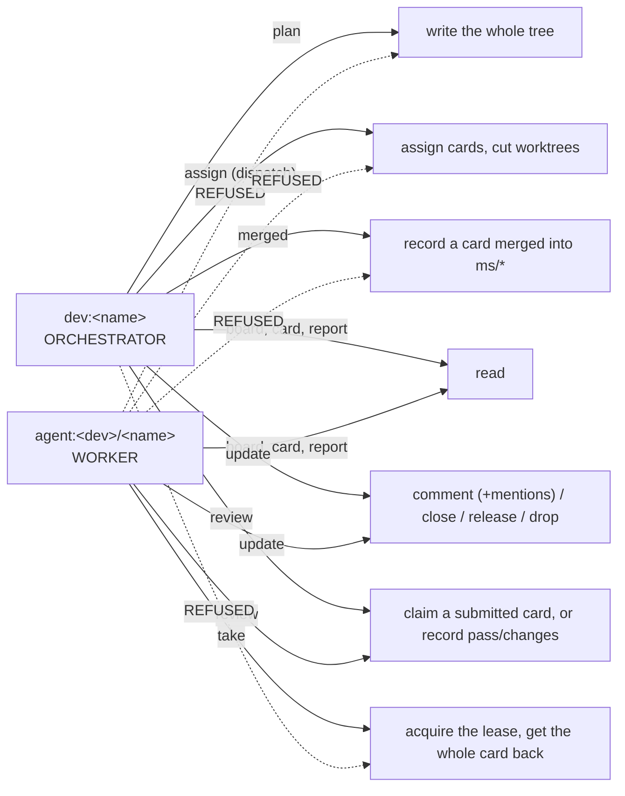
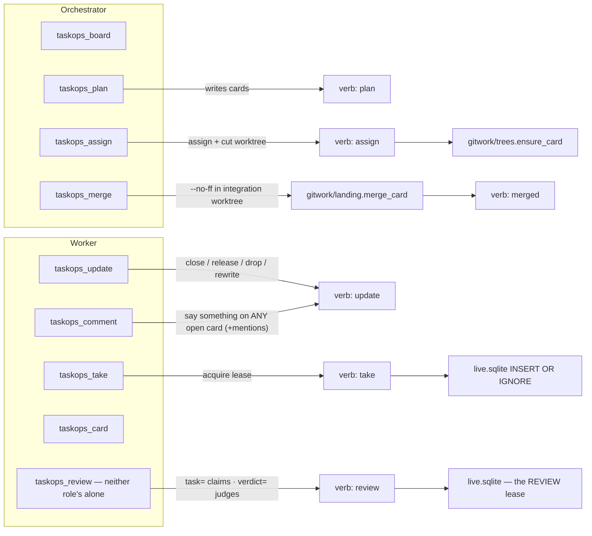
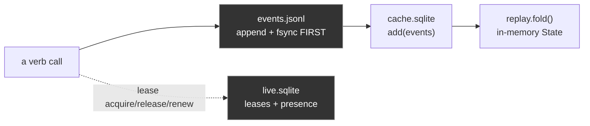

# taskops v2 — architecture

Executive reference for the whole system: what exists, how the pieces relate,
what happens on the wire when an agent does something. Generated by reading
the actual source — `src/taskops`, 97 Python files / ~11,000 lines, plus the
dashboard's own TypeScript source under `ui/src`, which §15 describes and
`CLAUDE.md` gives the command to count (45 files / ~11,703 lines) — and the
tests (`./scripts/test`: 388 passed). Every number here is meant to be re-derived, never
trusted; the dashboard is under active work and its file count moves. This
file describes what is *built* — if it ever disagrees with the code, the code
is right and this is a bug.

Companions: [`README.md`](README.md) (install it, run it, serve the UI) ·
[`CLAUDE.md`](CLAUDE.md) (how to work in this repo).

The v1 post-mortem behind each rule is inline, in the docstring of the module
that carries it — that is on purpose: a design document nobody opens is how a
rule outlives its reason. §11 and §14 are the index of those reasons.

---

## 1. Executive summary

taskops v2 is a work board — milestones → cards → subtasks — for teams of
coding agents working in parallel under one human who decides what merges.
It replaces a v1 system (~340 files) that had, in production: cards
permanently stuck "in progress" after a worker died, races between two
machines both convinced they owned the same card, automatic merges that broke
checkouts out from under a working agent, and 35 CLI commands duplicating
what a smaller surface could do once.

Four decisions eliminate those failure classes **by construction**, not by
adding a command that reacts to them after the fact:

1. **Only three facts are ever stored** (`open`, `done`, `dropped`). Everything
   else a board can say about a card — `ready`, `doing`, `blocked`, `stalled`
   — is computed at read time from the dependency graph and from who
   currently holds a live lease. A worker that dies simply stops renewing its
   lease; its card falls out of `doing` with no sweep, no timeout job, and no
   verb that "fixes" it, because there is nothing written to be wrong.
2. **A branch is inhabited, not switched.** Every card gets its own git
   worktree, pinned to its own branch for its whole life. `git switch` does
   not appear anywhere in the codebase. Two agents on two different cards are
   two directory trees sharing nothing; git itself refuses a branch checked
   out in two worktrees at once, which is a lock nobody has to remember to
   take.
3. **Two roles, enforced once, in one table.** `verbs/__init__.py` declares
   for every verb whether it reads or writes and which role may call it. The
   HTTP router, the local board, the MCP tool layer and the tests all defer to
   this one table — v1 re-took the same decision by hand at 25 call sites and
   four of them disagreed.
4. **Context rides in the tool result, not in a hook that decides.** One
   delivery-only Claude hook exists; it reads and injects,
   never writes. What a worker needs to act — the milestone's goal, the full spec,
   the whole comment thread, file collisions with other live work, the
   previous worker's handover note, its own worktree path — comes back
   *in the response* to `taskops_take`, ordered so that what changes what you
   do before you start is above the spec, not after it.

Storage is an append-only event log (the only truth) plus two SQLite files
that are both derived and both disposable — except that leases are alive, not
derived, and live in a file the cache-rebuild path can never touch.

---

## 2. Entities and relationships


**Reading this diagram:** `CARD.status` is the *only* status a row ever
carries. `doing` is not a value anywhere in this schema — it exists only as
the join between `CARD.id` and a `LEASE` row that has not expired. Delete the
lease (or let it expire) and the card's displayed state changes with zero
writes to `CARD` itself.

---

## 3. Stored vs. derived state

```mermaid
stateDiagram-v2
    [*] --> open : taskops_plan
    open --> done : status=done (needs a commit, or no_code=true+note)
    open --> dropped : status=dropped (reason required)
    done --> open : status=open (reopen)

    state open {
        [*] --> ready
        ready --> doing : taskops_take (lease acquired)
        doing --> ready : lease expires (worker died) — NO event, NO writer
        doing --> stalled : lease expires AND assignee still set
        stalled --> doing : taskops_take (new holder)
        ready --> blocked : an `after` dependency is not closed
        blocked --> ready : that dependency closes — no event on THIS card

        doing --> review : status=review (card.review only) — `submitted`, history-only
        review --> reviewing : taskops_review task= (the REVIEW lease)
        reviewing --> review : that lease expires — NO event, NO writer
        reviewing --> changes : verdict=changes — `reviewed`, history-only
        changes --> doing : the worker picks it back up
        review --> review : status=review again (a new round; the old verdict is stale)
    }
```



Only the outer transitions (`open → done → dropped`, and back) are events in
the log. Everything inside the `open` box — `ready`, `doing`, `blocked`,
`stalled`, and the three optional review states — is
`core/graph.py:derived()`, computed fresh on every read from
`(card.status, card.after[], live leases, live REVIEW leases, standings)`.
`review`, `reviewing` and `changes` appear only on a card with `review: true`;
both new parameters default to "nothing under review", so a board that never
turns it on derives exactly as it did before the feature existed
(`tests/test_core.py::test_a_card_without_review_derives_exactly_as_before`). There is deliberately no path in
this diagram labelled "recover": nothing is ever wrong for a recover to fix.

One more fact is derived the same way and is about a *reader*, not a card: a
**pending mention** (`core/mentions.py`). Being named in a comment's optional
`mentions[]` is pending until that actor writes any event on the card, or the
card closes — computed from the thread on every read, so answering is what
clears it. There is no `read` column and no ack verb, for the same reason
there is no `recover`: both would be a write whose only job is to contradict
an earlier one.

---

## 4. The six layers (imports only point down)

```mermaid
flowchart TB
    subgraph L0["0 · foundation (stdlib only)"]
        errors["_errors, _ids, _clock, _json, _locate, _version"]
        wire["_wire — one POST, one envelope: the decoder both clients share"]
    end
    subgraph L1["1 · core (PURE — no I/O)"]
        types["types — Card/Milestone/Event/Lease, KINDS registry"]
        actors["actors — presence, folded from events"]
        event["event — construct + hash"]
        replay["replay — fold(events) → State"]
        chapters["chapters — the milestone half of the fold: create/status/landed/edit"]
        machine["machine — transition guards"]
        graph["graph — ready/blocked/doing/stalled"]
        scope["scope — the SERVER-scope roles: owner | member | anon"]
        challenge["challenge — the login nonce: in memory, single-use, dead on claim"]
        mentionsm["mentions — who was named and has not answered"]
        reviewm["review — submitted/reviewed folded into a Standing"]
        hours["hours — working-time math"]
    end
    subgraph L2["2 · store (the ONLY SQL)"]
        log["log.jsonl — append + fsync"]
        cache["cache.sqlite — derived, disposable"]
        live["live.sqlite — leases + presence, NEVER disposable"]
        reviewsdb["reviews — the REVIEW lease, a second mutex in live.sqlite"]
        creds["creds — invite tokens, per board"]
        serverdb["server.sqlite — the HOST's principals + pubkeys, and allowed_signers derived from them"]
        pubkeysm["pubkeys — the ssh key grammar: parse, fingerprint, name"]
        stores["stores.py — journal → index → fold, in that order"]
    end
    subgraph L3["3 · verbs (+ the REGISTRY)"]
        plan["plan"]; take["take"]; update["update"]; card["card"]
        assign["assign"]; pulse["pulse — the board"]; record["record"]; report["report"]
        mentionsv["_mentions — the ✉ read"]; waitingv["_waiting — the ◆ read"]; eventsv["events — the log, paged"]
        reviewv["review — claim a submitted card, or record the verdict"]
        projectv["project — board-level facts: op=remote, op=visibility"]
        helpersv["_args _cards _context _facts _rows — the helpers; the _ says 'not a verb'"]
        registry["__init__ — Verb(fn, kind, roles, refusal)"]
    end
    subgraph L4["4 · board.py + gitwork (the ONLY git, client-side)"]
        board["board.py — LocalBoard | RemoteBoard, routing decided ONCE"]
        run["gitwork/run"]; trees["gitwork/trees — worktrees: the GEOMETRY"]
        landing["gitwork/landing — the MERGES: card→chapter, chapter→trunk"]
        catchup["gitwork/catchup — one worktree, up to date with a branch"]
        trailer["gitwork/trailer"]; bind["gitwork/bind"]
        install["gitwork/install — what GIT needs: hooks, gitignore, the address"]
        claudef["gitwork/claudefiles — what CLAUDE reads: .mcp.json, settings.json"]
        remote["gitwork/remote — origin: {host, slug, url}, and best-effort push"]
        diff["gitwork/diff — the walls and the range arithmetic"]
        patchm["gitwork/patch — a resolved range → text and numbers"]
        sigm["gitwork/sig — SSHSIG: ssh-keygen -Y sign / -Y verify"]
        sessionm["session.py — the token's life: mint, refresh, remember"]
        identitym["identity.py — WHO signs in, with WHICH key: discover, establish"]
    end
    subgraph L5["5 · transports"]
        mcpsrv["mcp/server, hello, tools, gitmoves, integrate, dossier, before, render, brief, schema, thread, boards, fields"]
        httpsrv["http/server (lifecycle), handler (one method per door), mounts, watcher, rpc, admin, scoped, grants, ingest, auth, login, feed, static, gitdoor, upstream"]
    end
    subgraph L6["6 · cli"]
        cli["commands: init · join --key · hook   ·   watch: join with nothing   ·   serving: serve · ui   ·   remote: remote add — which host, which board   ·   operate: board · board visibility · invite · revoke   ·   push: board push   ·   admin: server init + break-glass"]
    end

    L1 --> L0
    L2 --> L1
    L3 --> L2
    L4 --> L3
    L5 --> L4
    L6 --> L5
```

`tests/test_architecture.py` enforces this by reading the AST of every module:
imports only point down, `subprocess` appears only in `gitwork/run.py`, `sqlite3`
only under `store/`, the wall clock only in `_clock.py` and `core/hours.py`
(the one module whose whole subject is time), and every module stays
under 200 lines — a budget that forces a split to land on a cohesive boundary
instead of an arbitrary one.

**A leading `_` marks plumbing for the layer above, and it is a three-zone
convention**: the package root (`_errors _ids _clock _json _locate _version
_wire` are level 0; `board.py`, `session.py` and `identity.py` are that layer's
doors), and `verbs/` (`_args _cards _context _facts _mentions _rows _waiting`
are helpers — the un-prefixed files are the registry's entries, one per verb).
Nowhere else carries it, because every module under `core/ store/ gitwork/
http/ mcp/ cli/` is internal to its layer and there is nothing to distinguish;
`import taskops` exposes five errors and a version, so module names are a
contract with nobody. This is NOT anthropic-sdk-python's convention, where `_`
marks the half of a *library* users must not import — taskops has no such half,
and renaming a package to `_core/` to resemble one would be cargo cult.

**Zero headroom is a finding, not a pass** (audited 2026-08-09). The budget test
is `<= 200`, and it was green with SIX modules at exactly 200 and fifteen within
ten lines — a seventh of the package that could not accept one line, so the next
card to touch any of them would have had to split it *under pressure*, which is
the one condition under which a split lands somewhere arbitrary. Eight modules
were split in cold blood instead, each at a seam that already existed:
`verbs/pulse → _rows`, `session → identity`, `http/server → handler`,
`gitwork/trees → landing`, `gitwork/install → claudefiles`, `gitwork/diff →
patch`, `core/replay → chapters`, `verbs/plan → _cards`. The cap is now 196 and
nothing sits on the line. Re-derive it rather than trusting this paragraph:

```sh
find src/taskops -name '*.py' -exec wc -l {} + | awk '$2!="total" && $1>=190' | sort -rn
```

---

## 5. Actors and permissions



The rule lives once, as data, in `verbs/__init__.py::REGISTRY`:

| verb | kind | role | if the wrong role calls it |
|---|---|---|---|
| `board` | read | both + **anon** | — |
| `mentions` | read | both + **anon** | — (a delivery-hook read: one of the two that renew no lease; for `anon` it is empty by construction) |
| `waiting` | read | `dev` | *"these are the orchestrator's moves, not yours. Your own picture: `taskops_board`"* — the other non-renewing read: MERGE / REVIEW / STALLED for the delivery hook |
| `card` | read | both + **anon** | — |
| `report` | read | both + **anon** | — |
| `events` | read | both + **anon** | — (the LOG, one keyset page at a time, newest first; board-wide by construction — see `verbs/events.py`) |
| `plan` | write | `dev` | *"workers do not plan the board. Report what you found instead: `taskops_comment task=<yours> text="…"`"* |
| `assign` | write | `dev` | *"dispatching is the orchestrator's move. Take what is yours: `taskops_take`"* |
| `merged` | write | `dev` | *"workers do not integrate branches. Close your card and the orchestrator merges it"* |
| `take` | write | `agent` | *"you are the orchestrator — you dispatch, you do not hold cards"* |
| `update` | write | both | — |
| `review` | write | both | — (optional review: claim a submitted card, or record the verdict. A verifier is an ordinary agent — there is no reviewer role) |
| `bind` | write | both | (internal — the git hooks call it) |
| `project` | write | both | (internal — board-level facts: `op=remote`, where the repo lives on the web, and `op=visibility`, public or private) |

**A PUBLIC board: anyone may watch, nobody writes without a key** (2026-08-09).
GitHub's model, deliberately and exactly — private by default, the owner may
publish (`taskops board visibility <host>/<name> public|private`, an owner-only
server-scope operation), public means ANONYMOUS READ, and a write always needs a
registered key. **No third state and no anonymous-write grace.**

The flag is a project-level EVENT beside `remote`, folded newest-wins, so "when
did this become public and who did it" is in the log; absent, a board is private,
which is why no board that predates the feature changed. It is derived onto the
`board` payload, and `_context.py::pulse` echoes the actor the server resolved —
so a reader can be told it is anonymous BEFORE it types, which is what the
dashboard's comment box does instead of offering a form that always 409s.

**The whole difficulty was that a read writes.** Every read verb opens with
`stores.live.renew(actor, now)`, which UPDATEs the leases that actor holds and
INSERTs a presence row: a public board without a guard would have every visitor
writing to `live.sqlite` on every page load — no event, no card, nothing any
screen would show. The guard is in `store/live.py::renew`, the ONE place that
writes, and not at the six callers, for the reason this file's §4 exists: a
seventh read verb gets written next month by somebody who never read the rule.
`tests/test_topology.py` hashes `events.jsonl`, `live.sqlite` and its `-wal`
before and after a full anonymous crawl — every read verb, twice, plus `/feed` —
and asserts they are byte-identical. `cache.sqlite` is excluded on purpose: it is
derived and disposable, and deleting it rebuilds it.

`/feed` opens for anon on a public board and that is not a relaxation: a message
there is `{"type": "change", "verb", "seq"}` and NOTHING else, so a watcher
learns only that the board moved and answers by re-reading through `/rpc`, where
the gate applies again in full. The day a message carries a card, that door
closes with it (`http/feed.py` carries the argument).

Anonymous is refused a write TWICE — `http/auth.py::anonymous` never hands out a
credential for one, and the registry refuses the role — and over a socket each
guard silently answered for the other: deleting either left the suite green.
Both are now asserted against their own function
(`test_each_of_the_two_write_walls_stands_on_its_own`). Anonymous may also not
CLAIM to be somebody: `actor` travels in the call, so `authorize` refuses an
`anon` credential naming any other actor.

`taskops join <url>` with no invite against a public board is a READ-ONLY join
(`cli/watch.py`): the board is ASKED rather than assumed, config is written with
`readonly: true` — recorded and not inferred from an empty token, because that is
also what a BROKEN join leaves — nothing is minted, no key is registered, and
`gitwork/remote.py::remember` is deliberately NOT called, since recording this
repo's origin would be the anonymous write the rule forbids. `taskops ui` then
serves the viewer's window: an `Upstream` with no bearer, which is exactly what
`Mounts.public` reads to let the local browser in while the REMOTE decides.

**Server scope is a SECOND registry, in the same shape** (`core/scope.py`,
added 2026-08-09). `verbs/__init__.py` answers *what may you do on a board*;
`scope.py` answers *what may you do to the HOST* — create a board, list them,
register a key, mint an invite. Three roles and no fourth: `owner` (the
principal that bootstrapped this host), `member` (a registered key that is not
the owner), `anon` (no credential — reads a public board, writes nothing).
GitHub's model, deliberately. `scope.permit(operation, role)` is the one gate
and its refusal names the role that may **and how a key gets registered**.

**No board comes into existence by accident** (the hole closed on 2026-08-09,
found the day before). `http/mounts.py::stores()` used to do
`Stores(self.root / name)` for any name matching the pattern, and `Stores`
makes its own directory — while `http/server.py` calls `mounts.check(board)`
BEFORE `self._credential(...)`. So an anonymous request for a name nobody had
ever used left a board directory with a cache and a lease file on the server's
disk: a write caused by a stranger's question. `stores()` now only OPENS; an
unknown board is 404 with no side effect
(`tests/test_topology.py::test_an_unknown_board_is_404_and_leaves_nothing_on_disk`),
and creation is `Mounts.create()`, reached only through the owner-only
`board.create` operation.

**The one ssh in the design.** `taskops server init --root <dir> --key
<path.pub>` (`cli/admin.py`) writes the first principal as owner and is meant
to be run on the host itself. Trust has to enter through a channel that
predates the system, and the machine's own shell is that channel: a remote
bootstrap would need a credential this host does not have yet. Every admin act
after it is a signed call over the API. The `allowed_signers` file beside
`server.sqlite` is DERIVED — regenerated whole from the store on every change,
never hand-edited, never read back into the store — the same relationship
`cache.sqlite` has to `events.jsonl`. Bearer tokens (`store/creds.py`, per
board) are untouched: keys are how tokens come to be MINTED.

**A key authenticates a LOGIN; the login mints a SESSION** (`http/login.py`,
`core/challenge.py`, `gitwork/sig.py`, `session.py` — 2026-08-09). `POST /login`
answers a random, single-use, in-memory nonce; the client signs it with
`ssh-keygen -Y sign -n taskops`; the server runs `ssh-keygen -Y verify -f
<root>/allowed_signers -I <principal>` and, if OpenSSH says yes, mints an
ordinary bearer credential with a 12-hour TTL. **Every downstream path is
UNTOUCHED** — /rpc's bearer check, /feed, the MCP board all see the token they
always saw. That is why the session model beat per-request signing: a signature
envelope would have to be taught to the stdlib HTTP server, to the WebSocket
handshake and to the MCP layer, three times. Exactly one thing changed: where
tokens come from.

The signed payload is a SERVER-ISSUED CHALLENGE and not a client timestamp, so
there is no clock-skew window to pick and no replay cache to size — the nonce
dies on the claim (`core/challenge.py` carries the argument, and why it is
memory and never a table: a challenge that outlived its process would be a
stored fact whose only job is to be contradicted, which is `recover`'s shape).
The subprocess runs through `gitwork/run.py::tool`, the ONE module allowed to
start a process, and `tests/test_architecture.py` still enforces exactly that.
ZERO pip dependencies, no hand-rolled crypto.

**The host is OPERATED from `taskops`, over its own API** (`http/admin.py`,
`cli/operate.py` — 2026-08-09, the anomaly this chapter exists to kill). Five
acts that used to be an ssh session on the box are now signed calls from the
laptop:

```sh
taskops remote add <url>                the host, once per checkout — git's origin
taskops board create [<name>]           owner only — THE way a board comes to exist
taskops board ls [<host>]               owner: all of them; member: their own
taskops board push [<name>]             a LOCAL board becomes the hosted one
taskops board visibility [<name>] public|private     owner only
taskops invite <who> --board <name>     owner only — prints the join line
taskops revoke --key SHA256:… | --invite <id>
```

**And they read like git: host once, key discovered, verbs bare**
(`cli/remote.py`, 2026-08-09 — the human's words: «esto debería ser como git …
pero sin --key»). Git asks for neither a URL nor an identity file on every push,
and both reasons are copied rather than invented. The ADDRESS is recorded per
checkout — `taskops remote add <url>` writes `login.host` into
`.taskops/remote.json`, the uncommitted per-machine file a `join --key` already
cached the same field into, which is git's `.git/config` and NOT the host alias
registry §11 refuses: what was refused is a TABLE, many names and global; this
is ONE host, in the file that already holds it, acquired by an explicit command
instead of only as a side effect of a join the owner on day one cannot run.
`board create` records the NAME it chose in the same block, so the bare `board
push` after `board create minombre` does not re-derive the directory and make
the human repeat a name — precedence is explicit argument > recorded name >
directory (`gh repo create`'s convention). The block is merged FIELD BY FIELD
(`_locate.py::write_remote`) because three writers own three of its fields and a
whole-block update would let a sign-in silently drop the recorded name. The KEY
is DISCOVERED the way ssh discovers one — `~/.ssh/id_ed25519`, `id_ecdsa`,
`id_rsa`, ssh's own files in ssh's own order, in ONE function
(`identity.py::discover_key`) that `establish` consumes so no verb guesses for
itself; `--key` stays as the override, exactly as `ssh -i` is, and the refusal
when none exists lists what it tried. Recording an address is not signing in:
`remote add` mints nothing and touches no key. Creating a board on a DIFFERENT
host from inside a joined checkout records nothing here — the same rule
`session.is_own_host` holds the token to, and the suite caught the first version
without it.

**A key is accepted by every one of them, and that is what
makes the FIRST one runnable** (`identity.py::establish`, 2026-08-09 — found by
running the chapter end to end on a clean host, not by a test). Without it the
owner of a new box was deadlocked: `operate.call` only knew the session a
previous `join --key` had cached, the invite that `join` wants is minted by
`taskops invite`, which wanted a session of its own, for a board nobody had
created yet — so day one on every host fell back to ssh, the exact anomaly this
chapter exists to kill. `establish` is `push.py`'s already-working key-to-session
logic, lifted so both consume ONE implementation; `--as <principal>` overrides
the `$USER` guess (a machine whose unix user is not the principal's name could
not sign in at all before it); the login block is cached once the host accepts
the signature, so the second command needs no flags; and the refusal names
`--key` beside `join`. On `revoke` the signing key is `--sign-key`, because
there `--key` is already the fingerprint being retired. The four scenarios go
through the real `main()` and argv in `tests/test_topology.py` — the wiring was
what was broken, and calling the functions is what hid it.

They are SERVER-SCOPE verbs in a registry of their own, gated by
`scope.permit`, authenticated by the session an ssh key mints, and they answer
on the **root `/rpc`** — one segment, because `admin` is a legal board name and
`/admin/rpc` would be that board's own door character for character. The
envelope is the board rpc's, so `_wire.py` is the client for both.
`board.create` refuses an existing name (`Mounts.create` is
`mkdir(exist_ok=True)`, so without the refusal it would hand somebody else's
history back as new) and writes WHO made it as the board's first project-level
event — the one fact no later event could reconstruct. A member's "their own
boards" is DERIVED from the credentials they hold, never a membership table.

**The scp dies: `taskops board push` promotes a local board** (`cli/push.py`,
`http/ingest.py` — 2026-08-09). Moving a board used to be a README paragraph
naming `events.jsonl` and a shell on the box — storage leaking into UX, with no
count and no verification. It is now one command, and **the ORDER is the
safety, with the config flipping LAST**: (1) the target must exist and hold no
history but its own beginning, (2) no live lease here, (3) the whole log is
streamed through the server-scope `board.ingest`, (4) the counts are compared,
per event KIND and not just a total, and a mismatch is a STOP, (5) only then
`board.json`/`remote.json`, with `.taskops/board/` renamed to
`board.local-<date>/` rather than deleted. A failure at any point above leaves
the repo exactly as it was.

Three decisions inside it, each pinned in `tests/test_topology.py`:

* **No force flag, and there must never be one.** A non-empty target means two
  histories, and giving them an order they never had is fabricating a timeline;
  the refusal says exactly that instead of offering a way.
* **The ingest verb is not a sync channel and cannot become one.** Its
  precondition is true exactly once in a board's life. "Empty" is not `seq == 0`
  but **"no history but its own configuration"** — `board.create` writes WHO
  made the board as its first event, and setting the visibility or recording a
  remote before the board is filled is a fact about the CONTAINER, not about the
  work. So the door exempts project events whose `op` is in the CLOSED list
  `{created, visibility, remote}` — and only while the board holds ZERO card
  events; one event about work and the exemption narrows back to the birth
  certificate (`ingest.py::_configuration`, whose docstring is the 2026-08-09
  reproduction: this repo's own board was created and made public before it was
  pushed, and the wall refused a push with nothing to merge). It
  appends through the store path replay already trusts and does NOT re-judge:
  events were validated by the verbs that made them, so the door checks the
  HASH and moves them. Retry is free by construction — ids are `sha256` of the
  content, so an interrupted push re-runs to a no-op and continues, which is
  why the whole history travels in ONE call (the set comparison that separates
  a retry from a stranger's board is only decidable with all of it in hand).
  The payload is deduplicated against ITSELF as well: `Stores.write` appends
  everything it is handed to the log while the cache ignores a repeated id, so
  a payload naming one line twice would put two lines in the truth and one row
  in the index.
* **Leases and presence do not travel.** `live.sqlite` is a fact about running
  processes, none of which will run against the new host; the board starts with
  nobody working, which is true. A held lease refuses the push rather than being
  copied.

And **`taskops join` refuses to orphan a local board** (`cli/commands.py`, the
same day). Joining a repo whose `.taskops/board/` held events simply started
reading the remote one: the history stayed on disk, byte for byte, and nothing
ever looked at it again or said so. It is now a STOP naming both ways out —
`taskops board push` to take it along, or `--discard-local` to archive (never
delete) and join anyway. It counts EVENTS, not the directory, so the ordinary
`init` → `join` sequence is untouched.

**The on-box commands survive as break-glass**: `taskops invite/revoke --root
<dir>` still work against the files, on the machine that holds them, for the day
the server is down or the owner's key is lost. Not deprecated — a system whose
only door is its own API cannot be repaired when that API is what broke. And
there is deliberately **no `taskops host add`**: the host is already recorded per
project by the join that registered the key (`remote.json`'s `login.host`), so an
alias table would be a third place a server's address lives and the first to
drift.

The client half is `session.py`: `board.py::open_board` refreshes an absent or
expiring session before it hands a board back, and `RemoteBoard.call` retries
ONCE when the server says a credential expired — because the MCP server opens a
board once and keeps it for a session longer than the token. A config with no
`login` block, and a token with no expiry, are never touched: that is the shape
production's four boards are in. One limit, stated and not solved: `-Y sign`
needs the private key FILE, so an agent-only setup is refused in one sentence
naming the limit rather than taught the ssh-agent protocol.

    POST /login {"principal": "berna"}                        -> nonce, expires
    POST /login {"principal", "nonce", "signature"}           -> token, expires, role

Every refusal names the call that works. `core/actors.py::role_of` (re-exported
by `core/types.py`, so `types` stays the one name a caller imports) is the
*only* actor parser in the codebase (v1 had five, plus an inference step that
let an actor-less sub-agent silently resolve to the human).

**Identity is resolved per CALL, not per process** (2026-08-07). Every MCP
tool accepts `actor=`, and `board.py::_who` lets it win over the board's own
identity (`TASKOPS_ACTOR` at MCP-server start, else the credential's
subject). The reason is the host, not taste: one MCP server runs per session
and every sub-agent shares it, so the `export` in a worker's brief never
reaches the process that speaks MCP — without a per-call actor, every worker
spoke as the orchestrator and `take` was unreachable. On a remote board
`http/auth.py::authorize` judges the override: a credential may act as
itself, and a dev's credential as that dev's own agents — nobody else's.

---

## 6. The nine MCP tools (not the same as the fourteen verbs)

A tool is what an agent should think in one move; a verb is one write on the
board. The mapping is deliberately not 1:1 in either direction:
`taskops_assign` alone is two verb calls (`assign`, then per-card worktree
creation) collapsed into one tool; `taskops_merge` runs git in the *caller's*
filesystem before recording the result as a verb (v1's `recover` ran git on
the *server* and reported paths from a machine that was never the caller's);
`taskops_review` is the verifier's ONE door — `task=` claims the review lease
and returns the whole dossier, `verdict=` judges — because a `review=true` flag
on `taskops_take` was built and then deleted:
two tool surfaces over one verb is the duplicate-channel shape that broke v1,
and `take` holds the WORK lease and nothing else; and
`taskops_update` + `taskops_comment` are two tools over the ONE `update`
verb — one write path underneath, because v1 split closing across six modules
and forgot to record it in one of them, but two moves on top, because saying
something is not changing something.



---

## 7. Storage and the write path



* `events.jsonl` is the truth. Event ids are `sha256(canonical)[:32]`, so a
  replayed write is a no-op — the log is idempotent by construction.
* `cache.sqlite` is disposable: delete it, `Stores._bootstrap()` replays the
  log and rebuilds it on next open.
* `live.sqlite` is **not** disposable and lives in its own file on purpose —
  a cache rebuild must never be able to drop a live claim (v1 kept both kinds
  of state in one database).
* The write order is fixed: journal → index → fold. A crash between the first
  two costs a rebuild (automatic); the reverse order would cost the events
  themselves.
* Replay sorts strictly by `ts` with Python's *stable* sort, so events sharing
  a timestamp keep arrival order — sorting by `(ts, id)` was tried and broke
  a `claimed`/`released` pair under a frozen test clock.

---

## 8. Sequence — a card's whole life

```mermaid
sequenceDiagram
    actor Dev as dev:berna (orchestrator)
    actor W1 as agent:berna/w1 (worker)
    participant Board as taskops board (MCP/HTTP)
    participant Git as git (worktrees)

    Dev->>Board: taskops_plan (milestone + cards + deps)
    Board-->>Dev: cards created, status=open

    Dev->>Board: taskops_assign tasks=[tk-a1]
    Board->>Git: ensure_card() — new worktree, branch tk-a1
    Board-->>Dev: paste-ready brief for tk-a1
    Dev->>W1: spawn worker with the brief

    W1->>Board: taskops_take task=tk-a1 actor=agent:berna/w1
    Note over W1,Board: actor= on the CALL — the sub-agent shares the session's MCP server
    Board->>Board: live.acquire() — INSERT OR IGNORE (the mutex)
    Board-->>W1: whole card: spec, criteria, thread, collisions, worktree path
    Note over W1: card is now `doing` — DERIVED, no row written

    W1->>Git: commits in its worktree (branch tk-a1)
    Git->>Board: post-commit hook → bind.record() (sha, subject, files, numstat +/- per file)

    W1->>Board: taskops_update task=tk-a1 status=done note="…"
    Board->>Board: check_transition — refuses if 0 commits and no_code≠true
    Board-->>W1: ok
    Note over W1: card is now `done` — assignee cleared, lease irrelevant

    Dev->>Board: taskops_board
    Board-->>Dev: group MERGE: [tk-a1]
    Dev->>Board: taskops_merge task=tk-a1  (or tasks=[tk-a1, tk-b2] / done=true — the same path per card, in order, stopping at the first failure)
    Board->>Git: trees.behind() — if tk-a1 lacks the ms/* head, catchup.catch_up() merges ms/* IN tk-a1's own worktree (dirty or missing: refused, untouched; conflict: aborted clean, git's files + the count)
    Board->>Git: merge_card() --no-ff into ms/<milestone>, in the integration worktree
    Git-->>Board: sha (or refused, conflict files named, ms/* untouched)
    Board-->>Dev: merged

    Note over Dev: the HUMAN decides how ms/<milestone> reaches main: a PR, or taskops_merge milestone= once every card is closed and integrated
    Dev->>Board: taskops_merge milestone=ms-x criteria_met=true
    Board->>Board: the GATE first — open work, then the chapter's criteria (no answer, no git)
    Board->>Git: trees.behind_trunk() — if ms/* lacks base_ref's head, the SAME catchup.catch_up() merges the trunk IN the integration worktree (dirty or missing: untouched, today's path; conflict: aborted clean, git's files + the count)
    Board->>Git: land_milestone() --no-ff into the trunk, in the shared checkout
```

## 9. Sequence — the case v2 exists to remove

```mermaid
sequenceDiagram
    actor W1 as agent:berna/w1
    participant Live as live.sqlite
    participant Board as taskops board

    W1->>Board: taskops_take task=tk-a1
    Board->>Live: acquire(tk-a1, w1, ttl=900s)
    Note over W1: w1's process crashes. Nothing else happens.
    Note over Live: no DELETE runs, no sweep, no cron — the row just sits there, unexpired

    rect rgb(40,40,40)
    Note over Live: 900 seconds pass
    end

    actor Dev as dev:berna
    Dev->>Board: taskops_board
    Board->>Live: held(now) — the row for tk-a1 has expires <= now
    Board-->>Dev: tk-a1 is NOT in `doing`. It is in `stalled` (assignee=w1, quiet_for≥900s)
    Note over Dev: no verb named "recover" exists to call

    Dev->>Board: taskops_assign tasks=[tk-a1]   (hand it to a new worker)
    actor W2 as agent:berna/w2
    W2->>Board: taskops_take task=tk-a1
    Board->>Live: acquire() — old row past its expiry, new INSERT succeeds
    Board-->>W2: the card, plus w1's handover note if it left one
```



Nothing here is a repair. `stalled` was always going to be the answer the
moment `expires <= now`; `taskops_assign` is the same verb used for a card
nobody has touched yet.

---

## 10. Protocols

| transport | who uses it | shape |
|---|---|---|
| **MCP over stdio** | Claude / any MCP host, per-repo | newline-delimited JSON-RPC 2.0. `initialize` returns `instructions`: the whole role protocol AND the board as of that moment (`mcp/hello.py` — the same verb and renderer an agent would call, so it is a delivered answer, not a second version of one). That is what a v1 system prompt was, minus the second place for truth to live, and it needs no hook and no settings file to be trusted. **One server per SESSION, shared by every sub-agent**, which is why identity rides on the call (`actor=`, §5) and not in the process's environment. `tools/call` on a refusal answers `isError: true` with the refusal *as the text content* — never a protocol-level error, because an agent that cannot read the way out will invent one; an unexpected exception answers the same way rather than ending the loop, since that loop is the session's only door to the board. |
| **HTTP RPC** | a remote board's clients (`RemoteBoard`, the browser) | `POST /<board>/rpc` with `{"verb", "args", "actor"}`, `Authorization: Bearer <token>`. Answer is always an envelope: `{"ok": true, "seq": N, "data": {...}}` or `{"ok": false, "error": {"code", "message"}}` — v1 let three verbs answer with a bare array and the decoder silently turned it into `{}`. |
| **WebSocket feed** | the browser UI only | `GET /<board>/feed`, upgraded via the RFC 6455 handshake (`HTTP/1.1` required for the 101 response to be accepted — the one bug class invisible to a library-based test, caught only with a raw-socket test). A message is a *signal* (`{"type": "changed"}`), never a payload — the client refetches, so a dropped or duplicated frame can never show something the board never said. SSE is the automatic fallback for a proxy that eats the Upgrade. Agents never use this: their live channel is the "pulse" line appended to every tool result. The UI carries exactly ONE write — a comment box with a mention picker on the card panel, through the same `/rpc` door and token. |
| **Delivery hook** | Claude Code sessions in a joined repo | `taskops hook claude`, wired by `init`/`join` into `.claude/settings.json` on `PostToolUse` + `UserPromptSubmit`. Read-only and one-way: resolves the reader (env, else worktree-path → card → holder) and injects context — `✉ …` when a mention is pending, for ANYBODY (throttled per reader per 30s); and `◆ …`, one line per group with the count and the call that clears it, when MERGE / REVIEW / STALLED is non-empty and the reader is a `dev:` (throttled per 180s, its own key). Silence otherwise, exit 0 always, any failure silent. Both reads (`mentions`, `waiting`) renew no lease. The one sanctioned Claude hook: it may deliver, never decide, store, or write. |

---

## 11. What is NOT here, on purpose

| removed / never built | why | where it's enforced |
|---|---|---|
| a `recover` verb | doing is derived from the live lease; nothing is ever wrong to recover | no entry in `verbs/__init__.py::REGISTRY`; `tests/test_verbs.py::test_a_dead_workers_card_comes_back_by_itself` |
| a reviewer ROLE, a stored review STATUS, automatic reviewer assignment | v1's review system: `peer` deadlocks, 14 closing rules over 6 modules, reviewers eating the budget of the work | review EXISTS since 2026-08-07 but narrowed: optional per card, derived from history-only events + a second lease, judged by an ordinary agent that may never judge its own work. `CARD_STATUSES` stays three; there is no reviewer role and nothing auto-assigns |
| AUTOMATIC merges to `main` | v1's `land` merged as a side effect of closing a card and ran checkout under working agents | a CARD cannot be merged to main — `taskops_merge task=` takes no target. A finished MILESTONE lands via `taskops_merge milestone=` (2026-08-07): explicit, refused while any card is open or unintegrated, refused off-trunk, recorded as a `milestone landed` event. What stays impossible is main moving as a side effect of anything |
| git replication between clones | split-brain, two machines "owning" the same card | `RemoteBoard` never falls back to a local store on write failure (`Unreachable` instead) |
| Claude hooks **that decide or store** | latency, another thing to install and drift; v1's held state and gated actions | context travels in `initialize.instructions` + tool responses. The ONE exception, sanctioned 2026-08-06: `taskops hook claude`, delivery-only — it reads, injects a ✉ or ◆ line, and can be deleted with no loss but immediacy. `tests/test_claude.py` pins its safety properties, one test each — the module docstring lists them and `grep -c '^def test_' tests/test_claude.py` counts them |
| a mark-as-read / ack verb for mentions | a stored `read` flag is `recover` again: a write whose only job is to contradict an earlier one | `core/mentions.py::pending()` derives it from the thread; `tests/test_verbs.py::test_a_mention_clears_itself_the_moment_the_actor_touches_the_card` |
| PER-REQUEST SIGNING (every call carrying an SSHSIG envelope, no sessions) | it was the first design and sessions won on cost, not on taste: a signature per request means teaching a signature envelope to THREE transports — the stdlib `http.server`, the WebSocket handshake on `/feed`, and the MCP layer that opens a board once and holds it — and every one of them would have had to learn nonce replay, clock skew and canonicalisation separately, for exactly the result a bearer already has. It also needs the private key FILE on every call, in every worker, forever; a session needs it twice a day. And the fleet argument decides it: a signed envelope is a NEW wire format, so production's four boards would have had to be re-joined, which rule 3 forbids | `/login` is the only door that verifies a signature (`http/login.py`), and what it hands back is an ordinary `Credential` — the same row, the same table, the same `Authorization: Bearer` every legacy token uses (`store/creds.py`). The client half is `session.py` (the token's life: mint, refresh, remember) with `identity.py` beside it (WHO signs in and with WHICH key — `discover_key`, `establish`, the one door `--key` comes in through); each is well under the budget *because* each has one job. `tests/test_topology.py::test_a_legacy_only_board_still_works_on_rpc` and its three siblings are the fleet half: production's exact state — no principal, no key, an empty `allowed_signers` — driven through /rpc, /feed, the MCP handshake and the `taskops ui` window |
| HAND-ROLLED CRYPTO, and a pip crypto DEPENDENCY | two ways to lose the same argument. Writing ed25519 verification by hand is the classic own-goal; adding `cryptography` or `PyNaCl` to buy it back breaks "a wheel and a directory" — the property that makes `pip install taskops` on a bare box a deploy (§17) — and puts a compiled wheel in the path of every agent's install | the verifier is OpenSSH's own: `ssh-keygen -Y sign` / `-Y verify -f allowed_signers`, the same SSHSIG mechanism git uses to sign commits, invoked through the ONE subprocess module (`gitwork/sig.py`, under `gitwork/run.py`). `pyproject.toml` has no runtime dependency at all, and `tests/test_architecture.py` keeps `subprocess` out of every layer but that one |
| ANONYMOUS WRITES, in any form — including the invisible one | a public board is anonymous READ and nothing else. The subtle failure is not a card somebody could see: every read verb opens with `stores.live.renew(actor, now)`, an INSERT into `presence`, so a public board without a guard has every visitor writing to `live.sqlite` on every page load — no event, no card, nothing any ordinary test would notice. There is also no "anonymous-write grace" and no third visibility | `http/auth.py::anonymous` never hands out a credential with more than `{"read"}`, and refuses a write with the sentence that names how a key gets registered; `store/live.py::renew` is the ONE place that decides the presence row. `tests/test_topology.py::test_an_anonymous_crawl_of_a_public_board_moves_not_one_byte` asserts `events.jsonl` and `live.sqlite` (with `-wal` and `-shm`) hash-identical across a crawl of every read door there is, and `…::test_anonymous_may_not_claim_to_be_somebody` closes the `actor=` hole |
| a `--force` on `taskops board push`, and a SYNC channel behind `board.ingest` | a non-empty target means two histories, and giving them an order they never had fabricates a timeline the board never observed. The precondition ("no history but its own beginning") is true exactly once in a board's life, which is what keeps the door a promotion and not replication between clones — the thing banned two rows up | `http/ingest.py` refuses and says so; `tests/test_topology.py::test_a_target_that_is_not_empty_is_refused_and_no_force_is_offered`, and the argument is the module's own docstring |
| a SILENT `taskops join` over a local board | the local history stayed on disk byte for byte and nothing ever looked at it again or said so — a command about connecting is what made it invisible | `cli/commands.py::_keep_or_archive` refuses naming `taskops board push` and `--discard-local` (which archives, never deletes); `tests/test_topology.py::test_join_refuses_to_orphan_a_local_board_and_names_both_ways_out` |
| a slug in a branch name that isn't the milestone's | a renamed milestone orphaned its branch (ghost branches) | `Milestone.branch` computed once at creation, stored, never re-derived |
| a stored `doing` | a dead worker's card claimed to be worked on forever | `CARD_STATUSES = ("open", "done", "dropped")` — `"doing"` raises `BadRequest` if ever passed to `status=` |
| a worker-SLOT roster (held / free / lapsed as a pool) | taskops allocates no worker: `workers=[…]` is a label chosen at the call, sub-agents are ephemeral, and an actor is a name bound to the RUN of a card — a roster with capacity would be a fiction the board could never make true | the Actors view draws DEVS with their agents as lines inside them instead (`ui/src/pages/Actors.tsx`, `components/monitor/panels.ts` — both carry the post-mortem); an agent with no card is HISTORY, never "free", and `ui/smoke/sections/actors.tsx` asserts the words `free`, `slot` and `capacity` appear nowhere in that markup ("actors: NO WORKER SLOTS, under that name or any other") |
| a TILE per ephemeral sub-agent | the first Actors page drew one per ACTOR: sixty-seven tiles, sixty-six of them processes that had already died with their cards, each wearing the human's layout — the page contradicted its own goal | the top level is the DEV (`devRows()`), an agent is a row inside it, and `ui/smoke/sections/actors.tsx` pins that a board with one dev and many agents draws exactly one card per dev and none per agent ("actors: one card per dev is DRAWN, and no card for an agent") |

---

## 12. Housekeeping (done, 2026-08-07)

The `force_release()` this section used to flag as dead code is **deleted**:
no verb ever called it, and the only thing keeping it alive was a test whose
name (`…_but_recover_always_can`) advertised a recovery path this board does
not have. A dead function that describes a banned design is worse than no
function — the next reader takes it as permission. An abandoned lease expires;
nothing takes a card away from its holder.

The remaining "recover" mentions (`core/types.py`, `verbs/assign.py`,
`mcp/tools.py`, `gitwork/run.py`, `core/mentions.py`, `store/live.py`) are
intentional: each one explains why the
rule exists, which is the whole convention of this codebase.

**A known limit of `collisions()`, argued but not changed.**
`verbs/_context.py::collisions` intersects the DECLARED `files` of open cards:
it lives in path space. The Nova UI milestone (2026-08-07) fanned four cards
onto pairwise-disjoint paths — the warning was correctly silent — and the
merged tree still came back with two `ago()` and three `initials()`, because
that class of failure lives in *symbol* space. The conclusion of that
post-mortem is deliberately conservative and belongs here: taskops does NOT
learn to parse source (a symbol scanner is the first component that would have
to know what a language is, and §14's layering has nowhere to put it);
`collisions()` is not widened; language-specific duplicate detection stays in
the project's own linter. What it recommends instead is free — land the seams
serialized before fanning out — plus one optional field, `criteria` on a
Milestone, next to `rules`. Both are implemented (tk-097cae, 2026-08-07): the
ordering rule is one sentence in `mcp/server.py::INSTRUCTIONS`, delivered at
the handshake inside `hello.py`'s budget; `Milestone.criteria` travels into
every take like `rules` and is SHOWN at `taskops_merge milestone=`, which
refuses until the human answers `criteria_met=true` — recorded in the `landed`
event, never judged by the machine. §10 of that post-mortem was the map from each
adoption to its test.

---

## 13. Verified state at time of writing

```
388 passed             ./scripts/test
ruff clean            } ./scripts/lint
pyright --strict clean
```

That number moves with every card; re-run the command rather than reading it
here.

Test categories: architecture (AST-enforced layering), core (pure functions:
replay, graph, machine, hours, mentions, review), store (log/cache/live),
verbs (including the whole review cycle and the two races it can lose),
gitwork (including a raw-socket WebSocket handshake test), http (topology),
mcp (dossier section order, tool refusals), migration (the v1 mapping),
ui (headless: `ui/smoke/run.mjs` renders the modules `src/main.tsx` bundles
through `react-dom/server` — no browser, no jsdom — against a payload a real
`LocalBoard` answered with, plus a read of the COMMITTED bundle. It skips
without node or `ui/node_modules`).

Both remaining items are done. The migration ran against all four v1 boards
(§17), and `taskops.bernardocastro.dev` serves v2 since 2026-08-08 — not via
`shipway`, which moves a code tree to a pm2 app: a board host is a wheel plus a
directory of board logs, so it is `pip install` into a venv and one pm2 entry
(README, "Deployed"). **The box runs this tree** since 2026-08-09 (tk-df8e64,
§17), so `https://taskops.bernardocastro.dev/<board>/ui/` answers `410` and one
sentence, exactly as the trunk does (§16, §17). Re-derivable:
`curl -s https://taskops.bernardocastro.dev/healthz` and
`curl -w '%{http_code}' https://taskops.bernardocastro.dev/axion/ui/`
— measured `{"boards": 4}` (after all four boards had been addressed through
`/rpc`) and `410` with `http/static.py::NO_UI` as the body, on 2026-08-09. The repo is under git and its history is real:
the board's own milestones land on `master` through `taskops_merge
milestone=`.

---

## 14. The rules the code is held to

Pinned by `tests/test_architecture.py`, which reads the AST of every module.
**A rule with no test is a suggestion**, so each of these has one. Every entry
was a v1 bug that cost real time; the test's docstring names it.

| rule | why | where |
|---|---|---|
| imports only point DOWN, no exceptions | a cycle between layers is how v1 came to re-decide routing at 25 call sites, four of them differently | `test_imports_only_point_down` |
| `mcp/` and `http/` never import each other | peers go through `board`/`verbs`, or the two drift | `test_transports_do_not_import_each_other` |
| `sqlite3` only under `store/` | one place knows SQL exists | `test_sqlite_only_in_store` |
| `subprocess` only in `gitwork/run.py` | v1 had four wrappers; one swallowed stderr and reported a refused push as "somebody landed while this ran", in an infinite retry loop | `test_subprocess_only_in_gitwork_run` |
| the clock only in `_clock.py` + `core/hours.py` | v1 let a stray `strftime` through and a report cut days in two timezones at once | `test_only_clock_reads_the_clock` |
| `core/` imports no I/O at all — not even `os` | level 1 is pure or it is not level 1 | `test_core_is_pure` |
| a verb never runs git, renders, or reaches the network | v1's `recover` ran git porcelain on the SERVER and reported paths from a machine that was not the caller's | `test_verbs_never_run_git_or_render` |
| ≤200 lines per module | v1's ≤70 produced artificial splits — `land` ended in six modules and the step that recorded the result was forgotten in exactly one of two entry points. 200 forces cohesion instead of fabricating files | `test_no_module_exceeds_the_line_budget` |
| no `assert` for an invariant in `src/` | `python -O` deletes them | `test_no_assert_for_invariants_in_src` |
| `from __future__ import annotations` everywhere | ruff `FA102` | `test_future_annotations_everywhere` |

Four more that live in the code rather than the AST:

* **A stored name is never re-derived.** `Milestone.branch` and `Lease.branch`
  are computed once, at creation, and read from where they are. There is no
  `branch_for()` recomputing from a mutable title — that was v1's ghost
  branches and the whole `_whichbranch` saga.
* **No magic input coercion.** `verbs/_args.py` refuses a wrong shape and shows
  the right one. v1 accepted `"true"`, CSV-or-list and JSON-in-a-string in
  fifteen places, and one of them read `claim="false"` as `True`.
* **One error tree.** Everything that escapes descends from `TaskopsError`;
  a foreign exception is converted at the boundary that raises it. A caller
  never sees `sqlite3.OperationalError`.
* **A refusal contains the call that fixes it, verbatim.** The best habit of
  v1, kept word for word: an agent that reads "refused" and cannot see the way
  out will invent one.

Two habits, for whoever works here next:

* **Mutation-check every fix.** Break it on purpose, watch the test fail, put
  it back. Two tests in this repo looked green with the fix removed until this
  was done.
* **Docs are part of the diff.** This file, `README.md` and `CLAUDE.md`
  describe what is true NOW — counts, "not yet" and status tables all expire,
  and a statement that can be re-derived by a command beats a number that rots
  in silence.

---

## 15. The dashboard

A React + TypeScript app, source in `ui/`, built with esbuild by `node
build.mjs` into `src/taskops/ui/{index.html,app.js,style.css}` — **and that
output is committed**, which is what lets `pip install taskops` serve a
dashboard on a machine with no node. React is bundled, never fetched from a
CDN, so it also serves offline. It is a *client of the same HTTP contracts*
described in §10 and imports nothing from the Python tree.

What it shows, at this commit — the section is written to be re-read against
`ui/src/App.tsx` and `ui/src/components/chrome/TabNav.tsx`, which are the two
files that answer it:

* **Monitor** — Nova's first and central section and the default tab. The
  two-column layout (`ui/src/pages/Monitor.tsx`) and the shared pane chrome
  (`components/monitor/Pane.tsx`) landed FIRST, with every panel's props
  declared as an interface in `components/monitor/panels.ts` — the seam
  serialized ahead of the fan-out — the prescription of the post-mortem that
  the same milestone produced. Nova drew **eight** `<section>`
  panes in six layout slots (three stacked blocks left, three panes right); the
  **ninth is Swarm** (`components/monitor/Swarm.tsx`), who is attached to what
  right now — the team's `dev:` at the centre, a circle per actor and per card
  on one ring, an edge per LEASE (work and review are two mutexes, so a card
  under review has two edges and the verifier is its own kind), a faint edge for
  a stalled assignment, and a dashed one between two cards that DECLARED a path
  in common. **A lease edge starts at the AGENT, never at its dev**: the pane
  once drew `s14 — dev:berna — tk-13d115`, the lease line crossing the centre,
  which is the one attachment the server makes impossible (`verbs/__init__.py`
  refuses `take` to a `dev:`). A dev reaches a card only through its agents, so
  the diagram carries a second KIND of edge — `owns`, dev → agent, derived from
  the name alone (`format.ts::ownerOf`, the relation `http/auth.py::authorize`
  enforces on the wire), drawn `--hair-2` and thinner and left out of the header
  count, because a standing fact about a name is not work in flight. An agent
  whose dev is not on `team` stands alone; no orchestrator is invented for it.
  The DRAWING is the mockup's SVG transcribed number for number — a 600×400
  viewBox rendered 440 tall, guide rings at r=100 and r=130 with the nodes on
  the outer one, r=26 discs with a halo RING at r=34, two texts per node (the
  glyphs inside, the sub-label at `dy=46`) and a 28px grid as a CSS background
  on the wrapper rather than an SVG `<pattern>`; every one of those numbers
  turns a smoke assertion red on its own. Its placement is `topology()`, a pure function deterministic by
  index — `Math.random()` and a force simulation are both absent on purpose,
  because an animation loop is what no headless harness can assert. It reads
  only slices the board already sends: no verb, no payload key, no second fetch.
  All nine are filled, one card per panel — the Event stream among them, which drew
  an honest empty state for a chapter because nothing returned the log ("layout
  first, data second"), and is now fed by the `events` verb. That pane is the
  ONE place the dashboard fetches outside `useBoard`, and deliberately so: the
  log is a scrollback, not a snapshot, so it is paged by keyset on `seq`
  (`store/cache.py::page`, `verbs/events.py`) by the pane's own container
  (`EventStreamPane` beside the pure `EventStream`, `ui/src/useEvents.ts`). It
  opens no second socket — the board payload's identity is its change signal,
  so a frame on the one feed resets it to page one.
  **Chapter in focus** carries the pane-level version of the same "an honest
  empty state, never an apology" rule (`components/monitor/Chapter.tsx`):
  `verbs/_facts.py::in_scope` returns `None` for SEVERAL open chapters as well
  as for none — it refuses to guess between them, and that refusal stays — but
  the pane used to read the refusal as a fault and drew a paragraph telling the
  reader to land or drop one, saying nothing about either. It now LISTS every
  open chapter, one foldable row each (a real `<button>` with `aria-expanded`),
  the first expanded, the body identical to the single-chapter pane's because it
  IS that component. An accordion and not tabs: choosing a chapter is the header
  picker's job, and a second control that selected would be a second source of
  one fact with the unchosen entry hidden. Each row's `focus` therefore calls the
  picker's OWN setter (`App.tsx::setMilestone`, threaded down) — a door, not a
  copy. Landed chapters are not listed; per-chapter counts are folded from
  `board.groups` and are drawn nowhere if no row names a chapter.
* **Board** — the board's own groups, folded into SIX
  columns (`ui/src/pages/Board.tsx`): Ready · In flight (`doing` + `stalled`,
  which carries a danger marker) · Review (`review` + `reviewing` + `changes`,
  three chips in one column) · Blocked · To merge · Done.
* **Actors** — the fourth view (`ui/src/pages/Actors.tsx`), and the one that
  answers "who has been on this board, what did they carry, and for how long".
  **It is a page about DEVS, and an agent is a LINE inside one.** It shipped
  once as a grid of ACTOR tiles and that was sixty-seven tiles on the session
  that built it — one human and sixty-six ephemeral sub-agents that had already
  died with their cards — which contradicts the chapter's own goal: an actor is
  a name bound to the RUN of a card, and `w1` today is not `w1` yesterday. The
  top level is now the DEV, the durable identity (`core/actors.py::role_of`; an
  `agent:<dev>/<name>` carries its dev in the name, `format.ts::ownerOf`, the
  same relation `http/auth.py::authorize` enforces on the wire), and TWO devs
  are two cards each with its own agents — the case the shape exists for, and
  the reason the top level is not "the current user". A dev card says how many
  of its agents are on a card RIGHT NOW without being opened, its figures over
  the window, the most recent few agent names and the rest as a count — never a
  list of sixty-eight ids. `devRows()` and `actorRows()` are exported pure
  precisely so the folding and the ordering are asserted without rendering. It
  reads no verb and no new payload key: `team`, `doing`, `reviewing`, `stalled`
  and `board.hours` are four slices the board already sends, and
  `closed`/`commits` are counts over the SAME window, said once in the subtitle.
  A figure the payload cannot say draws an em dash and never `0`, and a dev's
  totals are dev + agents — refused WHOLE when one member cannot say its own,
  because a sum over a subset presented as a total is the dishonesty this
  chapter removes.
  **Nova draws this screen with a WORKER SLOTS roster — held / free / lapsed as
  a pool with a capacity — and that panel is deliberately not built** (§11): an
  agent with no card is HISTORY, saying what it carried and when it was last
  seen, never `— free —`. **Nothing stands where the roster would have stood.**
  An *Hours worked today* panel of BARS did, for one wave, and it is deleted
  rather than restyled: a bar chart exists to compare things against each other,
  and the things it compared were ephemeral agents — two labels. The hours are
  still drawn, and drawn better, inside the dev's own panel.
  A dev opens into a **full overlay** (`components/actors/DevPanel.tsx`), which
  REUSES `shared/Overlay` — the same portal, the same scrim, the same ONE
  `overlayStack` that owns Escape; the only thing it asked for is a `width`.
  `DevDetail` is exported beside `DevPanel` for the reason `Dossier` is exported
  beside `Drawer`: a portal renders nothing under `react-dom/server`, and the
  document must still be readable headlessly. The earlier "it reveals in place,
  it is not a modal" is reversed — that reasoning was about routing, and what is
  on screen does not fit in a grid cell.
  Inside it, **`components/actors/Daysheet.tsx` is a pane per calendar DAY**,
  newest FIRST and only the newest open, with the day's counted total on its
  header; inside a day, one row per hour it actually SPANS — first session's
  hour to the last's, so the shape of the day is visible and never 00–23 — each
  row folding open to that hour's sessions: `HH:MM – HH:MM`, the duration, the
  card and its title, each a door to the card's dossier. This is the SECOND
  design of that panel. The first drew ONE LANE PER AGENT on a shared wall-clock
  axis with a table of per-agent rows under it, and every trace of it is gone
  (`tests/test_ui.py::RETIRED_TIMESHEET` asserts the bundle carries none of its
  markers): an agent is a name bound to the RUN of a card, `w1` today is not
  `w1` yesterday, so a lane per agent compared two labels. A sub-agent adds
  nothing on this screen; it is at most the name on a session.
  Two rules carry the arithmetic. **A session belongs to the hour its START
  falls in and is never split** — splitting would invent intervals
  `core/hours.py::sessions` never produced, and that list is the very one
  `spent()` folds into the totals, so screen and figure cannot drift. And **an
  hour inside the span with nothing counted is DRAWN**, saying `nothing
  counted`, because that is where the dropped gaps are: a gap over 30 minutes is
  dropped WHOLE, never capped (v1 capped it and every break added a phantom half
  hour), which is why a day's total is smaller than its last session minus its
  first. The gaps are counted and measured under the hours, and the rule is on
  screen in `core/hours.py`'s own words. Every fold is a real `<button>` with
  `aria-expanded`; an hour with nothing behind it has no arrow at all, because
  an arrow that opens nothing is not a control. The fold state is view state and
  remembers nothing.
* **Worktrees** — an INDEX OF PULL REQUESTS (`ui/src/pages/Worktrees.tsx`): one
  tile per inhabited directory, which is idea 2 made visible, in two 50/50
  columns — *In progress* and *Merged* — each split into two sub-blocks, and a
  row carries the four facts you choose one by (branch, title, who carries it,
  which chapter). It was a five-column table whose commit cell had no source;
  that cell and its `worktree-commits` marker are gone. A tree is a pull
  request, so a row opens THIS view's own full-width diff surface
  (`WorktreeDiff`, its props declared in `components/monitor/panels.ts` as
  `WorktreeDiffProps`) and never the card drawer: the index is replaced, not
  floated over. The selection lives in `App.tsx`, next to the tab — it started
  as one `useState` in the page and had to move, because the thing that must
  clear it is the tab bar (`App.tsx::onTab`, pure and tested: selecting a tab,
  including the one already active, returns to the index). `Worktrees` takes it
  as an OPTIONAL controlled pair, so a caller that passes neither still gets the
  page it had. **A column with nothing in it is not drawn at all**: the grid is
  built from the columns that HAVE rows, so a chapter with nothing merged yet is
  ONE full-width panel rather than a tall column beside a stub, and both columns
  empty is one sentence centred in the page with no shell, no heading and no
  count. That reverses the first answer — an equal-height shell with a dotted
  empty field and its own sentence inside — which on a landed chapter was still
  half a screen spent on an absence; half a screen of styled nothing is not more
  honest than no panel, only bigger. `align-items: stretch` stays, because with
  two columns it is what keeps them level. The three note cards are drawn in
  every state, both-empty included: they state the rule the board enforces,
  which is true whether or not a tree exists. **The compare BASE belongs to the
  row's chapter, never to the one in focus**: it is resolved in `rows()` out of
  the same `board.milestones` list the title comes from and rides on
  `WorktreeRow.milestone.branch`. It was `board.milestone?.branch` threaded down
  as one prop, and with the header on "All milestones" that is `""`
  (`verbs/_facts.py::in_scope` returns `None` for zero or several rather than
  guessing), so every tree on the screen asked the door for `compare("", tk-x)`
  and got the cascade's last step — "this host could not read that diff". A card
  belongs to a chapter regardless of who is looking at it. There are only two
  steps and no fallback: the row's own chapter branch, else NO base (the
  forge's own default branch, the local door asked nothing) — substituting
  another chapter's branch would draw one chapter's work as another's diff. The
  diff page itself reads side by side (§16) and carries **the card's own
  thread** — there is no
  worktree comment and there must never be one, because a worktree has no
  identity apart from its card and a second thread would be two places to say
  one thing. `WorktreeDiffProps` and `ThreadProps` both live in
  `components/monitor/panels.ts`: `ThreadProps` spent one wave declared inside
  `WorktreeDiff.tsx` because the seam was held by another card, and came back at
  the chapter close. The seam is where a props contract lives; a page-local copy
  is a wave-length exception with a date on it, never the resting place.
* **the card dossier drawer**, opening over Monitor and Board through `App`'s
  `openCard` — it renders the acceptance criteria no v1 screen ever drew, and
  carries the UI's ONE write, the comment box with its mention picker
  . The header's milestone picker scopes every tab at once.

Removed on purpose and not to be rebuilt: an "Attention" screen, which is in no
Nova section, and an "Hours" tab, which in Nova is the Throughput panel *inside*
Monitor.

**The board points at the code** (`ui/src/links.tsx`): given a slug, a sha is an
anchor to `…/commit/<sha>`, a card offers its PR-style `…/compare/<base>...<head>`
and a chapter compares against the forge's own default branch — the trunk's name
is not on the board, and a `main` in one of these URLs would be the UI guessing.
The host is a VALUE (`BY_HOST`), not a second code path: GitLab differs by
`/-/commit/` and nothing else. And it shows the diff ITSELF when the host it is
served from sits in a clone: **Files changed** in the dossier, a fold under every
commit row, both drawn by `ui/src/components/card/Patch.tsx` from the step
`links.tsx::cascade` hands it. See §16 and its amendment for the switch and the
four steps.

**Prose is rendered as prose, by ONE renderer.** `ui/src/markdown.ts` parses
(pure, no React, produces DATA) and `components/shared/Markdown.tsx` turns the
blocks into elements — never `dangerouslySetInnerHTML`, so React's escaping IS
the sanitiser. Every screen that draws a human-written string calls it: a card
spec, a comment, a released note, a reviewer's verdict, a chapter GOAL, a
chapter rule, a chapter criterion, a card criterion, a mention row and a board
tile's note. It has two modes and no sibling: blocks, and `inline` — spans
only, for the strings that live inside a layout that already owns their shape
(a numbered tile, a grid cell, a 278px column), because block-rendering a rule
that opens `1. ` draws a second numbering inside the first. Titles, ids,
branches and the UI's own sentences are NOT prose and are drawn as text. A
chapter goal is the longest writing the board carries — axion's is 4,252
characters — so the pane gives it a max height and its own scroll: never a
clamp and never an ellipsis, since a cut goal is a lie about what the chapter
says. `ui/smoke/sections/monitor-panes.tsx` pins all of it from the server's own payload (the
`the goal renders as markdown, not as characters` group).

Colour lives in exactly one file, `ui/src/theme/tokens.css`; the theme is an
attribute on `<html data-tk>`, remembered in `localStorage`, defaulting to the
OS scheme. `tests/test_ui.py` runs the page headlessly through the smoke
harness (`ui/smoke/run.mjs`); `npm run check` runs all four of its steps and all
four are green. Its `git diff --exit-code` clause reports a bundle that has
drifted from `ui/` — red while a `.tsx`-only wave is in flight, green again once
the chapter-close rebuild lands.

---

## 16. GitHub-visible — the board points at the code

GitHub is the viewer; taskops is the board. Cards read like PRs (base
`ms/<slug>`, head `tk-<id>`) and milestones like PR groups — but **taskops never
hosts, serves or replicates git content**. Patches, trees and blame live in git;
`events.jsonl` stores REFERENCES AND MEASURES (sha, subject, numstat) and is
replayed forever, so it has no delete and no place for a diff.

Three mechanisms, all client-side, all in the layers that already had git:

| # | mechanism | where |
|---|---|---|
| 1 | a commit event carries `numstat` — `+/-` per file, `null` for a file git could not count (a binary, never a `0`) | `gitwork/bind.py` → `verbs/record.py`; drawn by `ui/src/links.tsx` on the dossier's commit list and on the Event stream |
| 2 | branches reach `origin` by **best-effort pushes** at the three lifecycle moments that already exist — done, integrate, land | `gitwork/remote.py::push`, called from `gitwork/trees.py` / `mcp/gitmoves.py`. `trees.py`'s `merge_trunk` is the precedent and its comment is the contract: *best effort; local still landed*. Never a gate, never in a commit hook, never a board fact |
| 3 | the repo's forge slug is recorded ONCE, by the side that HAS the repo (`init`/`join`), as `{host, slug, url}`, and rides on the board payload | `gitwork/remote.py::remember` → `verbs/project.py`; consumed by `ui/src/links.tsx` |

**The switch for all of it is `git remote get-url origin`, never a
local-vs-remote mode.** With no origin: nothing pushes, no link renders, and
nothing degrades — a board without a remote behaves byte-for-byte like the
taskops that predates this chapter, with no dead anchors and no column reserved
for one. That case is pinned headlessly (`ui/smoke/sections/forge-links.tsx`, the `no slug` assertions: *not one anchor
is rendered*, and the Worktrees index still draws both its columns and every row
in them) — and it is pinned there precisely because it stopped being this repo's
own case. Until 2026-08-09 this checkout had no `origin` and the degraded path
was exercised on every run by accident; it now pushes to
`github.com/bernatch22/taskops`, so the harness is the ONLY thing standing
between that path and a silent rot. Do not weaken those assertions.

The rules this chapter was held to are the milestone's own: LOCAL == REMOTE BY
CONSTRUCTION (a git fact enters the board only as an EVENT written by the side
that has the repo — no verb touches git), and every new payload key optional in
`ui/src/types.ts` with a fallback in every consumer.

### The amendment: a host that sits in a repo may read it (decided 2026-08-08)

The paragraph above used to end *"no verb touches git, **no server reads a
repo**"*. That second clause was written deliberately, and it is now **narrowed
on purpose** — recorded here rather than quietly dropped:

> **The dashboard renders the board, PLUS git content served by a host that
> sits inside a repo. A host that does not, says so.**

The reasoning is a fact about who runs the server, not a convenience. **Every
dev has the clone by construction**: `board.json` lives inside `.taskops/`,
inside the repo, and you cannot `init` or `join` without a checkout. So "the
side that HAS the repo" — the side the rule above already trusts to write git
facts — is the same machine that serves the page at render time. Asking it for
a diff is not a new trust boundary; it is the boundary that already existed,
read from instead of only written through.

The asymmetry is therefore honest and structural, **decided once at
construction and never sniffed per request** (`Mounts(repo=…)`,
`http/gitdoor.py`):

| host | root | /git | /ui/ |
|---|---|---|---|
| `taskops ui` | `<repo>/.taskops` — it IS in a checkout | mounted: `git/commit/<ref>`, `git/compare/<a>...<b>` | the bundle |
| `taskops serve` | a directory of boards, no checkout | **404 with the reason spelled out**, and nothing faked | **410 and one sentence** |

The `/ui/` column arrived later, and it is the same `repo` deciding both — see
"API ONLY is now literal" below.

A viewer meets that gap whenever this clone cannot answer — a ref not fetched
yet, a shallow checkout, a commit from before this repo had the branch — and
there the UI's declared cascade takes over: numstat from the event → patch from
/git → the forge link if a slug exists → one honest sentence. No dead anchor, no
empty pane pretending. (The gap used to have a second, worse shape: a browser
with no clone at all, pointed at the hosted page. There is no hosted page any
more — see below.)

That cascade is ONE function — `ui/src/links.tsx::cascade`, beside the slug and
the link templates it already owned — and `ui/src/components/card/Patch.tsx`
only DRAWS the step it is handed, so no component holds a fallback order of its
own. It feeds the dossier's **Files changed** (the card as a PR:
`compare/ms/<slug>...tk-<id>`, the file list from `stat`, each file's patch on
expand via `?path=`) and the fold on every commit row. Availability is
DISCOVERED, not configured: the first refusal whose words are
`gitdoor.py::NO_REPO` flips a module-level flag for the session and nothing asks
again — an unknown ref does not flip it, because that means "ask again for
another ref". All four steps are drawn from the door's own payload in
`ui/smoke/sections/git-diff.tsx` (the `cascade` groups, from `fixture.git`); what no
headless harness reaches is `useGitDiff`'s
effect firing, and that half is covered against a real server in
`tests/test_topology.py`.

**The same cascade now feeds a SECOND surface** (the worktrees-as-pull-requests
chapter): `pages/WorktreeDiff.tsx`, the full-width page a Worktrees row opens,
hands its whole range `<milestone branch>...tk-<id>` to the very same
`FilesChanged` — plus a summary bar, which is a prop on it and not a second ask.
Nothing else moved to do that: **no verb, no stored key, no change to the door**,
and no component fetches a patch outside `cascade()`. The one seam this cost is
`FileList` exported beside `FilesChanged` — the pure half, given a step — for
exactly the reason `Dossier` is exported beside `Drawer`: the asking half is a
`useEffect`, and `react-dom/server` fires none, so the drawn list would otherwise
have no headless test at all.

**And that surface reads like a page, not like a pane in a drawer.** Three
things, none of which stores anything or adds a verb. (1) The pane's
measurements are a PROP with two named values — `PatchSize = "drawer" | "page"`,
defaulted to `drawer`, so the dossier's pane is byte-for-byte what it was
(11.5px, 360px cap) while the page gets a page's typography and a cap on the
*viewport*. (2) Side by side: `components/card/split.ts` folds a unified patch
into `Hunk[]` of aligned rows with a line number per side, reading exactly the
prefixes `Patch.tsx::tone` reads and pairing a run of `-` with the run of `+`
after it POSITIONALLY. Anything it cannot parse returns `[]` and the component
draws the unified view it already had — an empty two-column table reads as "no
changes" and means "I did not understand", so that fallback is the whole safety
of the feature. The toggle is on the page, defaults to split, and remembers
nothing. (3) The card's OWN thread is on the page: the same `Thread` and the
same `CommentBox`, fed the dossier `App` already opened when it opened the tree,
writing through the same `update comment=`. There is **no worktree comment and
there must never be one** — a worktree has no identity apart from its card
(`gitwork/trees.py` pins `tk-<id>` as branch, directory and id at once), and a
second thread would be two places to say one thing. `ui/smoke/sections/diff-page.tsx` pins
all of it (`the page's pane is a page's`, `the card's own thread is on the page`),
`split()` against the door's own patch.

What did NOT change: `events.jsonl` still stores references and measures and
never content; the door DERIVES on demand and nothing it returns is written
back; git still lives only in `gitwork/` (`gitwork/diff.py` + `gitwork/patch.py`), read-only, behind
the same token door as `/rpc` and the same envelope as `rpc.py`. **A ref from a
browser is refused by shape, then resolved by `git rev-parse --verify --quiet`
as one argv element, and from there only the 40-hex sha is used** — nothing is
ever interpolated. A commit is spelled `git diff <sha>^1 <sha>` (first parent
only, so a merge does not explode into its whole branch; a root commit against
git's empty tree), a compare is `merge-base(a, b) → b`, and an over-cap patch
comes back `truncated: true` — flagged, never silently cut.

### The window: `taskops ui` serves locally even for a REMOTE board (2026-08-08)

The amendment above says a host that sits in a repo may read it. The command
then contradicted it for the case that matters most: `cli/serving.py::ui` had
two branches, and the remote one was `_open("<server>/ui/?token=…")` — a
redirect to the machine that owns the BOARD, which by the same rule has no
clone. On a shared board, every diff a reader opened fell straight through the
cascade to a forge link or a sentence. The window was pointed at the wrong
machine.

**`taskops ui` now always serves the window, from the checkout it stands in.**
The routes do not change, so the committed bundle is untouched by any of this:

```
        dev A (laptop)                             dev B (laptop)
┌────────────────────────────┐            ┌────────────────────────────┐
│ $ taskops ui               │            │ $ taskops ui               │
│  /board/ui/  ← the bundle  │            │  /board/ui/  ← the bundle  │
│  /board/rpc ─────┐         │            │  /board/rpc ─────┐         │
│  /board/git ─ A's clone    │            │  /board/git ─ B's clone    │
└──────────────────┼─────────┘            └──────────────────┼─────────┘
                   └──────────────┐            ┌─────────────┘
                                  ▼            ▼
                          ┌──────────────────────────┐
                          │  the server: API ONLY    │
                          │   /<board>/rpc   events  │
                          │   /<board>/feed  signal  │
                          │   /healthz               │
                          │   /<board>/ui/   410 —   │
                          │     "run taskops ui"     │
                          └──────────────────────────┘
```

**"API ONLY" is now literal** (decided 2026-08-08, the other half of the same
decision). The server used to serve the bundle too, from a `--ui` flag with a
packaged default — so the box above answered `/ui/` with a real dashboard, and
that dashboard could not draw a single patch, because the machine it was served
from deliberately has no clone. It was a degraded window presented as *the*
window; the redirect above merely pointed people at it. **The binary serves the
window; the server serves the truth.**

So: `Mounts.ui` is not a parameter, it is `repo`'s shadow — one construction-time
switch mounts `/git` AND the bundle, and only a process standing in a checkout
has either. `/ui/` on a board host answers `static.py::NO_UI` as plain text with
**410 Gone**, not 404: 404 says "no idea, maybe later", and this page was
withdrawn on purpose and is never coming back to a host with no clone. Plain
text and not the JSON envelope because the only reader who reaches that door is
a human with a browser. The `--ui` flag is REMOVED, not deprecated: there is no
command line that puts the decision back. The bundle still ships inside the
wheel — `pip install taskops` + `taskops ui` still needs no node toolchain; only
the server-side mount went. `tests/test_topology.py` pins all of it: the
sentence and its 410 on a `serve` host, the bundle still served by a host that
sits in a repo, and `serve --help` carrying no `--ui`.

The whole difference is one `if`, in `http/rpc.py::answered`: a config with a
`url` relays the /rpc body to `<url>/rpc` with the bearer from `remote.json`
(`http/upstream.py`); without one, `verbs.call` on the local stores, exactly as
before. `Mounts` carries `upstream` the way it already carries `repo` — decided
by the caller at construction, never sniffed per request — and `/git` is mounted
from the local clone in BOTH modes, which is the point.

**Why forward rather than point the page at the remote.** The alternative was
absolute URLs in the client, CORS on the server, and the team credential handed
to the browser to sign those calls: three surfaces touched for one result, and
the third is decisive. Forwarding keeps the page on one base URL with relative
paths — no CORS, no client change — and **the team credential never leaves the
local process**; the browser holds only the token `taskops ui` mints into
`ui.json`, which is local and revocable. `tests/test_topology.py` searches every
served byte, and their headers, for the team token.

**A refusal from the remote arrives in the SERVER's own words**, status and all:
`upstream.py` returns `(status, bytes)` and re-wraps only a body that is not an
envelope. A board that says "held by agent:berna/w1" with a 409 must not reach
the reader as a local 500, or they debug the wrong machine.

**The live signal is a POLL, never a relay.** No WebSocket is proxied through
the stdlib handler and no SSE stream is bridged: the local host asks the remote
for its `seq` — one `board` call — every `REMOTE_WATCH_SECONDS` (3s, against 1s
for a local rowid lookup) while somebody is connected, and pokes the socket it
already serves when the number moves. `http/feed.py`'s contract is what makes
that safe: a message is a SIGNAL, not a payload, so a late or missed poke costs
one tick and can never show something the board did not say.

**A ref the viewer has not fetched is not an error** (`gitdoor.py::STALE`). On a
shared board most branches belong to other people's cards; a card's branch
reaches origin when it closes, and until this clone fetches it, "not here" is
the truth about this disk. So the door says so and names the command —
`tk-91a27e is not in your clone yet — git fetch origin tk-91a27e brings it` —
and `links.tsx::cascade` QUOTES a refusal the door actually sent rather than
paraphrasing it, because only the door knows which ref was missing. Nothing is
fetched on the reader's behalf: a background fetch inside a read-only door would
move a branch under a worktree somebody is sitting in.

A repo joined to nothing behaves exactly as it did.

### A concept named by two cards is a seam — the fan-out rule, third notch

`gitwork/remote.py` was born TWICE in one wave: two workers, each over the
200-line budget in a different module, each split the origin concern out under
the obvious name, neither able to see the other. Both specs said "check `git
remote get-url origin`". Unlike the earlier fan-out's silent `ago()` twins, the
same-path collision made the merge refuse loudly and the halves were
complementary, so the union IS the module — the full post-mortem is its
docstring. The planning lesson generalises the one that fan-out already
concluded: taskops still never parses source, and `collisions()` is still not
widened; what changes is what the human looks for before dispatching. A NOUN
that appears in two specs is a seam, and a seam lands serialized first.

**And since 2026-08-09 the board computes it** (tk-1eecbf). "What the human
looks for before dispatching" was a sentence in `mcp/server.py::INSTRUCTIONS`,
and twice in one week it was not remembered, because nothing derived it.
`core/seams.py` is that derivation, PURE and level 1: `terms(spec)` reads the
planner's PROSE — backticked spans longer than one bare word, and identifiers
joined by `::`, `.`, `/` or `_` — and `wave(cards, ready)` partitions the READY
column, greedily, in its own priority order, into what is safe to fan out
together and what is held, each held card naming the card it clashes with and
the exact overlap. FILES before TERMS: a declared file is a fact the planner
wrote, a shared term is an inference from prose.

Three lines hold it to the rules above it. **Nothing is stored** — the wave is
recomputed on every `taskops_board` and there is no new event, table or cache.
**taskops still never parses source**: `terms` reads specs and `collisions()`
is still not widened. **A warning is never a lock**: the wave rides under TAKE
in `mcp/boardview.py` and in the brief of an assign that names cards it holds
apart (`mcp/brief.py::_apart`), and the assign proceeds regardless.

The extraction is deliberately NARROW, and that is the whole design: ordinary
prose yields the empty set, a lone `` `done` `` is not a concept, and `-` is
not a joiner so "post-mortem" is prose. A missed seam costs one duplicated
helper; a false hold costs the feature, because an orchestrator that is held
back over a coincidence stops reading the advice. `render.py` passed its
200-line budget when the wave line was added, so the board panorama moved to
`mcp/boardview.py` at the seam that file already had — the one big screen on
one side, what every other tool result is made of on the other.

The dashboard draws NOTHING of this yet: `BoardPayload.wave` is declared in
`ui/src/types.ts` with its `@source` line so the pane that eventually draws it
starts from the server's real shape, and `null` (fewer than two ready cards,
nothing to decide) is deliberately a different state from absent (a board older
than the wave).

---

## 17. Deployed — taskops.bernardocastro.dev is v2 (2026-08-08)

The v1 server this project replaces ran on the home box as a pm2 entry named
`taskops`, a `taskops serve` out of `/home/berna/taskops-app/.venv` on
`127.0.0.1:2180`, hosting four boards from `/home/berna/taskops-server/`. It
is gone: process deleted, `pm2 save` written, install removed. What replaced
it, and the ORDER, which was the whole safety of the operation:

```
back up all four OFF the box (rsync + md5 both ends)
  → migrate all four locally with scripts/migrate_v1.py
  → reconcile every count against each board's own v1 db.sqlite
  → stand v2 up on :2181 BESIDE the running v1, prove it by counts
  → move nginx's proxy_pass 2180 → 2181, reload
  → verify over HTTPS at the real domain, by counts
  → only then delete the v1 process and its install
```

Nothing was deleted before the replacement was verified serving, and the four
v1 board directories are still on disk untouched — they are the last backup.

**A board host is not a code tree, so it does not ship with `shipway`.**
`shipway` rsyncs a project directory and restarts it; a taskops host is one
wheel installed into a venv plus a directory of board logs that must NOT be
rsynced over. The deploy is therefore: build the wheel (`uv build --wheel`),
`pip install` it into `/home/berna/taskops-v2-app/.venv`, and one pm2 entry
pointing `--root` at `/home/berna/taskops-v2-server/`. Upgrading is
`pip install --force-reinstall <newer wheel>` + `pm2 restart`; the boards are
untouched by it, which is the point of keeping them out of the install.

That upgrade was exercised the same day (tk-c86312): the host was still serving
the wheel built at stand-up, four chapters behind, so axion's 4252-character
goal printed its asterisks and backticks literally. The installed wheel was
copied to `~/taskops-v2-app/rollback/` **before** anything was replaced, the new
one was checked for the prose markers before it was shipped, and the proof was
the bytes production hands out: the served `/axion/ui/app.js` is md5-identical
to the committed `src/taskops/ui/app.js`, and the four `events.jsonl` are
md5-identical before and after. README's "Upgrading a host" is that procedure,
written down. One doc claim was wrong and is fixed there: `/healthz`'s `boards`
counts boards OPENED so far, not boards on disk — a board mounts on first
request (`http/mounts.py::stores`), so a just-restarted process says `1`, not
`4`, until each board has been addressed.

**That md5-of-the-served-bundle check is history, not the procedure any more.**
Since §16's "API ONLY" amendment the host serves no bundle: `/<board>/ui/`
answers `410` and one sentence, so there is nothing at the domain to md5. The
wheel is still checked for its markers *before* it ships — it is the same wheel
teammates install to get `taskops ui` — and the domain is verified by DATA,
through `/rpc`.

**Production runs this tree since 2026-08-09** (tk-df8e64). The upgrade was the
same three steps and its second run of README's "Upgrading a host": the wheel
installed at tk-c86312 was copied to `~/taskops-v2-app/rollback/` and PROVEN to
be the pre-upgrade one — every `taskops/*.py` in it md5-identical to what was in
site-packages, and it still carried `taskops/http/static.py` and
`taskops/ui/app.js`, the mount this upgrade withdraws — then the new wheel was
checked for `chapter-goal` and `markdown-inline` in `taskops/ui/app.js` before it
left the laptop, `pip install --force-reinstall`, `pm2 restart taskops-v2`. All
four `/<board>/ui/` now answer **410** with `http/static.py::NO_UI` verbatim,
`/healthz` says 4 once each board has been addressed, axion's chapter still
carries its 4252-character goal through the public `/rpc`, and the four
`events.jsonl` are md5-identical before and after. End to end: `taskops ui` from
`~/axion-v3` served the window on `127.0.0.1`, its `/board/rpc` answered from the
remote (seq 847) and its `/board/git/compare/…` returned numstat **and** patch
read from that clone — the case §16 designed the local window for.

Two things README said that reality corrected, and both are fixed there: the
upgrade's `scp` target `/tmp/taskops-*.whl` collides with wheels left by earlier
runs, so `pip` is handed a glob it refuses (`Invalid wheel filename`) — ship into
a directory named for the card instead; and touching `/<board>/ui/` does NOT
mount a board any more, so it no longer moves `/healthz`'s count. Only `/rpc`
does.

The four boards migrated as: axion 926 v1 events → 845 + 81 named drops (86
cards, one chapter `ms-fe528b`, its 4252-character goal and 9 rules intact),
agenda 43 → 35 + 8, notas 59 → 48 + 11, probe 31 → 17 + 14. Every card count,
status split and dependency edge was reconciled against that board's own v1
`db.sqlite` before anything was switched, and again over HTTPS afterwards —
never against an exit code. agenda, notas and probe carry no milestone because
their v1 logs never created one; their `context` entries are named drops, not
silent ones.

**The host has an OWNER since 2026-08-09** (tk-c37061) — the FOURTH run of
README's *Upgrading a host*, and the only one whose go the human wrote out
loud, because it is the run that gives the box an identity. Same three steps,
same order:

* **the rollback first, and PROVEN**: the wheel installed by tk-df8e64 was
  copied to `~/taskops-v2-app/rollback/taskops-2.0.0a0-20260809-preupgrade-c37061.whl`
  and checked module by module — all **80** `taskops/*.py` in it md5-identical
  to site-packages, still carrying `taskops/http/static.py`, and NOT carrying
  `taskops/http/login.py`, which is what makes it the pre-chapter wheel rather
  than a leftover in `/tmp`;
* **the artefact checked before it left the laptop**: the wheel carries
  `taskops/http/login.py`, `admin.py` and `ingest.py`, and its
  `taskops/ui/app.js` still carries `chapter-goal` and `markdown-inline`;
* `pip install --force-reinstall` out of `/tmp/tk-c37061/`, `pm2 restart
  taskops-v2`.

Verified by CONTENT at the real domain: axion's `/rpc` answers seq **847** with
its 4252-character goal **to its legacy bearer token** (the fleet rule, proven
against the fleet and not a fresh keyed board), the other three refuse that
same token with the board-scoped message they refused it with before,
`/<board>/ui/` still answers **410**, and the four `events.jsonl` are
md5-identical before and after.

Then the one command that is meant to run over ssh, and **the last ssh this
host needs**: `taskops server init --root /home/berna/taskops-v2-server --key
<berna.pub> --owner berna`, the public half of this laptop's `~/.ssh/id_ed25519`
shipped over. `/login` had been answering the pre-init refusal that names that
exact command; with no restart at all it began answering a nonce. Everything
since has gone over the API from the laptop with the key DISCOVERED, no `--key`
and no URL: `taskops remote add https://taskops.bernardocastro.dev` · `board
create` (→ `taskops-v2`) · `board ls` (which is also the four legacy boards'
content check: agenda 35, axion 847, notas 48, probe 17) · `board visibility
public`.

**`taskops-v2` is the first PUBLIC board**, and the stranger was simulated
rather than argued: a fresh `git clone` of this repo into a scratch directory
with a fake `HOME` — no invite, no token, no ssh key to discover — ran `taskops
join https://taskops.bernardocastro.dev/taskops-v2` and got a read-only join
(`board.json` with `"readonly": true`, a `remote.json` holding an empty token,
nothing minted, no key registered). Anonymously over HTTP the board answers
`visibility: "public"`; an anonymous `plan` is refused with the invite-and-key
sentence; a private board (`axion`) still refuses anonymous read entirely. And
the rule held where it is invisible: after the whole anonymous crawl the board
is still at **seq 2** and `team` still lists only `dev:berna`, so not one read
by `anon` renewed a lease or wrote a presence row.

What is NOT done here is **this repo's own promotion**. `taskops board push`
was run bare and refused, correctly and by construction:

    somebody is holding a lease on this board right now (agent:berna/k9 on
    tk-c37061) — a push moves a history, and a card being worked on is a fact
    that has not finished happening.

The card that ships the promotion is the last card of the chapter, so its own
lease is the thing in the way — the push therefore belongs AFTER that card
closes, run by the orchestrator, and step 5 of `cli/push.py` (`board.json` +
`remote.json`, `.taskops/board/` archived) is what commits the URL a cloner
then gets for free. Nothing was forced and no config was flipped: `board.json`
was still `{}` after the refusal.

**Emptiness became "no history but its own configuration" — the FIFTH run of
README's *Upgrading a host*, 2026-08-09** (tk-bffa26). Promoting this repo's own
board is what found it: `board create` then `board visibility public` and only
LATER `board push` left the target holding a project event the push never
observed, and the two-histories wall refused a push that had nothing to merge.
`ingest.py::_birth` is now `_configuration`: project events whose `op` is in the
CLOSED list `{created, visibility, remote}` are exempt while the board holds
ZERO card events; one card event and the exemption narrows straight back to the
birth certificate, so the wall against two real histories does not move. Four
tests in `tests/test_topology.py` pin it against the real server, and each was
mutation-checked one site at a time — widening the list to any project op,
dropping the zero-cards narrowing, and reverting the list to `{created}` each
fail exactly the test that owns them.

The ship was the same three steps, in the same order: the wheel installed by
tk-c37061 was copied to
`~/taskops-v2-app/rollback/taskops-2.0.0a0-20260809-preupgrade-bffa26.whl` and
PROVEN pre-upgrade by content — all **98** `taskops/*.py` in it md5-identical to
site-packages, carrying `_birth` and NOT carrying `_configuration`; the new
wheel was checked for `_configuration` in `taskops/http/ingest.py` and for
`chapter-goal`/`markdown-inline` in `taskops/ui/app.js` before it left the
laptop; `pip install --force-reinstall` out of `/tmp/tk-bffa26/`, `pm2 restart
taskops-v2`. Verified by CONTENT at the real domain, on a DISPOSABLE board
(`scratch-tk-bffa26`) and never on a real one: `board create` + `board
visibility public` + `board push` — the exact sequence that was refused hours
earlier — landed 3 events at seq 5, and the board is still `public` with its 2
cards over an anonymous read. Then the wall, live: a SECOND local history
pushed at that now-worked-on board is refused, and it counts **4** events it
never observed — the visibility event has stopped being exempt and only the
birth certificate still is, which is the narrowing itself, observed in
production. The four legacy boards are untouched: `board ls` reads agenda 35 ·
axion 847 · notas 48 · probe 17, and their four `events.jsonl` are md5-identical
before and after.

One thing the same incident exposed and this card did NOT fix: `Mounts` caches
`Stores` handles, so a board directory removed under a live server stays mounted
until the process restarts. It is noted in `_configuration`'s docstring so the
next reader of that module knows it, and nowhere else.
